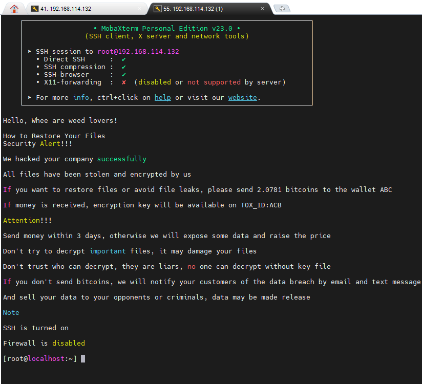

# Tình huống 2: Tấn công mã hóa máy ảo

Cấp độ: Chuyên viên

## Tổng quan

Một máy chủ VMWare ESXi của Công ty đã bị tấn công, đội ngũ quản trị viên cũng không biết rõ cho tới khi kẻ tấn công
đã để lại lời nhắn cho Công ty, khi quản trị viên vào giao diện web:

Quản trị viên biết rằng có một cách khác để lấy lại các máy ảo mà không qua web, đó là SSH:

Sau một hồi khám phá, chúng tôi tìm được giao diện cũ của ESXi qua đường dẫn `/index1.html`:

Máy ảo này rất quan trọng với Công ty chúng tôi, hãy giúp chúng tôi khôi phục lại dữ liệu và tìm ra nguyên nhân.

## Câu hỏi

1. Kẻ tấn công đã tấn công vào hệ thống của chúng tôi như thế nào?
2. Kẻ tấn công có lấy được dữ liệu gì quan trọng của Công ty không.
3. Kẻ tấn công đã làm gì khiến máy chủ ảo của chúng tôi không thể truy cập?
4. Bạn có thể khôi phục lại máy ảo giúp chúng tôi không?

## Tệp đính kèm

1. [Tệp
pcap](https://github.com/VNCERT-CC/digital-forensics-lab-frontend/releases/download/challenge2/DFLab-challenge2-network.pcap)
2. [Tệp máy ảo ESXi (part
1)](https://github.com/VNCERT-CC/digital-forensics-lab-frontend/releases/download/challenge2/DFLab-challenge2-VMware.ESXi.6.x.7z.001)
3. [Tệp máy ảo ESXi (part
2)](https://github.com/VNCERT-CC/digital-forensics-lab-frontend/releases/download/challenge2/DFLab-challenge2-VMware.ESXi.6.x.7z.002)