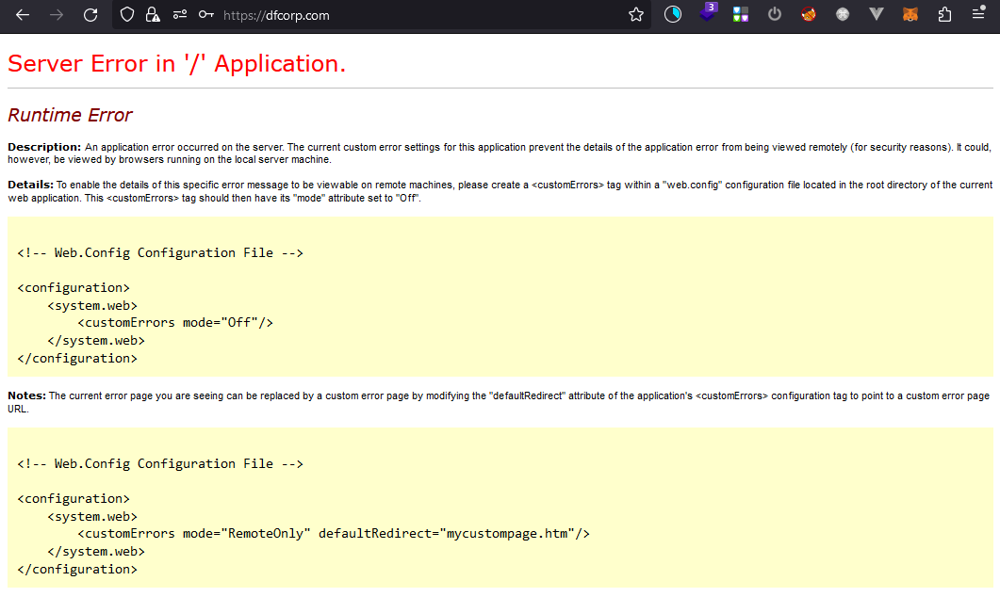

# Tình huống 3: Tấn công vào máy chủ web

Cấp độ: Chuyên viên

## Tổng quan

Máy chủ website của chúng tôi đột nhiên bị lỗi, các dữ liệu quan trọng lưu trên database bất ngờ bị xóa, chúng tôi không thể truy cập vào website của mình được. Hãy giúp chúng tôi tìm ra nguyên nhân và khôi phục lại website này.

## Câu hỏi

1. Thời gian xuất hiện tấn công nhiều nhất?
2. Kẻ tấn công đã tìm thấy bao nhiêu điểm yếu trên website?
3. Kẻ tấn công dùng cách gì để có thể thực thi được command trên server? Server nào đã bị kẻ tấn công kiểm soát?
4. Cho biết payload thực hiện của kẻ tấn công?
5. Kẻ tấn công dùng lệnh gì để thực hiện GET shell về hệ thống nhưng không thành công?
6. Bằng chứng nào cho thấy dữ liệu quan trọng trên website đã bị xoá? Kẻ tấn công có xóa thêm dữ liệu nào khác không?
7. Làm thế nào để chúng tôi có thể khôi phục được dịch vụ?

## Tệp đính kèm

1. [Tệp access log](https://github.com/VNCERT-CC/digital-forensics-lab-frontend/releases/download/challenge3/DFLab-challenge3-access_log.zip)
2. [Tệp SQL Log](https://github.com/VNCERT-CC/digital-forensics-lab-frontend/releases/download/challenge3/DFLab-challenge3-SQLLog.zip)
3. [Tệp bak](https://github.com/VNCERT-CC/digital-forensics-lab-frontend/releases/download/challenge3/DFLab-challenge3-bak.zip)