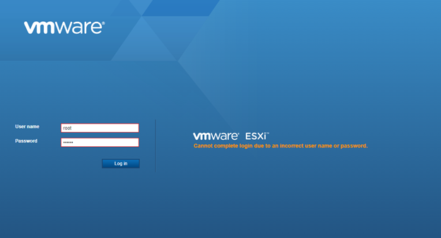
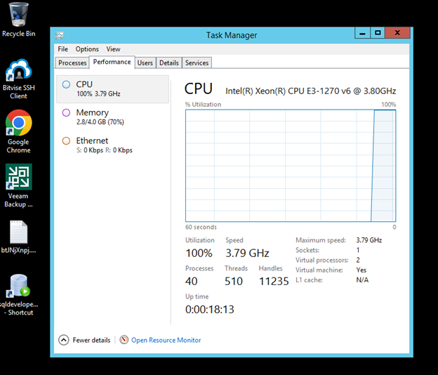

# Tình huống 7: Tấn công mã hóa dữ liệu

Cấp độ: Chuyên gia

## Tổng quan

Sự cố xảy ra trên hạ tầng máy chủ chính của DFCorp, chứa nhiều dữ liệu quan trọng của người dùng cũng như các bí mật kinh doanh. Hiện trạng sự cố:
‾	Các máy chủ dịch vụ (DB, Queue) không thể truy cập.
‾	Đội ngũ quản trị đã thử đăng nhập máy chủ ESXi để bật lại VM nhưng không thành công do sai mật khẩu:

Hình ảnh Máy chủ ESXi:

 
‾	Khi đăng nhập vào máy chủ backup, hệ thống luôn luôn sử dụng 100% CPU và có dấu hiệu của tấn công mã hóa dữ liệu:

Hình ảnh Máy chủ Backup:

 
Đội ngũ quản trị đã thực hiện cách ly máy chủ ESXi và máy chủ backup sang dải mạng riêng, với vai trò là đội ứng cứu sự cố, hãy hỗ trợ công ty DFCorp điều tra nguyên nhân tấn công và các hành vi kẻ tấn công đã thực hiện được.

## Phân vùng mạng và thông tin đăng nhập

Danh sách các dải mạng:
DMZ: `192.168.6.0/24`
USERLAN: `192.168.17.0/24`

Danh sách các thiết bị tham gia hệ thống mạng:
Máy chủ Backup (DMZ): `192.168.6.20` cài đặt 
Mật khẩu truy cập: `Administrator / DFCorp@sysad`
Máy chủ ảo hóa (DMZ): `192.168.6.21` cài đặt VMWare ESXi standalone
Mật khẩu truy cập: `root / DFC0rp@ESXi`

Thiết bị Firewall: `192.168.6.1` sử dụng thiết bị `Fortigate 201F`
Máy chủ Database (DMZ): `192.168.6.24` cài đặt `Ubuntu` và `OracleDB 23ai`
Máy chủ Queue (DMZ): `192.168.6.23` cài đặt `CentOS` và `RabbitMQ`
Các nhân viên tham gia với dải mạng `USERLAN`

## Câu hỏi

1. Thời gian mật khẩu ESXi bị đổi? Hãy chỉ ra thời gian đầu tiên ghi nhận các hành vi rà quét của kẻ tấn công.
2. Kẻ tấn công đã tấn công qua lỗ hổng của dịch vụ nào trên hệ thống? Có thành công hay không?
3. Kẻ tấn công có lấy được dữ liệu quan trọng nào của DFCorp không?
4. CnC server của kẻ tấn công là gì?
5. Kẻ tấn công thực hiện mã hóa dữ liệu từ đường dẫn nào?
6. Hãy xây dựng lại timeline của sự cố.

## Tệp đính kèm

1. [Máy ảo backup (part1)](https://github.com/VNCERT-CC/digital-forensics-lab/releases/download/challenge7/backup.zip.001)
2. [Máy ảo backup (part2)](https://github.com/VNCERT-CC/digital-forensics-lab/releases/download/challenge7/backup.zip.002)
3. [Máy ảo backup (part3)](https://github.com/VNCERT-CC/digital-forensics-lab/releases/download/challenge7/backup.zip.003)
4. [Máy ảo backup (part4)](https://github.com/VNCERT-CC/digital-forensics-lab/releases/download/challenge7/backup.zip.004)
5. [Máy ảo backup (part5)](https://github.com/VNCERT-CC/digital-forensics-lab/releases/download/challenge7/backup.zip.005)
6. [Máy ảo backup (part6)](https://github.com/VNCERT-CC/digital-forensics-lab/releases/download/challenge7/backup.zip.006)
7. [Máy ảo backup (part7)](https://github.com/VNCERT-CC/digital-forensics-lab/releases/download/challenge7/backup.zip.007)
8. [Máy ảo backup (part8)](https://github.com/VNCERT-CC/digital-forensics-lab/releases/download/challenge7/backup.zip.008)
9. [Máy ảo backup (part9)](https://github.com/VNCERT-CC/digital-forensics-lab/releases/download/challenge7/backup.zip.009)
10. [Máy ảo backup (part10)](https://github.com/VNCERT-CC/digital-forensics-lab/releases/download/challenge7/backup.zip.010)
11. [Máy ảo backup (part11)](https://github.com/VNCERT-CC/digital-forensics-lab/releases/download/challenge7/backup.zip.011)
12. [Máy ảo backup (part12)](https://github.com/VNCERT-CC/digital-forensics-lab/releases/download/challenge7/backup.zip.012)
13. [Máy ảo esxi](https://github.com/VNCERT-CC/digital-forensics-lab/releases/download/challenge7/Esxi.zip)