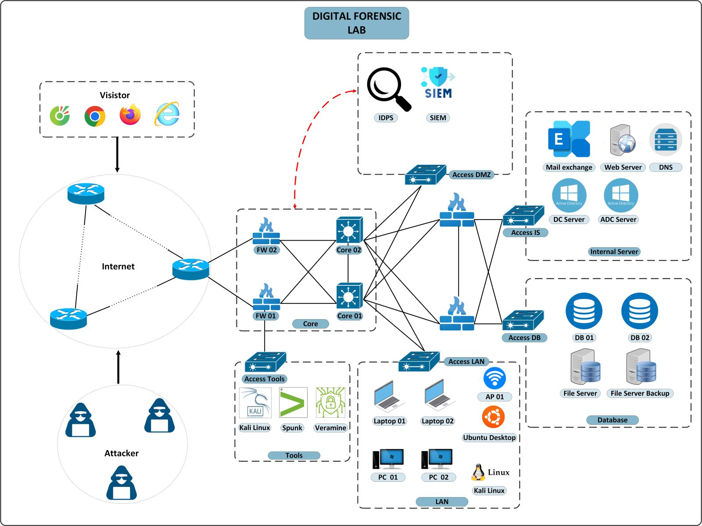

# Tình huống giả định

## Giới thiệu

DFLab được xây dựng trên mô hình mạng mô phỏng một doanh nghiệp vừa và nhỏ, đầy đủ các thành phần cơ bản, bao gồm: Vùng mạng server, Vùng mạng người dùng, Vùng mạng tấn công,...

Các tình huống của DFLab được xây dựng dựa trên việc mô phỏng các cuộc tấn công mạng nhắm vào nhiều thành phần khác nhau trong hệ thống mạng, thu thập các nhật ký, bằng chứng để người phân tích rà soát, tìm kiếm các dấu hiệu, hành động của kẻ tấn công.

Mỗi tình huống bao gồm các mục sau: Bối cảnh, Câu hỏi, Tệp đính kèm.

Đội ngũ ứng cứu, điều tra sự cố, các chuyên gia, học viên, sinh viên là người chơi (hoặc đội chơi) truy cập vào từng tình huống chúng tôi đã xây dựng. Dựa vào bối cảnh và các tệp đính kèm, các chuyên gia thực hiện phân tích, tìm kiếm dấu hiệu, bằng chứng của kẻ tấn công để lại trên nhật ký, qua đó trả lời được các câu hỏi chúng tôi đặt ra.

Sau khi trả lời được các câu hỏi, người chơi sẽ viết 01 báo cáo sự cố (tệp pdf hoặc docx, pptx,...) gửi cho chúng tôi, chúng tôi sẽ xem xét tổng thể quá trình ứng cứu, điều tra sự cố, từ đó đưa ra điểm số phù hợp.

Các đội chơi có thành tích điểm số cao sẽ được vinh danh trên hệ thống xếp hạng của chúng tôi và top 3 sẽ nhận được các phần quà đến từ VNCERT/CC.

## Mô hình mạng

DFLab xây dựng một chuỗi kịch bản tấn công sát với thực tế và đưa ra các mẫu bằng chứng, tệp nhật ký,... cho các
chuyên gia ứng cứu, điều tra, phân tích sự cố giả định.

Sự cố được giả định tại một Công ty có tên DFCorp có trụ sở tại Việt Nam. Công ty có tên miền dfcorp.com và sử dụng
các máy chủ, được thiết kế và lắp đặt, kết nối theo sơ đồ sau:

Danh sách các dải mạng:

* **DMZ**: 10.0.9.0/24
* **WZ**: 10.0.8.0/24
* **USERLAN**: 10.0.10.0/24

Danh sách các thiết bị tham gia hệ thống mạng:

* **Máy chủ ADDS (WZ)**: 10.0.8.2 cài đặt Windows Server 2019
* **Máy chủ Database (WZ)**: 10.0.8.5 cài đặt
* **Máy chủ MS Exchange (DMZ)**: 10.0.9.3 cài đặt Window Server 2019 và MS Exchange 2019
* **Máy chủ IIS (DMZ)**: 10.0.9.4 cài đặt Windows Server 2019
* **Máy chủ Firewall**: 10.10.2.136 cài đặt pfSense
* **Các nhân viên** tham gia với dải mạng USERLAN
* **Máy chủ IDS** tham gia dải mạng USERLAN

Các máy chủ MS Exchange và IIS được NAT ra ngoài mạng internet và được proxy thông qua haproxy đã được bật header
x-forwarded-for.

##  Danh sách các tình hướng

1. [Tình huống 1: Tấn công đào tiền ảo](./challenge1/index.md)

2. [Tình huống 2: Tấn công mã hóa máy ảo](./challenge2/index.md)

3. [Tình huống 3: Tấn công vào máy chủ web](./challenge3/index.md)

4. [Tình huống 4: Tấn công chiếm quyền trong môi trường domain](./challenge4/index.md)

5. [Tình huống 5: ](./challenge5/index.md)