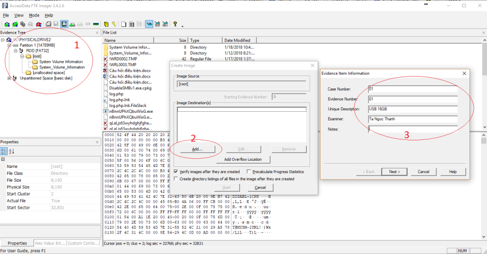
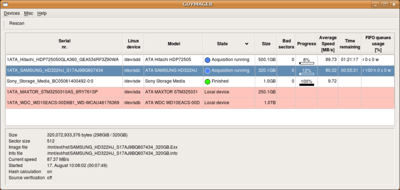

# Công cụ điều tra phương tiện lưu trữ

## AccessData FTK Imager

FTK Imager là ứng dụng được phát triển bởi công ty AccessData. Đây là một trong những công ty cung cấp những công cụ phục vụ công tác Computer Forensics tốt nhất hiện này.

FTK Imager được gắn liền với sự phát triển của FTK (Forensic Toolkits) cũng được phát triển bởi AccessData. Hiểu đơn giản, FTK Imager có nhiệm vụ tạo tệp tin ảnh để phục vụ cho FTK phân tích được hiệu quả và nhanh chóng (Hiện nay FTK Imager đã bổ sung nhiều định dạng tệp tin phổ biến để tệp tin ảnh có thể được sử dụng trên nhiều ứng dụng Forensic khác).

FTK Imager có nhiệm vụ chính là tạo tệp tin ảnh, hay hiểu là tạo một tệp tin phản ánh chính xác từng bit (bit by bit) một phần hoặc toàn bộ bộ nhớ. Nguyên do phải tạo file ảnh là để đảm bảo tính nguyên vẹn của chứng cứ được thu thập theo thủ tục tố tụng hình sự. Không chỉ vậy, ứng dụng này còn có khả năng trích xuất dữ liệu trực tiếp từ RAM trên các hệ thống đang hoạt động (Live)


??? note "Hướng dẫn sử dụng AccessData FTK Imager"

    Chọn File – Add Evidence Item để lựa chọn nguồn tạo tệp tin ảnh:

    

    Select Source

    

    Tùy vào nguồn muốn tạo ảnh:

    + Physical Drive (ổ đĩa vật lý): Là các thiết bị lưu trữ dữ liệu điện tử như: Ổ cứng máy tính, ổ cứng thể răn, thẻ nhớ v.v…).

    + Logical Drive (ổ đĩa logic):Là các phân vùng dữ liệu được tạo ra từ các ổ đĩa vật lý

    + Image File (File ảnh): Là file ảnh đã được tạo sẵn thường được định dạng dưới dạng “.dd”, “.SMART”, “.E01”…

    + Contents of a Folder (nội dung trong Folder): Đây là trường hợp ta lựa chọn khi ta biết chính xác địa điểm ta cần phân tích, khi sử dụng lựa chọn này, FTK Imager yêu cầu ta điều hướng chọn vùng cần phân tích sau đó nó sẽ tự khoanh vùng để tiến hành tạo tệp tin ảnh vùng đó.

    Trong phần này, ta chọn Physical Drive để tiến hành tạo tệp tin ảnh thiết bị lưu trữ:

    

    Chọn Finish, FTK Imager sẽ đọc và hiển thị nội dung của thiết bị lưu trữ:

    

    Chọn Export Logical image (AD1) như hình:

    

    Chọn Add và điền các thông tin cần thiết.

    

    Chọn Next và thiết lập tên cũng như nơi lữu trữ tệp tin ảnh.

    

    Có thể sử dụng chức năng nén hoặc mã hóa dữ liệu nếu cần. Chọn Finish và Start để bắt đầu tiến hành tạo tệp tin ảnh.

    Sau khi tệp tin ảnh được tạo xong, cần kiểm tra lại các thông tin trong hộp thoại Drive/Image Verify Results. Nếu mã **MD5** và **SHA1** cho kết quả *Match*. Tệp tin ảnh đã được tạo thành công.

## Bitscout

Bitscout là một công cụ xây dựng Live OS có thể tùy chỉnh được viết bằng Bash. Mục đích chính của công cụ là giúp các chuyên gia bảo mật nhanh chóng tạo tập tin ảnh hỗ trợ điều tra từ xa của riêng mình.  Bitscout là công cụ mã nguồn mở và miễn phí.


Trong hầu hết các cuộc tấn công mạng, chủ sở hữu hợp pháp của các hệ thống bị xâm nhập là nạn nhân của những thủ phạm không xác định. Nạn nhân thường đồng ý hợp tác và giúp các nhà nghiên cứu bảo mật tìm ra cách thức lây nhiễm hoặc các chi tiết khác về kẻ tấn công. Tuy nhiên, các nhà nghiên cứu cho rằng việc di chuyển khoảng cách xa để thu thập các bằng chứng quan trọng như các mẫu phần mềm độc hại từ các máy tính bị nhiễm có thể dẫn đến các cuộc điều tra tốn kém và trì trệ. Càng mất nhiều thời gian để tìm hiểu về một cuộc tấn công thì càng mất nhiều thời gian hơn trước khi người dùng được bảo vệ và xác định được thủ phạm. Tuy nhiên, các phương án thay thế đều cần đến các công cụ đắt tiền và kiến thức về cách vận hành chúng hoặc nguy cơ lây nhiễm hay làm mất bằng chứng bằng việc di chuyển nó giữa các máy tính.

Để giải quyết vấn đề này, ông Vitaly Kamluk, Giám đốc Nhóm Nghiên cứu và Phân tích Toàn cầu của Kaspersky Lab ở Châu Á Thái Bình Dương (APAC) đã tạo ra một công cụ kĩ thuật số nguồn mở có thể thu thập từ xa các tài liệu pháp y quan trọng, thu được hình ảnh đĩa toàn bộ thông qua mạng hoặc lưu trữ đính kèm cục bộ, hoặc đơn giản là hỗ trợ từ xa trong việc xử lí sự cố phần mềm độc hại. Dữ liệu bằng chứng có thể được xem xét và phân tích từ xa hoặc cục bộ trong khi lưu trữ dữ liệu nguồn vẫn còn nguyên vẹn.

??? note "Hướng dẫn sử dụng Bitscout"

    1. Xây dựng tập tin ISO:

    ```bash
    $ ./automake.sh
    ```
    Sau khi chạy lệnh này, ta cần trả lời một số câu hỏi như vị trí của máy chủ VPN, loại tập tin, v.v.
    Ngoài ra, ta có thể tải một trong những tập tin ISO dựng sẵn (chỉ dành cho việc thử nghiệm, không sử dụng trong môi trường thực tế ): https://bitscout-forensics.info/quick-try/prebuilt-images
    2. Kiểm tra tập tin ISO vừa tạo:

    ```bash
    $ ./autotest.sh
    ```
    Lệnh này sẽ chạy thử nghiệm đối với tập tin ISO mới được tạo.  Nó kiểm tra của các thành phần trên tập tin ISO và chạy nó bằng cách sử dụng qemu để chắc chắn rằng tất cả các dịch vụ thiết yếu đang chạy.

## FEX Imager

FEX Imager là công cụ thu thập hoặc băm tập tin ảnh của ổ đĩa cấp độ bit với xác thực hàm băm MD5, SHA1, SHA256. FEX Imager làm việc với ổ đĩa vật lý, ổ đĩa logic, thư mục và tệp, thiết bị từ xa (sử dụng servlet) hoặc lấy lại tập tin ảnh. Công cụ hỗ trợ các phương pháp không nén, nén nhanh, tốt hoặc tốt nhất với các tập tin ảnh:

* DD/RAW
* E01
* L01

Những tính năng chính của FEX Imager:

  * Tạo ảnh từ ổ đĩa vật lý, logic, thư mục và tập tin.
  * Lấy lại các tập tin ảnh hiện có.
  * Hỗ trợ thu thập từ các thiết bị từ xa bằng servlet GetData Forensics.
  * Chuyển sang định dạng .E01 hoặc DD với hàm băm MD5, SHA1 hoặc SHA256.
  * Chuyển các thư mục và tệp sang định dạng L01 với hàm băm tệp MD5, SHA1 hoặc SHA256.
  * Tự động xác minh hàm băm sau khi tạo.
  * Thu thập toàn bộ thiết bị hoặc đặt vị trí sector bắt đầu và kết thúc.
  * Chia tập tin ảnh thành các đoạn tùy chỉnh không giới hạn kích thước.
  * Có thể điều chỉnh sector size để thu thập với 512, 2048 hoặc 4096 sector size.

??? note "Hướng dẫn sử dụng FEX Imager"

    Chọn thiết bị nguồn:

    

    Chọn địa chỉ lưu tập tin ảnh và nhập thông tin:

    

    Thu thập và xác minh:

    

## Guymager

Guymager là một công cụ tạo tập tin ảnh miễn phí để thu thập chứng cứ.

Những tính năng chính của Guymager:

* Giao diện người dùng dễ sử dụng bằng nhiều ngôn ngữ khác nhau
* Chạy trên Linux
* Thực hiện nhanh và nén dữ liệu đa luồng
* Sử dụng tất cả tài nguyên của máy tính.
* Tạo tập tin dd, EWF (E01) và AFF, hỗ trợ sao chép đĩa
* Miễn phí, mã nguồn mở hoàn toàn

??? note "Hướng dẫn sử dụng Guymager"

     

    * Các thiết bị lưu trữ đã kết nối được liệt kê ở phần trên. Các thiết bị mới có thể được kết nối bất cứ lúc nào - nhấn nút Rescan để hiển thị.
    * Các thiết bị được đánh dấu bằng màu đỏ nhạt là các đĩa cứng cục bộ. Không thể tạo ảnh từ các ổ đĩa này để ngăn chặn việc chọn nhầm ổ đĩa. Đĩa cứng cục bộ được nhận dạng bằng số sê-ri có thể được cấu hình.
    * Phần bên dưới hiển thị thông tin chi tiết hơn về việc thu thập hiện được chọn.

    