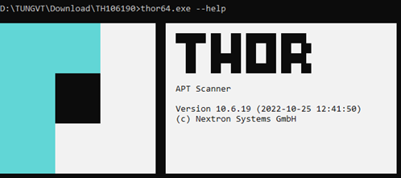
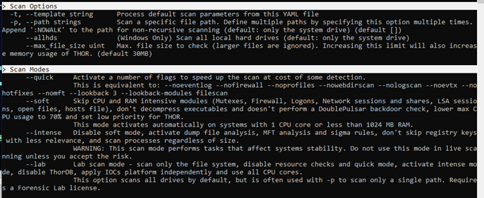

# Công cụ săn tìm mối đe doạ
  
## THOR Lite
  
THOR Lite là một IOC và YARA scanner đa nền tảng. THOR Lite là phiên bản miễn phí của THOR.

Những tính năng chính của THOR Lite:

* Scanner dùng cho Windows, Linux and macOS
* Bộ luật mã nguồn mở được biên dịch và mã hoá
* Công cụ cập nhật để tải xuống phiên bản mới nhất
* Quét với luật và IOC tự viết
* Nhiều loại kết quả scan: tập tin txt, SYSLOG (udp/tcp/tcp+tls), tập tin JSON, JSON thông qua Syslog
* Hạn chế sử dụng CPU, không gây nghẽn hệ thống


  
??? note "Hướng dẫn sử dụng THOR Lite"
  
      * https://www.nextron-systems.com/thor-lite/
      * https://www.nextron-systems.com/download-thor-lite/
      * Đăng ký với email để tải xuống THOR Lite và license.
      * Giải nén thư mục, di chuyển nó tới vị trí cần thiết.
      * Di chuyển license vào thư mục thor10lite-win-pack.
      * Khởi động THOR bằng chương trình thor64-lite.exe và thor-lite.exe
      
      

## Autoruns

Autoruns là một công cụ được phát triển bởi Microsoft Sysinternals cho phép xem, quản lý chương trình khởi động cùng Windows.
Autoruns là dạng phần mềm loại portable nên người sử dụng không cần cài đặt mà có thể chạy và sử dụng ngay lập tức.
Autoruns hiện có hai phiên bản với chức năng tương đương: Autoruns GUI và Autoruns command-line. Autoruns hoạt động với Windows XP trở lên.


*Giao diện Autoruns GUI.*


*Giao diện Autoruns command-line.*

??? note "Hướng dẫn sử dụng Autoruns"

    Các tính năng nổi bật mà Autoruns cung cấp:

    - Hiển thị danh sách tất cả các chương trình tự động chạy khi khởi động Windows theo dạng các mục như Logon, Explorer, Internet Explorer, Appinit DLLs, Image Hijacks, Winlogon, Windows Service, Winsock Providers, Boot Execute,....

    

    - Tìm kiếm trực tiếp trong registry và các tập tin khởi động của Windows để tìm kiếm các chương trình tự động chạy và cung cấp cho người dùng một danh sách chi tiết của chúng.

    

    - Mục Options mang tới 1 số lựa chọn lọc, chẳng hạn như chỉ hiển thị các chương trình non-Windows, cũng như truy cập vào hộp thoại scan. Từ đây người dùng có thể kích hoạt chế độ xác minh chữ kí hay thực hiện kiểm tra với Virus Total.

    

    

    -Người sử dụng có thể click chuột phải vào một chương trình rồi chọn Propeties trong menu hiện ra để xem thêm thông tin về chương trình. Để vô hiệu hóa 1 chương trình trong danh sách, chỉ cần bỏ chọn nó trong ô đánh dấu. Nếu muốn xóa chúng khỏi danh sách, người sử dụng có thể chọn Delete trong hộp thoại hiện ra khi dùng chuột phải.

    

    Autoruns cung cấp các cách tiện lợi và an toàn để quản lý các chương trình tự động chạy trên Windows, giúp người dùng tối ưu hóa hiệu suất hệ thống và bảo vệ máy tính khỏi các chương trình độc hại.

## Process Monitor 

Process Monitor là một tiện ích hỗ trợ giám sát tiến trình thuộc bộ công cụ SysInternals được Microsoft phân phối miễn phí. Process Monitor được sử dụng nhằm giám sát các tiến trình đang hoạt động, khoá registry và luồng lưu lượng mạng gửi/nhận từ hệ thống.
Ngoài ra, Process Monitor còn cho phép người dùng lưu lại các event dưới dạng PML (Process Monitor Log), từ đó cho phép điều tra viên lưu trữ, bảo quản nhằm phục vụ cho các khâu phân tích chuyên sâu.


Các tính năng nổi bật mà Process Monitor cung cấp:

- Giám sát tiến trình hệ thống theo thời gian thực.
- Tương thích với các hệ điều hành phổ biến như Windows và Linux.
- Khả năng ghi nhận event mạnh mẽ, lên đến ~10 triệu event mỗi bản ghi log.
- Hỗ trợ thu thập Boot log.
- Cung cấp đầy đủ các tính năng như xem Process Tree, kiểm tra các module được tiến trình sử dụng hay kiểm tra stack của các tiến trình.
- Cung cấp các bộ lọc theo thời gian thực mà không làm mất dữ liệu.

??? note "Hướng dẫn sử dụng Process Monitor"

    Sau khi tải bản nén từ [trang chủ của SysInternals](https://learn.microsoft.com/en-us/sysinternals/downloads/procmon), người dùng có thể chọn file thực thi Process Monitor phù hợp với hệ thống của mình để khởi chạy.

    
    
    Người dùng có thể tuỳ chọn các cột dữ liệu được hiện thị bằng cách bấm chuột phải vào cột bất kì, chọn Select Columns nhằm thêm bớt các thông tin cần thiết.
    
    
    
    Để xem các tiến trình dưới dạng cây, người dùng có thể sử dụng tổ hợp phím Ctrl + T. Các thông tin như Command line, thời gian bắt đầu/kết thúc, đường dẫn,… sẽ được hiển thị tương ứng.

    

    Nhằm quản lý quá trình ghi log về các tiến trình, người dùng có thể sử dụng tổ hợp phím Ctrl + E nhằm bật/tắt quá trình ghi chép. Mặc định khi khởi động, Process Monitor sẽ kích hoạt chế độ ghi. Tham số ở góc dưới cùng bên trái sẽ cho biết số bản ghi đã được ghi lại.

    
    
    Khi thu thập đủ thông tin, người dùng bấm tổ hợp phím Ctrl + S nhằm lưu lại file log trên. Các định dạng phổ biến cho file log từ Process Monitor là .pml, .csv và .xml.

    
  
## Fastfinder
  
FastFinder là công cụ được tạo ra để tìm kiếm mối đe dọa (threat hunting), forensics trực tiếp trên nền tảng Windows và Linux. Nó tập trung vào liệt kê endpoint và tìm tập tin đáng ngờ dựa trên các tiêu chí khác nhau.


Những chức năng chính của Fastfinder:

* file path / name
* md5 / sha1 / sha256 checksum
* Chuỗi đơn giản
* Điều kiện dựa trên YARA rule
  
??? note "Hướng dẫn sử dụng Fastfinder"
  
    Tải file thực thi của công cụ tại [đây](https://github.com/codeyourweb/fastfinder/releases), sau đó chạy chương trình qua CLI bằng quyền user hoặc admin

    ```powershell
    ___       __  ___  ___         __   ___  __
    |__   /\  /__`  |  |__  | |\ | |  \ |__  |__)
    |    /~~\ .__/  |  |    | | \| |__/ |___ |  \

    2021-2022 | Jean-Pierre GARNIER | @codeyourweb
    https://github.com/codeyourweb/fastfinder      usage: fastfinder [-h|--help] [-c|--configuration "<value>"] [-b|--build
                    "<value>"] [-o|--output "<value>"] [-n|--no-window]
                    [-u|--no-userinterface] [-v|--verbosity <integer>]
                    [-t|--triage]

                    Incident Response - Fast suspicious file finder

    Arguments:

    -h  --help              Print help information
    -c  --configuration     Fastfind configuration file. Default:
    -b  --build             Output a standalone package with configuration and
                            rules in a single binary
    -o  --output            Save fastfinder logs in the specified file
    -n  --no-window         Hide fastfinder window
    -u  --no-userinterface  Hide advanced user interface
    -v  --verbosity         File log verbosity
                                    | 4: Only alert
                                    | 3: Alert and errors
                                    | 2: Alerts,errors and I/O operations
                                    | 1: Full verbosity)
                                    . Default: 3
    -t  --triage            Triage mode (infinite run - scan every new file in
                            the input path directories). Default: false
    ```

## Fenrir
  
Fenrir là một bash script với vai trò là IOC Scanner đơn giản. Nó cho phép quét các hệ thống Linux/Unix/OSX để tìm các Indicators of Compromise (IOC).


Những tính năng chính của Fenrir:

* Bash Script
* Không cần cài đặt agent hoặc phần mềm
* Sử dụng công cụ phổ biến để trích xuất các nội dung thuộc tính (ví dụ md5sum, grep, stat ở nhiều chế độ khác nhau)
* Có thể chạy trên mọi Linux / Unix / OS X với Bash
* Sử dụng ít tài nguyên
* Loại trừ thông minh (kích cỡ file, extension, các thư mục loại trừ) tăng tốc quá trình quét
  
??? note "Hướng dẫn sử dụng Fenrir"
  
    ```bash
    ./fenrir.sh "ĐỊA CHỈ THƯ MỤC"
    ```

    Tất cả các cài đặt có thể được định điều chỉnh trong header của script.

    

## Loki
    
Fenrir là một IOC Scanner đơn giản dựa trên 4 nguyên tắc: tên tập tin, yara rule, kiểm tra hash, kiểm tra kết nối đến C2 Server.


Những tính năng khác của Loki:
* Kiểm tra tính nguyên vẹn của hệ thống (thông qua --reginfs)
* Kiểm tra tiến trình bất thường (dựa trên [Sysforensics](http://goo.gl/P99QZQ))
* Giải nén và quét SWF
* Kiểm tra SAM dump
  
??? note "Hướng dẫn sử dụng Loki"
  
    * Tải xuống phiên bản mới nhất của LOKI tại [releases](https://github.com/Neo23x0/Loki/releases)
    * Giải nén bộ công cụ
    * Chạy loki-upgrader.exe trên hệ thống có kết nối internet để cập nhật các đặc trưng mới nhất 
    * Di chuyển bộ công cụ tới hệ thống mục tiêu cần quét: USB, ổ cứng di động, network share, copy thư mục tới máy mục tiêu,...
    * Mở cửa số "cmd.exe" với quyền Administrator và chạy LOKI từ đó (Ta có thể chạy LOKI mà không cần quyền Administrator nhưng một số kiểm tra sẽ bị tắt và một số mục tiêu quét sẽ không thể truy cập được)

    ```powershell
    usage: loki.py [-h] [-p path] [-s kilobyte] [-l log-file] [-r remote-loghost]
                 [-t remote-syslog-port] [-a alert-level] [-w warning-level]
                 [-n notice-level] [--allhds] [--alldrives] [--printall]
                 [--allreasons] [--noprocscan] [--nofilescan] [--vulnchecks]
                 [--nolevcheck] [--scriptanalysis] [--rootkit] [--noindicator]
                 [--dontwait] [--intense] [--csv] [--onlyrelevant] [--nolog]
                 [--update] [--debug] [--maxworkingset MAXWORKINGSET]
                 [--syslogtcp] [--logfolder log-folder] [--nopesieve]
                 [--pesieveshellc] [--nolisten]
                 [--excludeprocess EXCLUDEPROCESS] [--force]

    Loki - Simple IOC Scanner

    optional arguments:
    -h, --help            show this help message and exit
    -p path               Path to scan
    -s kilobyte           Maximum file size to check in KB (default 5000 KB)
    -l log-file           Log file
    -r remote-loghost     Remote syslog system
    -t remote-syslog-port
                          Remote syslog port
    -a alert-level        Alert score
    -w warning-level      Warning score
    -n notice-level       Notice score
    --allhds              Scan all local hard drives (Windows only)
    --alldrives           Scan all drives (including network drives and
                          removable media)
    --printall            Print all files that are scanned
    --allreasons          Print all reasons that caused the score
    --noprocscan          Skip the process scan
    --nofilescan          Skip the file scan
    --vulnchecks          Run the vulnerability checks
    --nolevcheck          Skip the Levenshtein distance check
    --scriptanalysis      Statistical analysis for scripts to detect obfuscated
                          code (beta)
    --rootkit             Skip the rootkit check
    --noindicator         Do not show a progress indicator
    --dontwait            Do not wait on exit
    --intense             Intense scan mode (also scan unknown file types and
                          all extensions)
    --csv                 Write CSV log format to STDOUT (machine processing)
    --onlyrelevant        Only print warnings or alerts
    --nolog               Don't write a local log file
    --update              Update the signatures from the "signature-base" sub
                          repository
    --debug               Debug output
    --maxworkingset MAXWORKINGSET
                          Maximum working set size of processes to scan (in MB,
                          default 100 MB)
    --syslogtcp           Use TCP instead of UDP for syslog logging
    --logfolder log-folder
                          Folder to use for logging when log file is not
                          specified
    --nopesieve           Do not perform pe-sieve scans
    --pesieveshellc       Perform pe-sieve shellcode scan
    --nolisten            Dot not show listening connections
    --excludeprocess EXCLUDEPROCESS
                          Specify an executable name to exclude from scans, can
                          be used multiple times
    --force               Force the scan on a certain folder (even if excluded
                          with hard exclude in LOKI's code
    ```

## recon
  
recon là công cụ index metadata đa chức năng tập trung vào loại nội dung.

Chúng ta có thể dùng recon như:
* `find` với khả năng sử dụng các query phức tạp của SQL
* Công cụ điều tra số: Tìm kiếm các tập tin khớp với điều kiện từ đơn giản đến phức tạp trên máy mục tiêu
* Công cụ phát hiện và thu thập những phần mềm hoặc nội dung độc hại

`$ DATABASE_URL=sqlite::memory: recon <..args..>`
  
??? note "Hướng dẫn sử dụng recon"
  
    Tạo một tập tin cấu hình chứa cá thông tin cần tìm kiếm:

    ```yaml
    # ...
    computed_fields:
        byte_type: true
        is_binary: true
        file_magic: true
        # crc32: true
        sha256: true
        sha512: true
        simhash: true
    ```

    Chỉ tìm tập tin binary:

    ```powershell
    recon -c config.yaml -q 'select path from files where is_binary = 1'
    ```

    Tạo danh sách chứa các thông tin của tập tin

    ```powershell
    recon -c config.yaml -q 'select path,sha256,sha512 from files'
    ```


    Xuất mọi thứ

    ```powershell
    recon -c config.yaml -q 'select * from files' --csv
    ```