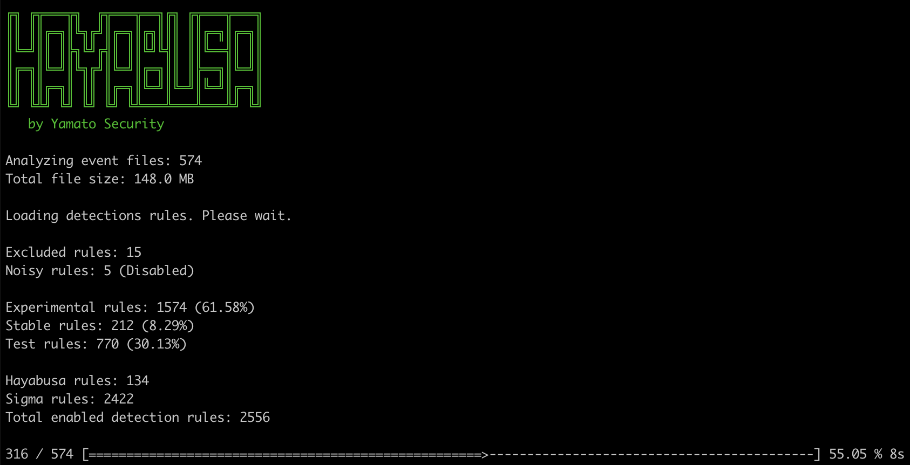
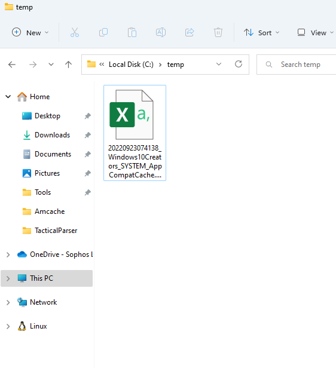

# Công cụ điều tra nhật ký sự kiện

## Hayabusa

Hayabusa là một công cụ xử lý nhanh Windows Event Log, tạo timeline và tìm kiếm mối đe dọa do Yamato Security ở Nhật Bản phát triển. Nó được viết bằng Rust và hỗ trợ xử lý đa luồng. Hayabusa có thể chạy trên các hệ thống đang hoạt động để phân tích trực tiếp, bằng cách thu thập Event Logs từ một hoặc nhiều hệ thống để phân tích ngoại tuyến hoặc bằng cách chạy công cụ Hayabusa với Velociraptor để tìm kiếm mối đe dọa và ứng phó sự cố trên quy mô lớn. Báo cáo là một timeline trên CSV để dễ dàng phân tích trong Excel, Timeline Explorer, Elastic Stack, Timesketch, v.v...


Những chức năng chính của Hayabusa:

  * Săn lùng mối đe doạ trên quy mô doanh nghiệp trên nhiều nền tảng: Windows, Linux, MacOS,...
  * Tạo timeline dựa trên Windows Event Logs, hỗ trợ chuyển đổi Sigma rules thành Hayabusa rules.
  * Đánh giá, phân tích các kỹ thuật tấn công với MITRE ATT&CK Framework.
  * Phân tích trên Timeline Explorer, Elastic Stack, Excel,...

??? note "Hướng dẫn sử dụng Hayabusa"

    Tải xuống phiên bản mới nhất của Hayabusa tại [đây](https://github.com/Yamato-Security/hayabusa/releases).

    Mở cửa sổ CMD/Powershell hoặc Windows Terminal, sau đó chạy tập tin thực thi.

    Các option chính của Hayabusa:

    ```powershell
    csv-timeline: Lưu timeline ở định dạng CSV.
    json-timeline: Lưu timeline ở định dạng JSON/JSONL.
    logon-summary: Xuất ra báo cáo tổng hợp về các lần logon trên hệ thống.
    metrics: Xuất ra các chỉ số và tỉ lệ các sự kiện dựa trên Event ID.
    pivot-keywords-list: Xuất ra các từ khoá nghi vấn cần điều tra
    update-rules: Cập nhật tập luật từ Github.
    level-tuning: Chỉnh sửa mức độ cảnh báo.
    list-profiles: Hiển thị các output profiles có sẵn.
    set-default-profile: Chỉnh sửa profile mặc định.
    ```
    
    ```powershell
    Usage:
    hayabusa.exe help <COMMAND>
    hayabusa.exe <COMMAND> [OPTIONS]
    
    Commands:
    csv-timeline         Save the timeline in CSV format
    json-timeline        Save the timeline in JSON/JSONL format
    logon-summary        Print a summary of successful and failed logons
    metrics              Print event ID metrics
    pivot-keywords-list  Create a list of pivot keywords
    update-rules         Update to the latest rules in the hayabusa-rules github repository
    level-tuning         Tune alert levels (default: ./rules/config/level_tuning.txt)
    set-default-profile  Set default output profile
    list-contributors    Print the list of contributors
    list-profiles        List the output profiles
    help                 Print this message or the help of the given subcommand(s)
    
    Options:
            --no-color  Disable color output
    -q, --quiet     Quiet mode: do not display the launch banner
    ```
    
    Khởi động phần mềm:
    
    
    
    Tổng kết sau khi chạy công cụ:
    
    
    
    Báo cáo HTML được xuất ra:
    
    
    
    
    
    
    
    Phân tích với các công cụ:
    
    
    
    
    
    

## APT-Hunter

APT-Hunter là công cụ Threat Hunting dựa trên Event Log của windows được tạo với mindset của purple team để cung cấp khả năng phát hiện các tấn công APT ẩn trong rất nhiều windows event logs để giảm thời gian phát hiện hoạt động đáng ngờ.

Công cụ hoạt động mà không cần phải có giải pháp phức tạp để phân tích cú pháp và phát hiện các cuộc tấn công trong nhật ký sự kiện của windows như giải pháp SIEM và trình thu thập logs.


Những tính năng chính của APT-Hunter:

* Phát hiện các hoạt động đáng ngờ nào mà ta không biết trước khi nó trở thành một sự cố lớn.
* Phát hiện tấn công nhanh hơn, điều này sẽ làm giảm thời gian phản hồi để nhanh chóng ngăn chặn và loại bỏ các cuộc tấn công.
* Báo cáo tương thích với timesketch để thực hiện phân tích dòng thời gian.
* Điều tra nhiều máy chủ nhanh hơn trong khoảng thời gian ngắn.
* Giúp ích cho điều tra viên trong những trường hợp không có nhiều thời gian để phân tích chuyên sâu.
* Biến hàng triệu sự kiện thành hàng trăm sự kiện với mức độ nghiêm trọng có thể sử dụng làm bộ lọc.

??? note "Hướng dẫn sử dụng APT-Hunter"

    Điều đầu tiên cần làm trước khi sử dụng công cụ là thu thập Event Logs:

    ```powershell
    # Để thu thập với định dạng EVTX, sử dụng script sau:
    windows-log-collector-full-v3-EVTX.ps1 
    # Để thu thập với định dạng CSV, sử dụng script sau: 
    windows-log-collector-full-v3-CSV.ps1
    ```

    Cài đặt các thư viện python cần thiết:
    ```powershell
    python3 -m pip install -r Requirements.txt
    ```

    ```powershell
    python3 APT-Hunter.py -h
    usage: APT-Hunter.py [-h] [-p PATH] [-o OUT] [-t {csv,evtx}]
                        [--security SECURITY] [--system SYSTEM]
                        [--scheduledtask SCHEDULEDTASK] [--defender DEFENDER]
                        [--powershell POWERSHELL] [--powershellop POWERSHELLOP]
                        [--terminal TERMINAL] [--winrm WINRM] [--sysmon SYSMON]
    
    optional arguments:
    -h, --help            show this help message and exit
    -p PATH, --path PATH  path to folder containing windows event logs generated by the APT-Hunter-Log-Collector.ps1
    -o OUT, --out OUT     output file name
    -t {csv,evtx}, --type {csv,evtx}
                            csv ( logs from get-eventlog or windows event log GUI
                            or logs from Get-WinEvent ) , evtx ( EVTX extension
                            windows event log )
    --security SECURITY   Path to Security Logs
    --system SYSTEM       Path to System Logs
    --scheduledtask SCHEDULEDTASK
                            Path to Scheduled Tasks Logs
    --defender DEFENDER   Path to Defender Logs
    --powershell POWERSHELL
                            Path to Powershell Logs
    --powershellop POWERSHELLOP
                            Path to Powershell Operational Logs
    --terminal TERMINAL   Path to TerminalServices LocalSessionManager Logs
    --winrm WINRM         Path to Winrm Logs
    --sysmon SYSMON       Path to Sysmon Logs
    ```
    `-p`: địa chỉ trỏ đến thư mục chứa các Event Logs

    `-o`: Tên của dự án

    `-t`: Loại của log (ví dụ CSV hoặc EVTX)

    Ví dụ:

    ```powershell
    python3 APT-Hunter.py  -t evtx  -p /opt/wineventlogs/  -o Project1
    
    python3 APT-Hunter.py  -t csv  -p /opt/wineventlogs/  -o Project1
    
    python3 APT-Hunter.py  -t evtx  --security evtx/security.evtx -o Project2
    ```

## LogonTracer

LogonTracer là một công cụ để điều tra các lần đăng nhập bằng cách trực quan hóa và phân tích nhật ký sự kiện Windows Active Directory. Công cụ này liên kết tên máy chủ (hoặc địa chỉ IP) và tên tài khoản được tìm thấy trong các sự kiện liên quan đến đăng nhập và hiển thị dưới dạng biểu đồ. Bằng cách này, có thể biết nỗ lực đăng nhập tài khoản nào xảy ra và máy chủ nào được sử dụng.

Những sự kiện mà LogonTracer hỗ trợ:

* 4624: Đăng nhập thành công
* 4625: Đăng nhập thất bại
* 4768: Kerberos Authentication (TGT Request)
* 4769: Kerberos Service Ticket (ST Request)
* 4776: Xác thực NTLM
* 4672: Đăng nhập với quyền đặc biệt

??? note "Hướng dẫn sử dụng LogonTracer"

    Sử dụng câu lệnh sau để khởi động LogonTracer:

    ```bash
    $ python3 logontracer.py -r -o [PORT] -u [USERNAME] -p [PASSWORD] -s [IP Address]
    ```

    ```bash
    -r: Khởi chạy máy chủ web
    -o: Cổng dịch vụ máy chủ web hoạt động (ví dụ: 8080)
    -u: Tên người dùng (Mặc định là “neo4j”)
    -p: Mật khẩu
    -s: Địa chỉ IP của máy chủ web (ví dụ: localhost)
    ```

    Truy cập http://[[Địa chỉ của LogonTracer]]:8080, sử dụng tài khoản từ câu lệnh phía trên:

    

    Upload evtx:

    

    Sử dụng thanh điều hướng để tìm tên tài khoản, địa chỉ IP, event ID,...

    

    Lọc thời gian:

    

## Zircolite

Zircolite là công cụ viết bằng Python3, cho phép sử dụng SIGMA rules trên Windows Event Logs (định dạng EVTX và JSONL), Auditd và Sysmon với Linux.

Những chức năng chính của Zircolite:

  * Zircolite có thể được sử dụng trực tiếp trên endpoint được điều tra hoặc trong môi trường phân tích chuyên sâu / môi trường giả lập.
  * Nhanh và xử lý được lượng lớn dữ liệu cùng lúc
  * Sử dụng Sigma backend (SQLite)
  * Xuất kết quả sang nhiều định dạng khác nhau dựa trên các templates: JSON, CSV, JSONL, Splunk, Elastic, Zinc, Timesketch...

??? note "Hướng dẫn sử dụng Zircolite"

    Tải xuống công cụ tại [đây](https://github.com/wagga40/Zircolite), sau đó cài đặt các library với câu lệnh: `pip3 install -r requirements.txt`

    Phân tích EVTX với bộ rule Windows Sysmon:

    ```powershell
    # python3 zircolite.py --evtx <EVTX FOLDER or EVTX FILE> --ruleset <SIGMA RULESET> [--ruleset <OTHER RULESET>]
    python3 zircolite.py --evtx sysmon.evtx --ruleset rules/rules_windows_sysmon.json
    ```

    Phân tích Auditd / Sysmon cho Linux / JSONL hoặc NDJSON logs :

    ``` powershell
    python3 zircolite.py --events auditd.log --ruleset rules/rules_linux.json --auditd
    python3 zircolite.py --events sysmon.log --ruleset rules/rules_linux.json --sysmon4linux
    python3 zircolite.py --events <JSON_FOLDER or JSON_FILE> --ruleset rules/rules_windows_sysmon.json --jsononly
    ```

    Sử dụng miniGUI với option `--package`:

    

    Timeline các sự kiện đã được phát hiện:

    

    Ma trận MITRE ATT&CK:

    

## AppCompatCacheParser
  
AppCompatCacheParser là công cụ phân tích AppCompatCache (ShimCache). Hỗ trợ xử lý các tập tin bị khóa.


??? note "Hướng dẫn sử dụng AppCompatCacheParser"

    Tải xuống công cụ tại [đây](https://ericzimmerman.github.io/#!index.md).

    Mở cửa sổ CMD với quyền Administrator.

    Chạy AppCompatCacheParser với cửa sổ dòng lệnh CMD vừa mở:

    ```powershell
    AppCompatCache Parser version 1.4.4.0

    Author: Eric Zimmerman (saericzimmerman@gmail.com)
    https://github.com/EricZimmerman/AppCompatCacheParser

            c               The ControlSet to parse. Default is to extract all control sets.
            f               Full path to SYSTEM hive to process. If this option is not specified, the live Registry will be used
            t               Sorts last modified timestamps in descending order

            csv             Directory to save CSV formatted results to. Required
            csvf            File name to save CSV formatted results to. When present, overrides default name

            debug           Debug mode
            dt              The custom date/time format to use when displaying timestamps. See https://goo.gl/CNVq0k for options. Default is: yyyy-MM-dd HH:mm:ss
            nl              When true, ignore transaction log files for dirty hives. Default is FALSE

    Examples: AppCompatCacheParser.exe --csv c:\temp -t -c 2
            AppCompatCacheParser.exe --csv c:\temp --csvf results.csv

            Short options (single letter) are prefixed with a single dash. Long commands are prefixed with two dashes
    ```

    

    Để bắt đầu phân tích, ta sẽ chạy câu lệnh sau:

    ```powershell
    AppCompatCacheParser.exe -f C:\temp\muldwych\Content\C\Windows\System32\config\SYSTEM –csv c:\temp –dt yyyy-MM-ddTHH:mm:ss
    ```

    * Chạy AppCompatCacheParser.exe
    * -f yêu cầu chương trình sử dụng tập tin tại đường dẫn sau nó, ở ví dụ là `C:\temp\muldwych\Content\C\Windows\System32\config\SYSTEM`
    * –csv yêu cầu công cụ xuất dưới đuôi csv và tại thư mục đã nêu, tức là `c:\temp`
    * –dt yêu cầu công cụ sử dụng định dạng ngày/giờ tùy chỉnh khi xử lý thời gian, trong ví dụ là `yyyy-MM-ddTHH:mm:ss`

    

    Sau đó chúng ta đã có tập tin csv để tiến hành điều tra chuyên sâu hơn:

    

    Chúng ta có thể sử dụng Timeline Explorer hoặc Excel để mở tập tin trên.

    

## CyberChef

> Được đóng góp bởi: [Công ty Cổ phần BKAV](https://www.bkav.com.vn/)

CyberChef là một ứng dụng web nguồn mở, miễn phí được thiết kế để thực hiện các kỹ thuật thao tác dữ liệu phổ biến theo cách có cấu trúc, có hệ thống và có thể lặp lại. Điều này bao gồm các hoạt động như giải mã đơn giản, tính toán hàm băm, trích xuất nội dung, phân tích cú pháp định dạng,…CyberChef có thể triển khai trên local hoặc trực tuyến.

??? note "Hướng dẫn sử dụng CyberChef"

    - Cài đặt Git
    - Cài đặt Node.js phiên bản 18 và npm phiên bản 8
    - git clone https://github.com/gchq/CyberChef.git
    - cd CyberChef
    - npm install


    Hoặc người dùng có thể sử dụng trực tuyến bằng cách truy cập: https://gchq.github.io/CyberChef/

    
  
## Chainsaw

Chainsaw là công cụ hỗ trợ phân tích và phát hiện dấu hiệu tấn công hệ thống thông qua các đặc trưng từ Windows, ví udj như Event Logs và MFT.  Chainsaw cung cấp một phương pháp tìm kiếm nhanh chóng thông qua từ khóa và xác định mối đe doạ dựa trên Sigma rules.


Những chức năng chính của Chainsaw:

  * Săn tìm mối đe doạ dựa trên Sigma rules và các rule tuỳ chỉnh từ Chaisaw
  * Tìm kiếm và trích xuất các dấu vết bằng khớp chuỗi và biểu thức chính quy (regex).
  * Được viết bằng Rust, dựa trên thư viện [EVTX parser](https://github.com/omerbenamram/evtx)
  * Xuất kết quả với nhiều định dạng khác nhau: ASCII table, định dạng CSV và định dạng JSON

??? note "Hướng dẫn sử dụng Chainsaw"

    Tải xuống Chainsaw từ mục [releases](https://github.com/countercept/chainsaw/releases)

    ```powershell
    USAGE:
        chainsaw search [FLAGS] [OPTIONS] <pattern> [--] [path]...

    FLAGS:
        -h, --help            Prints help information
        -i, --ignore-case     Ignore the case when searching patterns
            --json            Print the output in json format
            --load-unknown    Allow chainsaw to try and load files it cannot identify
            --local           Output the timestamp using the local machine's timestamp
        -q                    Supress informational output
            --skip-errors     Continue to search when an error is encountered
        -V, --version         Prints version information

    OPTIONS:
            --extension <extension>...    Only search through files with the provided extension
            --from <from>                 The timestamp to search from. Drops any documents older than the value provided
        -o, --output <output>             The path to output results to
        -e, --regex <pattern>...          A string or regular expression pattern to search for
        -t, --tau <tau>...                Tau expressions to search with. e.g. 'Event.System.EventID: =4104'
            --timestamp <timestamp>       The field that contains the timestamp
            --timezone <timezone>         Output the timestamp using the timezone provided
            --to <to>                     The timestamp to search up to. Drops any documents newer than the value provided

    ARGS:
        <pattern>    A string or regular expression pattern to search for. Not used when -e or -t is specified
        <path>...    The paths containing event logs to load and hunt through
    ```

    Tìm kiếm tất cả chuỗi "mimikatz" không phân biệt hoa thường:

    ```bash
    ./chainsaw search mimikatz -i evtx_attack_samples/
    ```

    Tìm kiếm tất cả sự kiện đăng nhập với regex, xuất dưới dạng JSON:

    ```bash
    ./chainsaw search -e "DC[0-9].insecurebank.local" evtx_attack_samples --json
    ```

    Tìm kiếm tất cả các tập tin evtx bằng Sigma rules để phát hiện tấn công:

    ```powershell
    $ ./chainsaw hunt -r rules/ evtx_attack_samples -s sigma/rules --mapping mappings/sigma-event-logs-all.yml --level critical

    ██████╗██╗  ██╗ █████╗ ██╗███╗   ██╗███████╗ █████╗ ██╗    ██╗
    ██╔════╝██║  ██║██╔══██╗██║████╗  ██║██╔════╝██╔══██╗██║    ██║
    ██║     ███████║███████║██║██╔██╗ ██║███████╗███████║██║ █╗ ██║
    ██║     ██╔══██║██╔══██║██║██║╚██╗██║╚════██║██╔══██║██║███╗██║
    ╚██████╗██║  ██║██║  ██║██║██║ ╚████║███████║██║  ██║╚███╔███╔╝
    ╚═════╝╚═╝  ╚═╝╚═╝  ╚═╝╚═╝╚═╝  ╚═══╝╚══════╝╚═╝  ╚═╝ ╚══╝╚══╝
        By Countercept (@FranticTyping, @AlexKornitzer)

    [+] Loading detection rules from: ../../rules/, /tmp/sigma/rules
    [+] Loaded 129 detection rules (198 not loaded)
    [+] Loading event logs from: ../../evtx_attack_samples (extensions: .evtx)
    [+] Loaded 268 EVTX files (37.5 MB)
    [+] Hunting: [========================================] 268/268

    [+] Group: Antivirus
    ┌─────────────────────┬────────────────────┬──────────┬───────────┬─────────────┬────────────────────────────────┬──────────────────────────────────┬────────────────────┐
    │      timestamp      │     detections     │ Event ID │ Record ID │  Computer   │          Threat Name           │           Threat Path            │        User        │
    ├─────────────────────┼────────────────────┼──────────┼───────────┼─────────────┼────────────────────────────────┼──────────────────────────────────┼────────────────────┤
    │ 2019-07-18 20:40:00 │ ‣ Windows Defender │ 1116     │ 37        │ MSEDGEWIN10 │ Trojan:PowerShell/Powersploit. │ file:_C:\AtomicRedTeam\atomic-   │ MSEDGEWIN10\IEUser │
    │                     │                    │          │           │             │ M                              │ red-team-master\atomics\T1056\   │                    │
    │                     │                    │          │           │             │                                │ Get-Keystrokes.ps1               │                    │
    ├─────────────────────┼────────────────────┼──────────┼───────────┼─────────────┼────────────────────────────────┼──────────────────────────────────┼────────────────────┤
    │ 2019-07-18 20:53:31 │ ‣ Windows Defender │ 1117     │ 106       │ MSEDGEWIN10 │ Trojan:XML/Exeselrun.gen!A     │ file:_C:\AtomicRedTeam\atomic-   │ MSEDGEWIN10\IEUser │
    │                     │                    │          │           │             │                                │ red-team-master\atomics\T1086\   │                    │
    │                     │                    │          │           │             │                                │ payloads\test.xsl                │                    │
    └─────────────────────┴────────────────────┴──────────┴───────────┴─────────────┴────────────────────────────────┴──────────────────────────────────┴────────────────────┘

    [+] Group: Log Tampering
    ┌─────────────────────┬───────────────────────────────┬──────────┬───────────┬────────────────────────────────┬───────────────┐
    │      timestamp      │          detections           │ Event ID │ Record ID │            Computer            │     User      │
    ├─────────────────────┼───────────────────────────────┼──────────┼───────────┼────────────────────────────────┼───────────────┤
    │ 2019-01-20 07:00:50 │ ‣ Security Audit Logs Cleared │ 1102     │ 32853     │ WIN-77LTAPHIQ1R.example.corp   │ Administrator │
    └─────────────────────┴───────────────────────────────┴──────────┴───────────┴────────────────────────────────┴───────────────┘

    [+] Group: Sigma
    ┌─────────────────────┬────────────────────────────────┬───────┬────────────────────────────────┬──────────┬───────────┬──────────────────────────┬──────────────────────────────────┐
    │      timestamp      │           detections           │ count │     Event.System.Provider      │ Event ID │ Record ID │         Computer         │            Event Data            │
    ├─────────────────────┼────────────────────────────────┼───────┼────────────────────────────────┼──────────┼───────────┼──────────────────────────┼──────────────────────────────────┤
    │ 2019-04-29 20:59:14 │ ‣ Malicious Named Pipe         │ 1     │ Microsoft-Windows-Sysmon       │ 18       │ 8046      │ IEWIN7                   │ ---                              │
    │                     │                                │       │                                │          │           │                          │ Image: System                    │
    │                     │                                │       │                                │          │           │                          │ PipeName: "\\46a676ab7f179e511   │
    │                     │                                │       │                                │          │           │                          │ e30dd2dc41bd388"                 │
    │                     │                                │       │                                │          │           │                          │ ProcessGuid: 365ABB72-D9C4-5CC   │
    │                     │                                │       │                                │          │           │                          │ 7-0000-0010EA030000              │
    │                     │                                │       │                                │          │           │                          │ ProcessId: 4                     │
    │                     │                                │       │                                │          │           │                          │ RuleName: ""                     │
    │                     │                                │       │                                │          │           │                          │ UtcTime: "2019-04-29 20:59:14.   │
    │                     │                                │       │                                │          │           │                          │ 430"                             │
    ├─────────────────────┼────────────────────────────────┼───────┼────────────────────────────────┼──────────┼───────────┼──────────────────────────┼──────────────────────────────────┤
    │ 2019-04-30 20:26:51 │ ‣ CobaltStrike Service         │ 1     │ Microsoft-Windows-Sysmon       │ 13       │ 9806      │ IEWIN7                   │ ---                              │
    │                     │ Installations in Registry      │       │                                │          │           │                          │ Details: "%%COMSPEC%% /b /c st   │
    │                     │                                │       │                                │          │           │                          │ art /b /min powershell.exe -no   │
    │                     │                                │       │                                │          │           │                          │ p -w hidden -noni -c \"if([Int   │
    │                     │                                │       │                                │          │           │                          │ Ptr]::Size -eq 4){$b='powershe   │
    │                     │                                │       │                                │          │           │                          │ ll.exe'}else{$b=$env:windir+'\   │
    │                     │                                │       │                                │          │           │                          │ \syswow64\\WindowsPowerShell\\   │
    │                     │                                │       │                                │          │           │                          │ v1.0\\powershell.exe'};$s=New-   │
    │                     │                                │       │                                │          │           │                          │ Object System.Diagnostics.Proc   │
    │                     │                                │       │                                │          │           │                          │ essStartInfo;$s.FileName=$b;$s   │
    │                     │                                │       │                                │          │           │                          │ .Arguments='-noni -nop -w hidd   │
    │                     │                                │       │                                │          │           │                          │ en -c &([scriptblock]::create(   │
    │                     │                                │       │                                │          │           │                          │ (New-Object IO.StreamReader(Ne   │
    │                     │                                │       │                                │          │           │                          │ w-Object IO.Compression.GzipSt   │
    │                     │                                │       │                                │          │           │                          │ ream((New-Object IO.MemoryStre   │
    │                     │                                │       │                                │          │           │                          │ am(,[Convert]::FromBase64Strin   │
    │                     │                                │       │                                │          │           │                          │ g(''H4sIAIuvyFwCA7VW+2/aSBD+OZ   │
    │                     │                                │       │                                │          │           │                          │ H6P1...                          │
    │                     │                                │       │                                │          │           │                          │ (use --full to show all content) │
    │                     │                                │       │                                │          │           │                          │ EventType: SetValue              │
    │                     │                                │       │                                │          │           │                          │ Image: "C:\\Windows\\system32\   │
    │                     │                                │       │                                │          │           │                          │ \services.exe"                   │
    │                     │                                │       │                                │          │           │                          │ ProcessGuid: 365ABB72-2586-5CC   │
    │                     │                                │       │                                │          │           │                          │ 9-0000-0010DC530000              │
    │                     │                                │       │                                │          │           │                          │ ProcessId: 460                   │
    │                     │                                │       │                                │          │           │                          │ RuleName: ""                     │
    │                     │                                │       │                                │          │           │                          │ TargetObject: "HKLM\\System\\C   │
    │                     │                                │       │                                │          │           │                          │ urrentControlSet\\services\\he   │
    │                     │                                │       │                                │          │           │                          │ llo\\ImagePath"                  │
    │                     │                                │       │                                │          │           │                          │ UtcTime: "2019-04-30 20:26:51.   │
    │                     │                                │       │                                │          │           │                          │ 934"                             │
    ├─────────────────────┼────────────────────────────────┼───────┼────────────────────────────────┼──────────┼───────────┼──────────────────────────┼──────────────────────────────────┤
    │ 2019-05-12 12:52:43 │ ‣ Meterpreter or Cobalt        │ 1     │ Service Control Manager        │ 7045     │ 10446     │ IEWIN7                   │ ---                              │
    │                     │ Strike Getsystem Service       │       │                                │          │           │                          │ AccountName: LocalSystem         │
    │                     │ Installation                   │       │                                │          │           │                          │ ImagePath: "%COMSPEC% /c ping    │
    │                     │                                │       │                                │          │           │                          │ -n 1 127.0.0.1 >nul && echo 'W   │
    │                     │                                │       │                                │          │           │                          │ inPwnage' > \\\\.\\pipe\\WinPw   │
    │                     │                                │       │                                │          │           │                          │ nagePipe"                        │
    │                     │                                │       │                                │          │           │                          │ ServiceName: WinPwnage           │
    │                     │                                │       │                                │          │           │                          │ ServiceType: user mode service   │
    │                     │                                │       │                                │          │           │                          │ StartType: demand start          │
    ├─────────────────────┼────────────────────────────────┼───────┼────────────────────────────────┼──────────┼───────────┼──────────────────────────┼──────────────────────────────────┤
    │ 2019-06-21 07:35:37 │ ‣ Dumpert Process Dumper       │ 1     │ Microsoft-Windows-Sysmon       │ 11       │ 238375    │ alice.insecurebank.local │ ---                              │
    │                     │                                │       │                                │          │           │                          │ CreationUtcTime: "2019-06-21 0   │
    │                     │                                │       │                                │          │           │                          │ 6:53:03.227"                     │
    │                     │                                │       │                                │          │           │                          │ Image: "C:\\Users\\administrat   │
    │                     │                                │       │                                │          │           │                          │ or\\Desktop\\x64\\Outflank-Dum   │
    │                     │                                │       │                                │          │           │                          │ pert.exe"                        │
    │                     │                                │       │                                │          │           │                          │ ProcessGuid: ECAD0485-88C9-5D0   │
    │                     │                                │       │                                │          │           │                          │ C-0000-0010348C1D00              │
    │                     │                                │       │                                │          │           │                          │ ProcessId: 3572                  │
    │                     │                                │       │                                │          │           │                          │ RuleName: ""                     │
    │                     │                                │       │                                │          │           │                          │ TargetFilename: "C:\\Windows\\   │
    │                     │                                │       │                                │          │           │                          │ Temp\\dumpert.dmp"               │
    │                     │                                │       │                                │          │           │                          │ UtcTime: "2019-06-21 07:35:37.   │
    │                     │                                │       │                                │          │           │                          │ 324"                             │
    └─────────────────────┴────────────────────────────────┴───────┴────────────────────────────────┴──────────┴───────────┴──────────────────────────┴──────────────────────────────────┘
    ```

## Event Log Observer

Event Log Observer là công cụ giúp nhanh chóng tìm và phân tích các cảnh báo bảo mật, sự cố và các sự kiện khác trong hệ điều hành Microsoft Windows. Với Event Log Observer, ta có thể trích xuất dữ liệu cần thiết bằng cú pháp truy vấn SQLite và nâng cao hiệu quả phân tích Event Logs.

Những chức năng chính của Event Log Observer:

* Điều hướng dễ dàng và trực quan hóa dữ liệu
* Sử dụng SQL để đọc event logs
* Sử dụng cho nhiều loại log khác nhau
* Hỗ trợ tìm kiếm thông tin nhanh chóng

??? note "Hướng dẫn sử dụng Event Log Observer"

    Tải xuóng công cụ: [Event Log Observer](https://lizard-labs.com/event_log_observer.aspx)

    Giao diện Dashboard của Event Log Observer:

    

    Tìm kiếm thông tin từ Event Log:

    

##  Log Parser Lizard

Công cụ truy vấn dữ liệu và phân tích Event log cho phép dễ dàng trích xuất thông tin có giá trị bằng sức mạnh của các lệnh truy vấn SQL. Với Log Parser Lizard, ta có thể dễ dàng phân tích các system hoặc application logs khác nhau, sau đó thực hiện các truy vấn SQL đối với chúng.

Những chức năng chính của  Log Parser Lizard:

  * Sử dụng truy vấn SQL để đọc log
  * Web API Server
  * Lọc dữ liệu và xử lý khối lượng log lớn
  * Xuất ra nhiều định dạng: XLS, XLSX, PDF, RTF, TXT, MHT, CSV, HTML,...

??? note "Hướng dẫn sử dụng  Log Parser Lizard"

    Sử dụng câu lệnh SQL để xử lý dữ liệu mà không cần lưu vào database:

    

    ```SQL
    SELECT DISTINCT src-ip FROM firewall.log WHERE action='DROP'

    SELECT TOP 100 * FROM c:\webserver.log WHERE sc-status <> 200

    SELECT cs-uri-stem FROM c:\InetPub\Logs\ex*.log
    GROUP BY cs-uri-stem HAVING COUNT(*) > 50

    SELECT to_lowercase(extract_extension(cs-uri-stem)) AS PageType, SUM(sc-bytes)
    FROM ex131118.log, ex131119.log GROUP BY PageType 
    ```

## System Monitor

> Được đóng góp bởi: [Công ty Cổ phần BKAV](https://www.bkav.com.vn/)

System Monitor là một công cụ giám sát mức host thuộc bộ SysInternals được Microsoft cung cấp cho các quản trị viên và nhà phát triển. Sau khi cài đặt, System Monitor sẽ mặc định khởi chạy mỗi khi hệ thống khởi động nhằm đảm bảo ghi nhận đầy đủ các sự kiện. 
Những thông tin được System Monitor thu thập bao gồm việc tiến trình được khởi tạo/ngừng hoạt động, truy cập đến các vùng nhớ, hành vi kết nối mạng,… Các log được System Monitor ghi lại có thể truy cập thông qua Event Viewer tại mục Applications and Services Logs/Microsoft/Windows/Sysmon/Operational.


Các tính năng nổi bật mà System Monitor cung cấp:

- Ghi lại thông tin các tiến trình bao gồm Command line của tiến trình hiện tại và tiến trình cha.
- Tính toán giá trị hash (MD5, SHA1, SHA256) của tiến trình và các driver/DLL kèm theo.
- Ghi nhận các hành vi truy cập vào các ổ đĩa và vùng nhớ.
- Thu thập các thông tin về kết nối mạng bao gồm IP, tiến trình sử dụng mạng, port number, hostname,…
- Phát hiện các thay đổi ở phần timestamp của các file, cho biết thời gian thực sự của file được khởi tạo.
- Cho phép tuỳ chỉnh hoạt động theo các file config của người dùng.

??? note "Hướng dẫn sử dụng System Monitor"


    Cài đặt:

    Sau khi tải bản nén từ trang chủ của SysInternals (https://learn.microsoft.com/en-us/sysinternals/downloads/sysmon) và giải nén, ta cần sử dụng Command line với quyền Administrator nhằm thực hiện cài đặt. 

    

    Sau khi cài đặt, System Monitor sẽ khởi chạy mà không cần reboot hệ thống. Các event được System Monitor ghi nhận sẽ tích hợp vào Windows Event Viewer tại mục Applications and Services Logs/Microsoft/Windows/Sysmon/Operational. 

    
    
    Phạm vi giám sát mặc định của System Monitor sẽ không đáp ứng yêu cầu trong một số trường hợp. Khi đó, người dùng có thể áp dụng các config khác lên System Monitor nhằm mở rộng phạm vi giám sát lên hệ thống.
    
    

    Người dùng có thể quay lại mục Sysmon log nhằm kiểm tra lượng event đã được cập nhật như yêu cầu hay chưa.

    

  
## GoAccess

> Được đóng góp bởi: [Công ty Cổ phần BKAV](https://www.bkav.com.vn/)

GoAccess là trình phân tích nhật ký web, có thể quan sát theo thời gian thực và trình xem tương tác mã nguồn mở chạy trong terminal trong các hệ thống..
Cung cấp số liệu thống kê HTTP nhanh chóng và có giá trị cho các quản trị viên hệ thống yêu cầu báo cáo máy chủ trực quan một cách nhanh chóng.


??? note "Hướng dẫn sử dụng GoAccess"

    Cài đặt:

    ```
    $ wget https://tar.goaccess.io/goaccess-1.7.2.tar.gz
    $ tar -xzvf goaccess-1.7.2.tar.gz
    $ cd goaccess-1.7.2/
    $ ./configure --enable-utf8 --enable-geoip=mmdb
    $ make
    # make install
    ```

    Để xuất ra thiết bị đầu cuối và tạo báo cáo tương tác:

    `goaccess access.log`

    Để tạo báo cáo HTML:

    `# goaccess access.log -a > report.html`

    Để tạo báo cáo JSON:

    `# goaccess access.log -a -d -o json > report.json`

    Để tạo tệp CSV:

    `# goaccess access.log --no-csv-summary -o csv > report.csv`

    Try vấn lọc dữ liệu dựa trên thời gian:

    ```
    # sed -n '/05\/Dec\/2010/,$ p' access.log | goaccess -a -
    # sed -n '/'$(date '+%d\/%b\/%Y' -d '1 week ago')'/,$ p' access.log | goaccess -a -
    # sed -n '/5\/Nov\/2010/,/5\/Dec\/2010/ p' access.log | goaccess -a -
    # goaccess access.log --keep-last=5
    ```

    Để phân tích các trang cụ thể, ví dụ: lượt xem trang, html, htm, phpv.v. trong một yêu cầu:

    `# awk '$7~/\.html|\.htm|\.php/' access.log | goaccess -`

    Phân tích mã trạng thái cụ thể, ví dụ: 500 (Lỗi Máy chủ Nội bộ):

    `# awk '$9~/500/' access.log | goaccess -`

    Hoặc nhiều mã trạng thái, ví dụ: tất cả 3xx và 5xx:

    `# tail -f -n +0 access.log | awk '$9~/3[0-9]{2}|5[0-9]{2}/' | goaccess -o out.html -`

    Và để có cái nhìn tổng quan ước tính về số lượng bot (trình thu thập thông tin) đang tấn công máy chủ:

    `# tail -F -n +0 access.log | grep -i --line-buffered 'bot' | goaccess -`

    Khi sử dụng, lưu ý cần cấu hình đúng các định dạng format theo logs cần đọc.
  