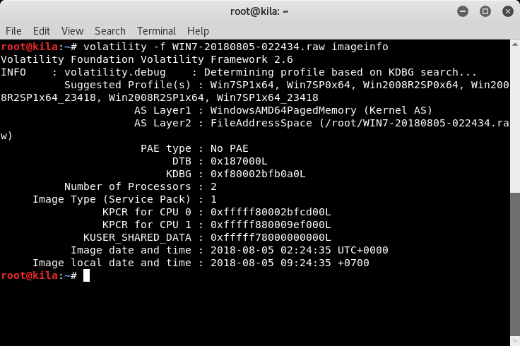
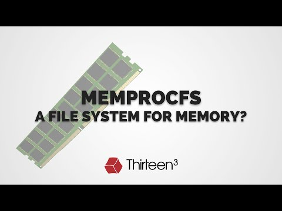

# Công cụ điều tra dữ liệu bộ nhớ

## Volatility

Volatility là một framework với rất nhiều plugins được dùng để phân tích và tìm kiếm thông tin từ chứng cứ thu được. Các plugins được viết để phân tích điều tra bộ nhớ theo kiến trúc của hệ điều hành windows.


Một số câu lệnh đáng chú ý của Volatility :

* malfind: câu lệnh này tìm code được tiêm vào trong 1 process (nếu được cung cấp processID cụ thể) hoặc cả hệ thống (nếu không có processID)
* vaddump : câu lệnh này sẽ đổ tất cả vùng nhớ vào 1 file riêng biệt
* dlldump: để đổ 1 file dll từ vùng nhớ của process lên ổ đĩa.
* dlllist: liệt kê tất cả mô-đun từ PEB(Process enviroment block)
* ldrmodules: liệt kê những mô-đun trong EPROCESS.
* HollowFind: là 1 plugin của Volatility framework dùng để phát hiện các vùng nhớ đáng ngờ

??? note "Hướng dẫn sử dụng Volatility"

    Để xử lý một tập tin RAM dump, ta phải phân tích xem nó là của OS nào bằng câu lệnh:
    `volatility -f <tập_tin_ram_dump.raw> imageinfo`

    

    Sau khi đã biết được profile của tập tin dump RAM này, ta sẽ liệt kê chi tiết về một tiến trình – mà cụ thể ở đây là notepad – kèm với kết hợp câu lệnh grep để lọc ra process muốn tìm.

    

    Sau khi tìm được kết quả như ý muốn, ta ghi nhớ lại số PID của tiến trình notepad trong tập tin dump RAM này. Sau đó, ta sẽ dump riêng process này ra để xem nội dung.

    

## VolUtility

VolUtility là Web interface của Volatility Memory Forensics Framework


Những tính năng chính của VolUtility:

* Chạy các plugin và lưu trữ kết quả trong cơ sở dữ liệu mongo. 
* Trích xuất các tệp từ plugin (hỗ trợ dump-dir) và lưu trữ trong cơ sở dữ liệu.
* Tìm kiếm trên tất cả các plugin và nội dung tệp bằng tìm kiếm strings và yara rules. 
* Cho phép làm việc trên nhiều memory dump trong một cơ sở dữ liệu.

??? note "Hướng dẫn sử dụng VolUtility"

    cd tới VolUtility folder, sau đó chạy câu lệnh sau:

    ```powershell
    ./manage.py runserver 0.0.0.0:8000
    ```
    Theo mặc định, 0.0.0.0 cho phép website có thể được truy cập từ bất kỳ thiết bị/giao diện mạng nào. Ta có thể thay đổi điều này bằng cách đặt 0.0.0.0 thành một địa chỉ cụ thể hoặc thành 127.0.0.1 chỉ để truy cập local. Cổng 8000 cũng có thể được thay đổi để phù hợp với nhu cầu của người dùng. 
    Sau khi bắt đầu, hãy truy cập trình duyệt tới địa chỉ `IP:Port`.

    

## Invtero.net

Tìm/Trích xuất tiến trình, hypervisors (bao gồm cả nested hypervisors) trong memory dumps sử dụng kỹ thuật vi kiến trúc Virtual Machine Introspection (WMI) độc lập. Công cụ hỗ trợ đa nền tảng, đa kiến trúc với khả năng xử lý bộ nhớ tốc độ cao.


Những tính năng chính của Invtero.net:

* VMWARE
* XEN
* Crash dump (PAGEDUMP64 / Blue Screen dump)
* Symbolic type extraction / binding
* DLR Scripting (Python)
* Linux cơ bản (Chủ yếu trên: BSD), HyperV, Windows,...

??? note "Hướng dẫn sử dụng Invtero.net"

    [Tải xuống công cụ tại đây](https://github.com/ShaneK2/inVtero.net/blob/master/quickdumps/publish.zip)

    Đăng ký msdia140.dll bằng câu lệnh 
    ```batch
    cmd /c regsvr32 msdia140.dll
    ```
    Sau đó chạy trực tiếp chương trình từ CLI, không cần cài đặt / cấu hình.

## KeeFarce

KeeFarce cho phép trích xuất thông tin cơ sở dữ liệu mật khẩu KeePass 2.x từ bộ nhớ. KeeFarce sử dụng kỹ thuật DLL injection để thực thi mã độc trong khi tiến trình KeePass đang chạy.


KeeFarce có thể thu thập thông tin dạng rõ(cleartext) và lưu dưới dạng CSV ở %AppData%: 

* Usernames
* Passwords
* Notes 
* Url

??? note "Hướng dẫn sử dụng KeeFarce"

    Cần lựa chọn bản build KeeFarce thích hợp tùy thuộc vào kiến ​​trúc của mục tiêu (32 bit hoặc 64 bit). Để chạy công cụ, các tệp sau cần nằm trong cùng một thư mục:

    * BootstrapDLL.dll
    * KeeFarce.exe
    * KeeFarceDLL.dll
    * Microsoft.Diagnostic.Runtime.dll

    Sao chép các tệp này vào máy mục tiêu và thực thi KeeFarce.exe

## MemProcFS

MemProcFS là công cụ hỗ trợ phân tích bộ nhớ vật lý dưới dạng tập tin hoặc ổ đĩa ảo.



Những tính năng chính của MemProcFS:

* Giám sát mọi gói tin trao đổi ra/vào máy chủ, trong đó cho phép phát hiện ảnh, các file dữ liệu và tài khoản đăng nhập.

??? note "Hướng dẫn sử dụng MemProcFS"

    * Mount memory dump dưới dạng ổ đĩa ảo M:
    `memprocfs.exe -device c:\temp\win10x64-dump.raw`
    * Mount memory dump dưới dạng ổ đĩa ảo M: ở chế độ verbose :
    `memprocfs.exe -device c:\temp\win10x64-dump.raw -v`
    * Mount memory dump dưới dạng ổ đĩa ảo M: và bắt đầu forensics mode:
    `memprocfs.exe -device c:\temp\win10x64-dump.raw -forensic 1`
    * Mount the memory dump file vào /home/pi/mnt/ trên Linux:
    `./memprocfs -mount /home/pi/linux -device /dumps/win10x64-dump.raw`
    * Mount memory dump dưới dạng ổ đĩa ảo S:
    `memprocfs.exe -mount s -device c:\temp\win10x64-dump.raw`
    * Mount bộ nhớ trực tiếp ở chế độ chỉ đọc - verbose, với DumpIt ở chế độ /LIVEKD:
    `DumpIt.exe /LIVEKD /A memprocfs.exe /C "-v"`
    * Mount bộ nhớ trực tiếp ở chế độ chỉ đọc, với WinPMEM driver:
    `memprocfs.exe -device pmem`
    * Mount bộ nhớ trực tiếp ở chế độ đọc/ghi, với thiết bị thu thập bộ nhớ PCILeech FPGA:
    `memprocfs.exe -device fpga -memmap auto`
    * Mount memory dump với tập tin page files tương ứng:
    `memprocfs.exe -device unknown-x64-dump.raw -pagefile0 pagefile.sys -pagefile1 swapfile.sys`

## Rekall

Rekall là một framework mã nguồn mở và miễn phí giúp triển khai các kỹ thuật phân tích tiên tiến với memory forensics và ứng cứu sự cố.
Rekall là một branch trong Volatility project được tạo ra module hoá code base, cải thiện hiệu suất và tăng khả năng sử dụng. 
Tính mô đun cho phép chức năng phân tích bộ nhớ vật lý được sử dụng trong [GRR](https://github.com/google/grr) để phân tích trực tiếp trong bộ nhớ từ xa.


Rekall hỗ trợ điều tra các bộ nhớ 32 bit và 64 bit sau:

* Microsoft Windows XP Service Pack 2 và 3
* Microsoft Windows 7 Service Pack 0 và 1
* Microsoft Windows 8 và 8.1
* Microsoft Windows 10
* Linux Kernels 2.6.24 tới hiện tại.
* OSX 10.7-10.12.x.

??? note "Hướng dẫn sử dụng Rekall"

    Rekall có sẵn dưới dạng python package có thể cài đặt thông qua pip package manager. Để cài đặt công cụ, trước tiên hãy tạo một virtal env, chuyển sang nó và sau đó cài đặt rekall:
    ```bash
    $ virtualenv  /tmp/MyEnv
    New python executable in /tmp/MyEnv/bin/python
    Installing setuptools, pip...done.
    $ source /tmp/MyEnv/bin/activate
    $ pip install --upgrade setuptools pip wheel
    $ pip install rekall-agent rekall
    ```