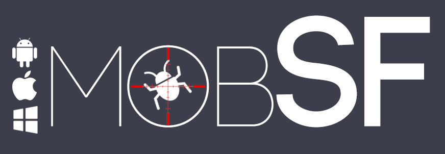
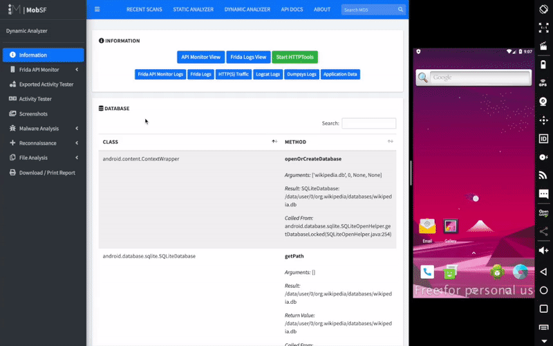
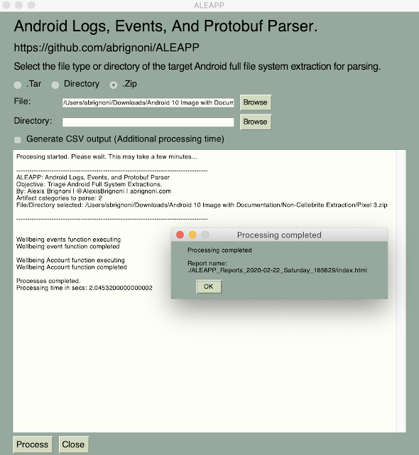
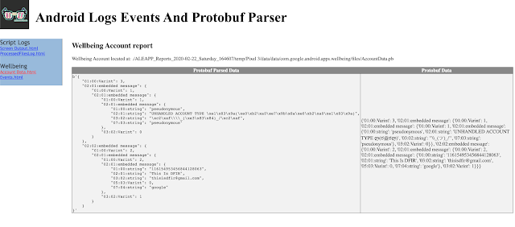
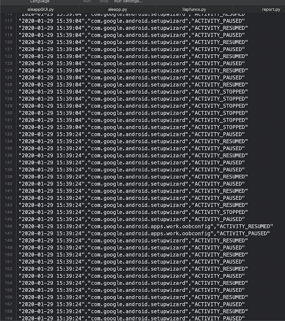

# Công cụ điều tra thiết bị di động

## MobSF

Mobile Security Framework (MobSF) là một công cụ phân tích phần mềm độc hại trên các hệ điều hành di động (IOS, Android, Windows) có khả năng thực hiện phân tích tĩnh và động.



Các tính năng chính của MobSF:

* Phân tích tĩnh - Android
* Phân tích tĩnh - Android dưới dạng Source Tree
* Phân tích tĩnh - iOS
* Phân tích động - Android APK
* Kiểm tra Web API

??? note "Hướng dẫn sử dụng MobSF"

    Để cài đặt công cụ:
    ```powershell
    git clone https://github.com/MobSF/Mobile-Security-Framework-MobSF.git
    cd Mobile-Security-Framework-MobSF
    setup.bat
    ```

    Để chạy công cụ:
    ```powershell
    run.bat 127.0.0.1:8000
    ```

    Phân tích tĩnh - Android

    

    Phân tích tĩnh - Android dưới dạng Source Tree

    

    Phân tích tĩnh - iOS

    

    Phân tích động - Android APK

    

    Kiểm tra Web API

    

## Andriller

Andriller là một bộ công cụ điều tra dành cho điện thoại. Công cụ này có thể thực hiện lấy dữ liệu trên hệ điều hành Android mà không ảnh hưởng đến thiết bị. Nó có thể xuất báo cáo dưới định dạng HTML và Excel.

Các tính năng chính của Andriller:

* Khai thác và giải mã dữ liệu.
* Trích xuất dữ liệu của thiết bị chưa root bằng Android Backup (Phiên bản Android 4.x).
* Trích xuất dữ liệu với quyền root: root adb deamon, chế độ khôi phục CWM hoặc SU (Superuser/SuperSU).
* Phân tích cú pháp và giải mã dữ liệu cho: Thư mục, tập tin Tarball (từ bản sao lưu nanddroid) và Sao lưu Android (tệp backup.ab).
* Giải mã cơ sở dữ liệu của ứng dụng Android. 
* Giải mã cơ sở dữ liệu WhatsApp được mã hóa (.crypt thành .crypt12, phải có *key* phù hợp).
* Bẻ khóa màn hình cho Pattern, mã PIN, Mật khẩu.
* Giải nén các tập tin sao lưu Android.
* Chụp màn hình hiển thị của thiết bị.

??? note "Hướng dẫn sử dụng Andriller"

    Yêu cầu của công cụ:

    ```
    Python 3.6-3.10 (64-bit)
    adb
    python3-tk
    ```

    [Ubuntu/Debian] Cài đặt từ terminal: `sudo apt-get install android-tools-adb python3-tk`

    [Mac] Cài đặt từ Homebrew: `brew install android-platform-tools`

    [Windows]: Đã bao gồm trong bộ công cụ.

    Cài đặt:

    Tạo một môi trường ảo bằng python3:

    ```powershell
    python3 -m venv env
    ```

    Kích hoạt môi trường ảo:

    Linux: `source env/bin/activate`
    Windows: `.\env\Scripts\activate`

    Cài đặt/Cập nhật Andriller với PIP:

    ```powershell
    pip install andriller -U
    ```

    Khởi động công cụ:

    ```powershell
    python -m andriller
    ```

## ALEAPP

ALEAPP là công cụ hỗ trợ phân tích Android Logs Events và Protobuf. Công cụ có thể phân tích ổ cứng logic, trích xuất tar và zip cũng như xuất báo cáo ở định dạng html và csv.



Các tính năng chính của ALEAPP:

* Hỗ trợ phân tích các sự kiện và tài khoản trong Wellbeing Android database
* Hỗ trợ phân tích sự kiện UsageStats dưới dạng XML và protobuf.

??? note "Hướng dẫn sử dụng ALEAPP"

    Yêu cầu hệ thống:

    ```
    Python 3.7.4 hoặc cao hơn
    pip install six
    pip install PySimpleGUI
    ```

    Thông tin tài khoản được trích xuất từ protobuf:

    

    Báo cáo sự kiện Wellbeing Android:

    

    Báo cáo CSV:

    

## iLEAPP

iLEAPP là công cụ phân tích Logs, Events và Plists. Hỗ trợ iOS/iPadOS 11, 12, 13 và 14. công cụ có thể phân tích trực tiếp từ tệp .tar/.zip đã nén hoặc thư mục đã giải nén hoặc thư mục sao lưu iTunes/Finder.

Các tính năng chính của iLEAPP:

* Logs cài đặt của thiết bị.
* Thông báo của iOS 12 và 13.
* Thông tin build (phiên bản iOS,...).
* Thông tin dịch vụ di động (IMEI, số điện thoại,...).
* Danh sách biểu tượng.
* Tên người dùng và máy tính mà thiết bị iOS đã kết nối.

??? note "Hướng dẫn sử dụng iLEAPP"

    Cài đặt môi trường: `py -m pip install -r requirements.txt`

    Với linux, ta cần cài đặt `tkinter`: `sudo apt-get install python3-tk`

    Chạy công cụ với Command line interface (CLI):

    ```bash
    $ python ileapp.py -t <zip | tar | fs | gz> -i <path_to_extraction> -o <path_for_report_output>
    ```

    Chạy công cụ với Graphical User Interface (GUI):

    ```bash
    $ python ileappGUI.py 
    ```

    Mở hướng dẫn:

    ```bash
    $ python ileapp.py --help
    ```