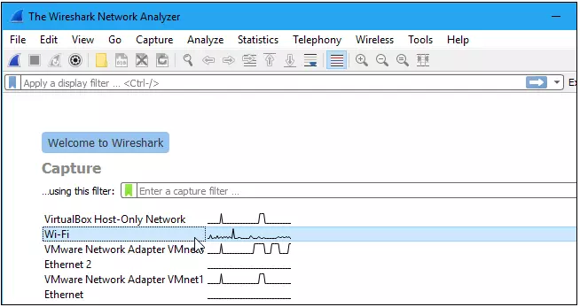
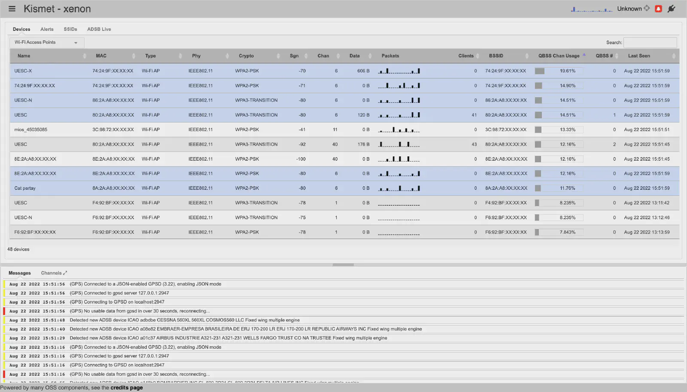

# Công cụ điều tra mạng

## Wireshark
Wireshark là một ứng dụng dùng để bắt (capture), phân tích và xác định các vấn đề liên quan đến network như: rớt gói tin, kết nối chậm, hoặc các truy cập bất thường. Phần mềm này cho phép quản trị viên hiểu sâu hơn các Network Packets đang chạy trên hệ thống, qua đó dễ dàng xác định các nguyên nhân chính xác gây ra lỗi.

Sử dụng WireShark có thể capture các packet trong thời gian thực (realtime), lưu trữ chúng lại và phân tích chúng offline. Ngoài ra, nó cũng bao gồm các filter, color coding và nhiều tính năng khác, cho phép người dùng tìm hiểu sâu hơn về lưu lượng mạng cũng như inspect (kiểm tra) các packets.

Ứng dụng được viết bằng ngôn ngữ C và hệ điều hành Cross-platform, ngoài ra hiện này gồm có các bản phân phối Linux, Windows, OS X, FreeBSD, NetBSD và OpenBSD. Đây là một phần mềm mã nguồn mở, được cấp phép GPL, và do đó miễn phí sử dụng, tự do chia sẻ và sửa đổi.


Các tính năng nổi bật của phần mềm bắt gói tin Wireshark:

* Hỗ trợ phân tích sâu hàng trăm giao thức và liên tục được cập nhật.
* Live capture và phân tích offline.
* Hoạt động đa nền tảng: Windows, Linux, MacOS, Solaris, FreeBSD, OpenBSD…
* Các gói tin đã capture có thể xem bằng giao diện hoặc sử dụng command line (tshark).
* Display filter mạnh mẽ.
* Hỗ trợ phân tích VoIP chuyên sâu.
* Hỗ trợ read/write nhiều định dạng: tcpdump (libpcap), Pcap NG, Catapult DCT2000, Cisco Secure IDS iplog, Microsoft Network Monitor, Network General Sniffer® (compressed and uncompressed), Sniffer® Pro, and NetXray®, Network Instruments Observer, NetScreen snoop, Novell LANalyzer, RADCOM WAN/LAN Analyzer, Shomiti/Finisar Surveyor, Tektronix K12xx, Visual Networks Visual UpTime, WildPackets EtherPeek/TokenPeek/AiroPeek …
* File capture được nén bằng gzip có thể được giải nén “on the fly”.
* Capture dữ liệu từ Ethernet, IEEE 802.11, PPP/HDLC, ATM, Bluetooth, USB, Token Ring, Frame Relay, FDDI …
* Hỗ trợ decryption của nhiều giao thức như: IPsec, ISAKMP, Kerberos, SNMPv3, SSL/TLS, WEP, and WPA/WPA2.
* Coloring rules cho phép thiết lập màu sắc cho các packet giúp phân tích nhanh và hiệu quả hơn.
* Output có thể export sang XML, PostScript®, CSV, hoặc plain text.

??? note "Hướng dẫn sử dụng Wireshark"

    Sau khi download và cài đặt, ta có thể khởi động nó bằng cách double-click vào tên của Network interface trong danh sách phía dưới “Capture” để bắt đầu bắt gói tin trên card mạng đó. Đường biểu diễn phía sau tên Interface thể hiện lưu lượng mạng đang sử dụng.

    > Ví dụ: Nếu muốn bắt gói tin trong mạng wifi, hãy double click vào “Wi-Fi” (hoặc “Wireless Interface”). Ngoài ra, chúng ta cũng có thể thiết lập các biểu thứ ở phần “…using this filter” để lọc và capture những packet chỉ định khi thỏa mãn yêu cầu.

    

    Sau đó, các packet sẽ bắt đầu hiển thị theo thời gian thực. Wireshark sẽ capture từng packet được gửi đến hoặc đi từ hệ thống của ta.

    Click vào nút “Stop” màu đỏ (ở góc trên bên trái của cửa sổ – hoặc chọn “Capture > Stop”) nếu muốn dừng việc capture lại.

    

    Ngoài cách bắt gói tin và sử dụng giao diện như trên, bạn cũng có thể dùng cách bắt gói tin bằng cách sử dụng command line được đề cập ở phần nâng cao phía dưới bài viết.

    Để mở gói tin bằng Wireshark, chọn “File > Open” và tìm đến đường dẫn của file cần mở.

    

    Để lưu gói tin đã capture, click vào “File > Save”, sau đó chọn dường dẫn để lưu trữ, đặt tên cho file capture và định dạng sẽ lưu.

## Brim

Brim hay còn được biết đến với tên ZUI là ứng dụng mã nguồn mở có thể được sủ dụng để phân tích lưu lượng mạng có cấu trúc.


??? note "Hướng dẫn sử dụng Brim"

    - Cài đặt Brim Security trên Ubuntu/Debian Desktop

    ```bash
    wget https://github.com/brimdata/zui/releases/download/v1.0.1/zui_1.0.1_amd64.deb
    apt install ./zui_1.0.1_amd64.deb -y
    ```

    - Cài đặt Brim trên trên CentOS/Rocky Linux/RHEL: Tương tự, tải xuống các tệp nhị phân RPM từ trang tải xuống;

    ```bash
    yum local install https://github.com/brimdata/zui/releases/download/v1.0.1/zui-1.0.1.x86_64.rpm
    ```

    Cài đặt Brim trên  Windows: Tải file cài đặt từ link và thực hiện cài đặt:

    ```
    https://github.com/brimdata/zui/releases/download/v1.0.1/Zui-Setup-1.0.1.exe
    ```

    Giao diện khởi chạy của Brim:

    

    Phân tích lưu lượng mạng với BRIM/ZUI

    Nhập tệp PCAP vào Brim để phân tích bằng cách kéo tệp vào Brim hoặc chỉ cần nhập bằng cách tải tệp lên trong khung “IMPORT FILES”

    

    Sau khi tải lên, Brim ngay lập tức bắt đầu xử lý tệp lưu lượng truy cập mạng bằng các công cụ ZEEK inbuild;

    

    Kết quả sau xử lí 
     
    

    Sau xử lí Brim đưa ra các trường thông tin như dns , stats , conn , freak , capture_loss v.v. Và alert là những nhật ký được tạo bằng quy tắc công cụ Suricata của Brim.
    Brim cũng cho phép hỗ trợ truy vấn log dựa trên các query:
     
    
  
## GoAccess

GoAccess là trình phân tích nhật ký web, có thể quan sát theo thời gian thực và trình xem tương tác mã nguồn mở chạy trong terminal trong các hệ thống..
Cung cấp số liệu thống kê HTTP nhanh chóng và có giá trị cho các quản trị viên hệ thống yêu cầu báo cáo máy chủ trực quan một cách nhanh chóng.


??? note "Hướng dẫn sử dụng GoAccess"

    Cài đặt:

    ```
    $ wget https://tar.goaccess.io/goaccess-1.7.2.tar.gz
    $ tar -xzvf goaccess-1.7.2.tar.gz
    $ cd goaccess-1.7.2/
    $ ./configure --enable-utf8 --enable-geoip=mmdb
    $ make
    # make install
    ```

    Để xuất ra thiết bị đầu cuối và tạo báo cáo tương tác:

    `goaccess access.log`

    Để tạo báo cáo HTML:

    `# goaccess access.log -a > report.html`

    Để tạo báo cáo JSON:

    `# goaccess access.log -a -d -o json > report.json`

    Để tạo tệp CSV:

    `# goaccess access.log --no-csv-summary -o csv > report.csv`

    Try vấn lọc dữ liệu dựa trên thời gian:

    ```
    # sed -n '/05\/Dec\/2010/,$ p' access.log | goaccess -a -
    # sed -n '/'$(date '+%d\/%b\/%Y' -d '1 week ago')'/,$ p' access.log | goaccess -a -
    # sed -n '/5\/Nov\/2010/,/5\/Dec\/2010/ p' access.log | goaccess -a -
    # goaccess access.log --keep-last=5
    ```

    Để phân tích các trang cụ thể, ví dụ: lượt xem trang, html, htm, phpv.v. trong một yêu cầu:

    `# awk '$7~/\.html|\.htm|\.php/' access.log | goaccess -`

    Phân tích mã trạng thái cụ thể, ví dụ: 500 (Lỗi Máy chủ Nội bộ):

    `# awk '$9~/500/' access.log | goaccess -`

    Hoặc nhiều mã trạng thái, ví dụ: tất cả 3xx và 5xx:

    `# tail -f -n +0 access.log | awk '$9~/3[0-9]{2}|5[0-9]{2}/' | goaccess -o out.html -`

    Và để có cái nhìn tổng quan ước tính về số lượng bot (trình thu thập thông tin) đang tấn công máy chủ:

    `# tail -F -n +0 access.log | grep -i --line-buffered 'bot' | goaccess -`

    Khi sử dụng, lưu ý cần cấu hình đúng các định dạng format theo logs cần đọc.
  
## Kismet

Kismet là công cụ dò tìm, nghe lén và phát hiện người dùng bất hợp pháp xâm nhập vào hệ thống mạng không dây. 

Kismet chủ yếu tập trung vào việc thu thập, đối chiếu và phân loại dữ liệu không dây. Logs do Kismet tạo có thể được đưa vào các công cụ khác (pcap, handshakes và các dữ liệu khác) như hashcat, aircrack, v.v.

Kismet có thể hoạt động cả headless như một hệ thống giám sát và Wireless IDS (WIDS) độc lập hoặc với giao diện trên web UI.

Kismet có thể chạy trên nhiều loại phần cứng, từ thiết bị rất nhỏ đến máy chủ lớn, tùy thuộc vào lượng lưu lượng truy cập dự định giám sát.


Những tính năng chính của Kismet:

  * Nghe lén gói tin, WIDS, wardriver và giám sát gói tin cho mạng Wi-Fi
  * Giám sát Bluetooth, BTLE
  * Nhiệt kế không dây, đồng hồ đo điện, Zigbee, v.v.

??? note "Hướng dẫn sử dụng Kismet"

    

    Cách đơn giản nhất để khởi động Kismet là mở terminal và chỉ cần chạy câu lệnh:

    `kismet`

    Câu lệnh này sẽ chạy Kismet với cấu hình mặc định. Kismet sẽ hiển thị thông tin về quá trình khởi động và các lỗi nếu có.

    ```bash
    dragorn@boron ~ % kismet -n --no-ncurses
    INFO: Including sub-config file: /usr/local/etc/kismet_httpd.conf
    INFO: Including sub-config file: /usr/local/etc/kismet_memory.conf
    INFO: Including sub-config file: /usr/local/etc/kismet_alerts.conf
    INFO: Including sub-config file: /usr/local/etc/kismet_80211.conf
    INFO: Including sub-config file: /usr/local/etc/kismet_logging.conf
    INFO: Including sub-config file: /usr/local/etc/kismet_filter.conf
    INFO: Including sub-config file: /usr/local/etc/kismet_uav.conf
    INFO: Loading config override file '/usr/local/etc/kismet_package.conf'
    INFO: Optional sub-config file not present: /usr/local/etc/kismet_package.conf
    INFO: Loading config override file '/usr/local/etc/kismet_site.conf'
    INFO: Optional sub-config file not present: /usr/local/etc/kismet_site.conf
    INFO: Setting server UUID DBC402AE-9B3E-11EC-88C2-4B49534D4554
    INFO: Starting Beast webserver on 0.0.0.0:2501
    INFO: Opened OUI file '/usr/local/share/kismet/kismet_manuf.txt.gz
    INFO: Indexing manufacturer db
    INFO: Completed indexing manufacturer db, 31466 lines 630 indexes
    INFO: Saving devices to the Kismet database log every 30 seconds.
    INFO: Using default rates of 10/min, 1/sec for alert 'DEVICEFOUND'
    INFO: Using default rates of 10/min, 1/sec for alert 'DEVICELOST'
    INFO: Registering support for DLT_PPI packet header decoding
    INFO: Registering support for DLT_RADIOTAP packet header decoding
    INFO: Registering support for DLT_BTLE_RADIO packet header decoding
    INFO: Using default rates of 10/min, 1/sec for alert 'BADFIXLENIE'
    INFO: PHY80211 will only process AP signal levels from beacons
    INFO: Allowing Kismet clients to view WEP keys
    INFO: Keeping EAPOL packets in memory for easy download and WIDS functionality; this can use more RAM.
    INFO: Registered PHY handler 'IEEE802.11' as ID 0
    INFO: Registered PHY handler 'RTL433' as ID 1
    INFO: Registered PHY handler 'Z-Wave' as ID 2
    INFO: Registered PHY handler 'Bluetooth' as ID 3
    INFO: Registered PHY handler 'UAV' as ID 4
    INFO: Registered PHY handler 'NrfMousejack' as ID 5
    INFO: Using default rates of 10/min, 1/sec for alert 'BLEEDINGTOOTH'
    INFO: Registered PHY handler 'BTLE' as ID 6
    INFO: Registered PHY handler 'METER' as ID 7
    INFO: Indexing ADSB ICAO db
    INFO: Completed indexing ADSB ICAO db, 322278 lines 6446 indexes
    INFO: Registered PHY handler 'ADSB' as ID 8
    INFO: Registered PHY handler '802.15.4' as ID 9
    INFO: Registered PHY handler 'RADIATION' as ID 10
    INFO: Serving static file content from /usr/local/share/kismet/httpd/
    INFO: Enabling channel hopping by default on sources which support channel control.
    INFO: Setting default channel hop rate to 5/sec
    INFO: Enabling channel list splitting on sources which share the same list of channels
    INFO: Enabling channel list shuffling to optimize overlaps
    INFO: Sources will be re-opened if they encounter an error
    INFO: Saving datasources to the Kismet database log every 30 seconds.
    INFO: Launching remote capture server on 127.0.0.1 3501
    INFO: No data sources defined; Kismet will not capture anything until a source is added.
    ALERT: LOGDISABLED Logging has been disabled via the Kismet config files or the command line.  Pcap, database, and related logs will not be saved.
    INFO: Logging disabled, not enabling any log drivers.
    INFO: GPS track will be logged to the Kismet logfile
    INFO: Starting Kismet web server...
    INFO: HTTP server listening on 0.0.0.0:2501
    INFO: Could not open system plugin directory (/usr/local/lib/kismet/), skipping: No such file or directory
    INFO: Did not find a user plugin directory (/home/user/plugins/), skipping: No such file or directory
    ```

## NetworkMiner

NetworkMiner là công cụ giám sát mạng, mã nguồn mở dành cho hệ điều hành Window. Công cụ này cũng được hỗ trợ để cài đặt trên Linux, Mac OS X và FreeBSD. 

Có hai phiên bản miễn phí và trả phí, trong đó, phiên bản trả phí có tính năng cho phép tìm kiếm trực tuyến thông tin về địa chỉ IP mà máy chủ (cài networkminer) đang có kết nối tới.

Đối với hệ thống ICS/SCADA, nếu sử dụng các công cụ dò quét mạng để discover các thông tin về thì rất dễ tạo ra một cuộc tấn công DoS, làm ngưng trệ hoạt động của hệ thống đó. 

NetworkMiner thu thập thông tin mà không cần tạo ra lưu lượng dò quét mà thực hiện kỹ thuật “passive network sniffing” và “packet capturing”. Sau đó dựa trên các thông tin thu thập được, NetworkMiner sẽ phân tích để có được các thông tin về hệ thống ICS/SCADA.


Những tính năng chính của NetworkMiner:

* Giám sát mọi gói tin trao đổi ra/vào máy chủ, trong đó cho phép phát hiện ảnh, các file dữ liệu và tài khoản đăng nhập.
* Dữ liệu hiển thị trực quan
* Dung lượng nhẹ

??? note "Hướng dẫn sử dụng NetworkMiner"

    

    Tại tab Credentials của NetworkMiner có thể thu thập thông tin người dùng gồm tài khoản đăng nhập và mật khẩu, kể cả thông tin người dùng sử dụng cho các dịch vụ trực tuyến phổ biến như Gmail hay Facebook. 

    Tab Keyword cho phép tìm kiếm bằng các từ khóa. Các báo cáo cũng có thể được chuyển sang các tập tin HTML, TXT, Javascript,...

    Tab Anomalies giúp phát hiện các hiện tượng khả nghi và các sự cố có thể xảy ra đối với hệ thống mạng, giúp admin phòng tránh và xử lý kịp thời.