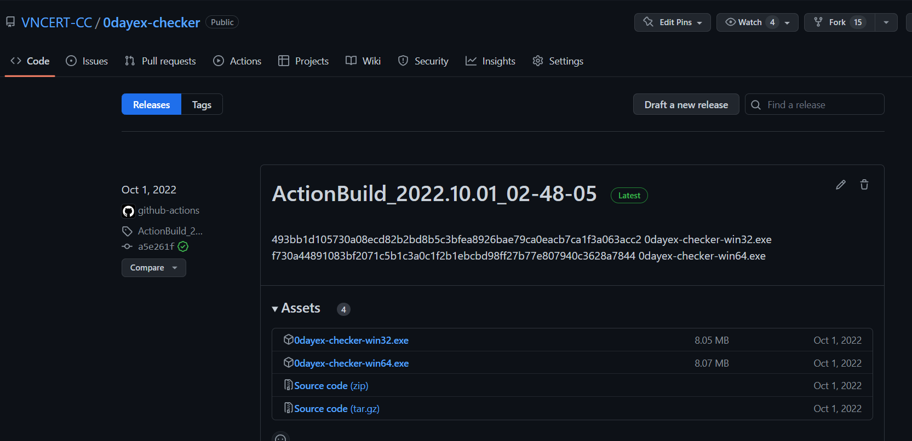

# Công cụ do VNCERT phát triển

## 0dayex-checker

0dayex-checker là công cụ kiểm tra lỗ hổng zeroday của Microsoft Exchange Server ([CVE-2022-41040](https://msrc.microsoft.com/update-guide/vulnerability/CVE-2022-41040) và [CVE-2022-41082](https://msrc.microsoft.com/update-guide/vulnerability/CVE-2022-41082)).

??? note "Hướng dẫn sử dụng 0dayex-checker"

    Tải xuống công cụ tại [Github](https://github.com/VNCERT-CC/0dayex-checker/releases):

    

    Chạy công cụ, nhập địa chỉ mail server vào ô đường dẫn và nhấn kiểm tra:

    