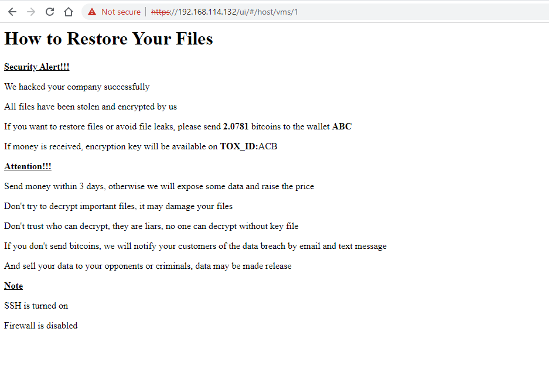
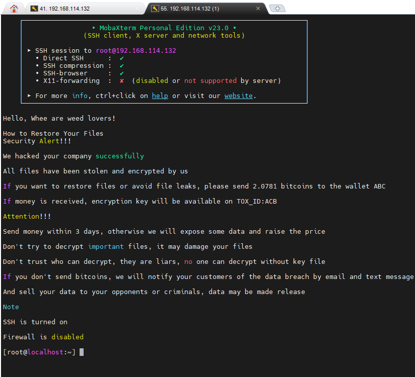
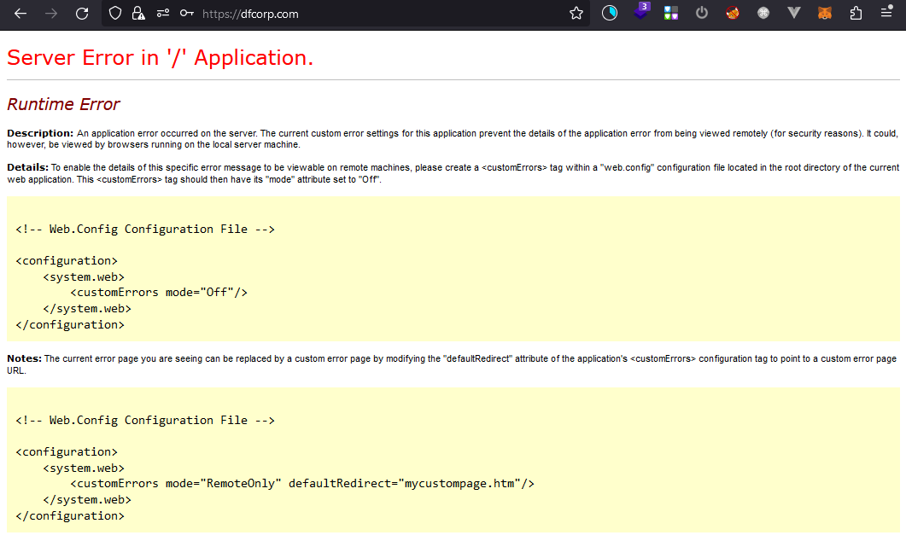

Giới thiệu chung

DFLab xây dựng một chuỗi kịch bản tấn công sát với thực tế và đưa ra các mẫu bằng chứng, tệp nhật ký,... cho các
chuyên gia ứng cứu, điều tra, phân tích sự cố giả định.

Sự cố được giả định tại một Công ty có tên DFCorp có trụ sở tại Việt Nam. Công ty có tên miền dfcorp.com và sử dụng
các máy chủ, được thiết kế và lắp đặt, kết nối theo sơ đồ sau:

Danh sách các dải mạng:
* DMZ: 10.0.9.0/24
* WZ: 10.0.8.0/24
* USERLAN: 10.0.10.0/24

Danh sách các thiết bị tham gia hệ thống mạng:
* Máy chủ ADDS (WZ): 10.0.8.2 cài đặt Windows Server 2019
* Máy chủ Database (WZ): 10.0.8.5 cài đặt
* Máy chủ MS Exchange (DMZ): 10.0.9.3 cài đặt Window Server 2019 và MS Exchange 2019
* Máy chủ IIS (DMZ): 10.0.9.4 cài đặt Windows Server 2019
* Máy chủ Firewall: 10.10.2.136 cài đặt pfSense
* Các nhân viên tham gia với dải mạng USERLAN
* Máy chủ IDS tham gia dải mạng USERLAN

Các máy chủ MS Exchange và IIS được NAT ra ngoài mạng internet và được proxy thông qua haproxy đã được bật header
x-forwarded-for.

Tình huống 1: Tấn công đào tiền ảo Chuyên gia

Cấp độ: Chuyên gia

Qua hệ thống giám sát IDS, đội ngũ quản trị, vận hành hệ thống phát hiện một cuộc tấn công tới hệ thống mạng, máy chủ
của DFCorp.
Quản trị viên nhanh chóng thực hiện các công việc sau:

1. Tiếp tục kiểm tra, theo dõi cuộc tấn công
2. Bật tcpdump và bắt các gói tin, lưu lượng truy cập trong mạng

Tuy nhiên, do năng lực hạn chế, đội ngũ quản trị đã không thể phát hiện sâu hơn các hành vi của kẻ tấn công.
Vài ngày sau đó, đội ngũ quản trị nhận được báo cáo từ người dùng rằng máy tính của họ cặp trục trặc, hay bị đơ, không
làm việc được.
Cùng thời gian đó, máy chủ Email của hệ thống hoạt động chập chờn, CPU luôn ở mức 99%.

Bạn, với vai trò là chuyên viên điều tra, ứng cứu sự cố, hãy giúp công ty DFCorp điều tra sự cố này.

Hình ảnh Máy chủ Email:

Hình ảnh Máy chủ ADDS:

Hình ảnh do người dùng cung cấp:

Câu hỏi

1. Kẻ tấn công đã sử dụng công cụ gì để rà quét hệ thống của DFCorp? IP của kẻ tấn công sử dụng để rà quét là gì?
2. Kẻ tấn công có phát hiện được lỗ hổng gì trong đợt rà quét đó không? Nếu có hãy chỉ ra lỗ hổng.
3. Kẻ tấn công đã tấn công qua email nào của hệ thống? Có thành công hay không?
4. Kẻ tấn công có lấy được dữ liệu quan trọng nào của DFCorp không?
5. Đường dẫn kẻ tấn công thực hiện để khai thác lỗ hổng và sử dụng shell? Kẻ tấn công có sử dụng shell thành công
hay không?
6. CnC server của kẻ tấn công là gì?
7. Quá trình mà kẻ tấn công thực hiện gây ra hậu quả như các hình ảnh trên.

Tệp đính kèm

1. [Tệp pcap khi phát hiện dấu hiệu tấn công (part
1)](https://github.com/VNCERT-CC/digital-forensics-lab-frontend/releases/download/challenge1/DFLab-challenge1-network1.zip.001)
2. [Tệp pcap khi phát hiện dấu hiệu tấn công (part
2)](https://github.com/VNCERT-CC/digital-forensics-lab-frontend/releases/download/challenge1/DFLab-challenge1-network1.zip.002)
3. [Tệp pcap
(tiếp)](https://github.com/VNCERT-CC/digital-forensics-lab-frontend/releases/download/challenge1/DFLab-challenge1-network2.pcap.gz)
4. [Tệp logs
ADDS](https://github.com/VNCERT-CC/digital-forensics-lab-frontend/releases/download/challenge1/DFLab-challenge1-Logs-ADDS.zip)
5. [Tệp logs
User](https://github.com/VNCERT-CC/digital-forensics-lab-frontend/releases/download/challenge1/DFLab-challenge1-Logs-User.zip)
6. [Tệp logs
Exchange](https://github.com/VNCERT-CC/digital-forensics-lab-frontend/releases/download/challenge1/DFLab-challenge1-Logs-EXCH01.zip)

Tình huống 2: Tấn công mã hóa máy ảo Chuyên viên

Cấp độ: Chuyên viên

Một máy chủ VMWare ESXi của Công ty đã bị tấn công, đội ngũ quản trị viên cũng không biết rõ cho tới khi kẻ tấn công
đã để lại lời nhắn cho Công ty, khi quản trị viên vào giao diện web:

Quản trị viên biết rằng có một cách khác để lấy lại các máy ảo mà không qua web, đó là SSH:

Sau một hồi khám phá, chúng tôi tìm được giao diện cũ của ESXi qua đường dẫn `/index1.html`:

Máy ảo này rất quan trọng với Công ty chúng tôi, hãy giúp chúng tôi khôi phục lại dữ liệu và tìm ra nguyên nhân.

Câu hỏi

1. Kẻ tấn công đã tấn công vào hệ thống của chúng tôi như thế nào?
2. Kẻ tấn công có lấy được dữ liệu gì quan trọng của Công ty không.
3. Kẻ tấn công đã làm gì khiến máy chủ ảo của chúng tôi không thể truy cập?
4. Bạn có thể khôi phục lại máy ảo giúp chúng tôi không?

Tệp đính kèm

1. [Tệp
pcap](https://github.com/VNCERT-CC/digital-forensics-lab-frontend/releases/download/challenge2/DFLab-challenge2-network.pcap)
2. [Tệp máy ảo ESXi (part
1)](https://github.com/VNCERT-CC/digital-forensics-lab-frontend/releases/download/challenge2/DFLab-challenge2-VMware.ESXi.6.x.7z.001)
3. [Tệp máy ảo ESXi (part
2)](https://github.com/VNCERT-CC/digital-forensics-lab-frontend/releases/download/challenge2/DFLab-challenge2-VMware.ESXi.6.x.7z.002)

Tình huống 3: Tấn công vào máy chủ web Chuyên viên

Cấp độ: Chuyên viên

Máy chủ website của chúng tôi đột nhiên bị lỗi, các dữ liệu quan trọng lưu trên database bất ngờ bị xóa, chúng tôi không thể truy cập vào website của mình được. Hãy giúp chúng tôi tìm ra nguyên nhân và khôi phục lại website này.

Câu hỏi

1. Thời gian xuất hiện tấn công nhiều nhất?
2. Kẻ tấn công đã tìm thấy bao nhiêu điểm yếu trên website?
3. Kẻ tấn công dùng cách gì để có thể thực thi được command trên server? Server nào đã bị kẻ tấn công kiểm soát?
4. Cho biết payload thực hiện của kẻ tấn công?
5. Kẻ tấn công dùng lệnh gì để thực hiện GET shell về hệ thống nhưng không thành công?
6. Bằng chứng nào cho thấy dữ liệu quan trọng trên website đã bị xoá? Kẻ tấn công có xóa thêm dữ liệu nào khác không?
7. Làm thế nào để chúng tôi có thể khôi phục được dịch vụ?

  

Tệp đính kèm

1. [Tệp access log](https://github.com/VNCERT-CC/digital-forensics-lab-frontend/releases/download/challenge3/DFLab-challenge3-access_log.zip)
2. [Tệp SQL Log)](https://github.com/VNCERT-CC/digital-forensics-lab-frontend/releases/download/challenge3/DFLab-challenge3-SQLLog.zip)
3. [Tệp bak](https://github.com/VNCERT-CC/digital-forensics-lab-frontend/releases/download/challenge3/DFLab-challenge3-bak.zip)

  

