<details close>
<summary class="h6">Công cụ do VNCERT phát triển</summary>

<details close>
  <summary>0dayex-checker</summary>

0dayex-checker là công cụ kiểm tra lỗ hổng zeroday của Microsoft Exchange Server ([CVE-2022-41040](https://msrc.microsoft.com/update-guide/vulnerability/CVE-2022-41040) và [CVE-2022-41082](https://msrc.microsoft.com/update-guide/vulnerability/CVE-2022-41082)).

<details open>
  <summary>Hướng dẫn sử dụng 0dayex-checker</summary>

Tải xuống công cụ tại [đây](https://github.com/VNCERT-CC/0dayex-checker/releases):

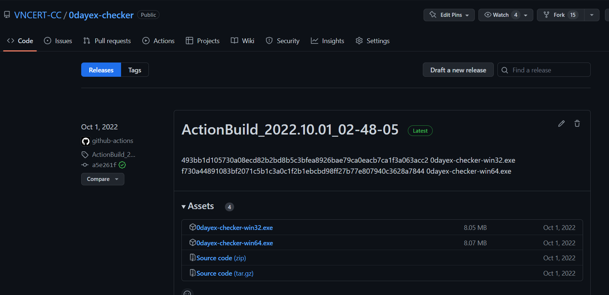

Chạy công cụ, nhập địa chỉ mail server vào ô đường dẫn và nhấn kiểm tra:


</details>
</details>

</details>

<details close>
<summary class="h6">Công cụ điều tra nhật ký sự kiện</summary>

<details close>
  <summary>Hayabusa</summary>

Hayabusa là một công cụ xử lý nhanh Windows Event Log, tạo timeline và tìm kiếm mối đe dọa do Yamato Security ở Nhật Bản phát triển. Nó được viết bằng Rust và hỗ trợ xử lý đa luồng. Hayabusa có thể chạy trên các hệ thống đang hoạt động để phân tích trực tiếp, bằng cách thu thập Event Logs từ một hoặc nhiều hệ thống để phân tích ngoại tuyến hoặc bằng cách chạy công cụ Hayabusa với Velociraptor để tìm kiếm mối đe dọa và ứng phó sự cố trên quy mô lớn. Báo cáo là một timeline trên CSV để dễ dàng phân tích trong Excel, Timeline Explorer, Elastic Stack, Timesketch, v.v...


Những chức năng chính của Hayabusa:

  * Săn lùng mối đe doạ trên quy mô doanh nghiệp trên nhiều nền tảng: Windows, Linux, MacOS,...
  * Tạo timeline dựa trên Windows Event Logs, hỗ trợ chuyển đổi Sigma rules thành Hayabusa rules.
  * Đánh giá, phân tích các kỹ thuật tấn công với MITRE ATT&CK Framework.
  * Phân tích trên Timeline Explorer, Elastic Stack, Excel,...

<details open>
  <summary>Hướng dẫn sử dụng Hayabusa</summary>

Tải xuống phiên bản mới nhất của Hayabusa tại [đây](https://github.com/Yamato-Security/hayabusa/releases).

Mở cửa sổ CMD/Powershell hoặc Windows Terminal, sau đó chạy tập tin thực thi.

Các option chính của Hayabusa:

```powershell
csv-timeline: Lưu timeline ở định dạng CSV.
json-timeline: Lưu timeline ở định dạng JSON/JSONL.
logon-summary: Xuất ra báo cáo tổng hợp về các lần logon trên hệ thống.
metrics: Xuất ra các chỉ số và tỉ lệ các sự kiện dựa trên Event ID.
pivot-keywords-list: Xuất ra các từ khoá nghi vấn cần điều tra
update-rules: Cập nhật tập luật từ Github.
level-tuning: Chỉnh sửa mức độ cảnh báo.
list-profiles: Hiển thị các output profiles có sẵn.
set-default-profile: Chỉnh sửa profile mặc định.
```

```powershell
Usage:
  hayabusa.exe help <COMMAND>
  hayabusa.exe <COMMAND> [OPTIONS]

Commands:
  csv-timeline         Save the timeline in CSV format
  json-timeline        Save the timeline in JSON/JSONL format
  logon-summary        Print a summary of successful and failed logons
  metrics              Print event ID metrics
  pivot-keywords-list  Create a list of pivot keywords
  update-rules         Update to the latest rules in the hayabusa-rules github repository
  level-tuning         Tune alert levels (default: ./rules/config/level_tuning.txt)
  set-default-profile  Set default output profile
  list-contributors    Print the list of contributors
  list-profiles        List the output profiles
  help                 Print this message or the help of the given subcommand(s)

Options:
      --no-color  Disable color output
  -q, --quiet     Quiet mode: do not display the launch banner
```

Khởi động phần mềm:

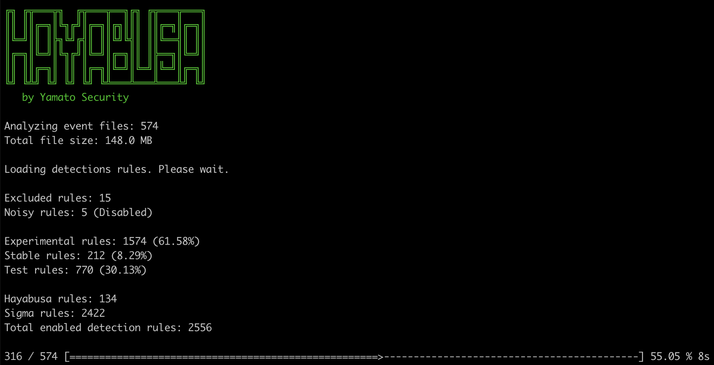

Tổng kết sau khi chạy công cụ:


Báo cáo HTML được xuất ra:

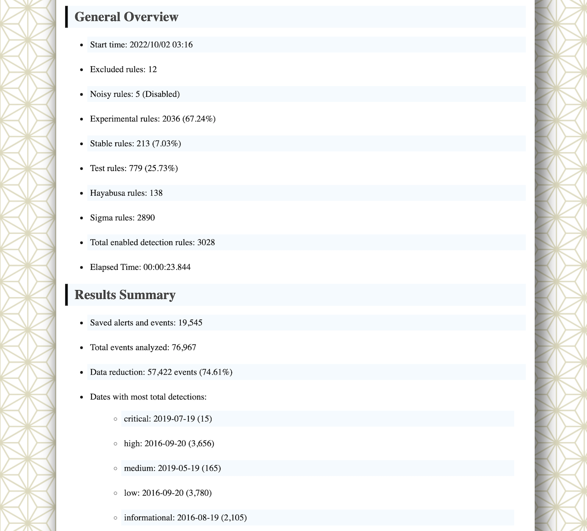

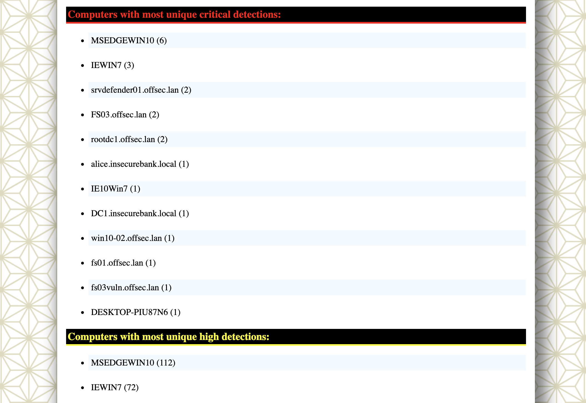


Phân tích với các công cụ:

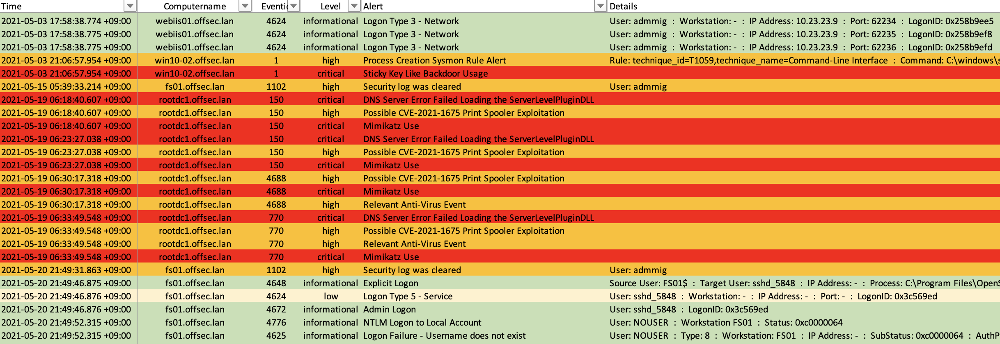

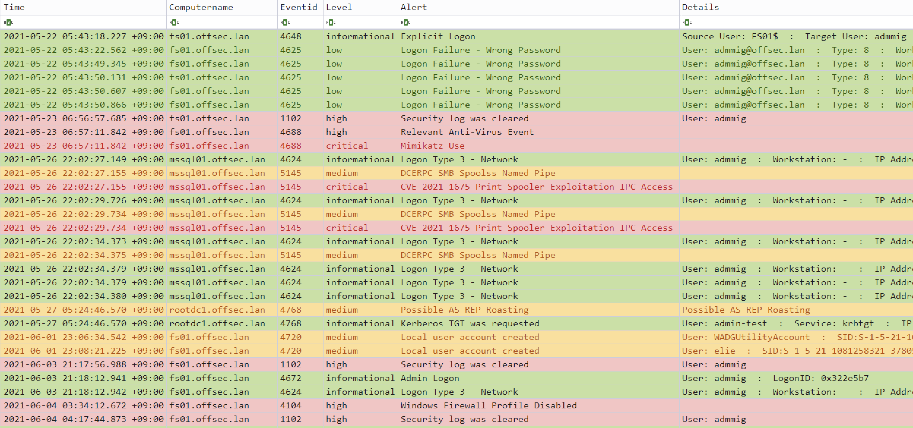

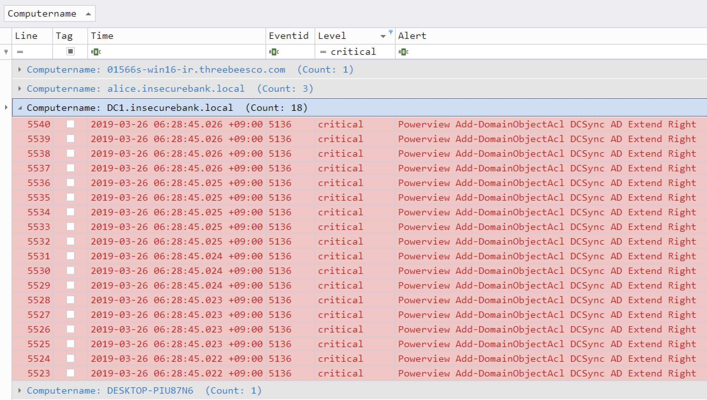


</details>
</details>


<details close>
  <summary>APT-Hunter</summary>

APT-Hunter là công cụ Threat Hunting dựa trên Event Log của windows được tạo với mindset của purple team để cung cấp khả năng phát hiện các tấn công APT ẩn trong rất nhiều windows event logs để giảm thời gian phát hiện hoạt động đáng ngờ.

Công cụ hoạt động mà không cần phải có giải pháp phức tạp để phân tích cú pháp và phát hiện các cuộc tấn công trong nhật ký sự kiện của windows như giải pháp SIEM và trình thu thập logs.


Những tính năng chính của APT-Hunter:

  * Phát hiện các hoạt động đáng ngờ nào mà ta không biết trước khi nó trở thành một sự cố lớn.
  * Phát hiện tấn công nhanh hơn, điều này sẽ làm giảm thời gian phản hồi để nhanh chóng ngăn chặn và loại bỏ các cuộc tấn công.
  * Báo cáo tương thích với timesketch để thực hiện phân tích dòng thời gian.
  * Điều tra nhiều máy chủ nhanh hơn trong khoảng thời gian ngắn.
  * Giúp ích cho điều tra viên trong những trường hợp không có nhiều thời gian để phân tích chuyên sâu.
  * Biến hàng triệu sự kiện thành hàng trăm sự kiện với mức độ nghiêm trọng có thể sử dụng làm bộ lọc.

<details open>
  <summary>Hướng dẫn sử dụng APT-Hunter</summary>

Điều đầu tiên cần làm trước khi sử dụng công cụ là thu thập Event Logs:

```powershell
# Để thu thập với định dạng EVTX, sử dụng script sau:
windows-log-collector-full-v3-EVTX.ps1 
# Để thu thập với định dạng CSV, sử dụng script sau: 
windows-log-collector-full-v3-CSV.ps1
```

Cài đặt các thư viện python cần thiết:
```powershell
python3 -m pip install -r Requirements.txt
```

```powershell
python3 APT-Hunter.py -h
usage: APT-Hunter.py [-h] [-p PATH] [-o OUT] [-t {csv,evtx}]
                     [--security SECURITY] [--system SYSTEM]
                     [--scheduledtask SCHEDULEDTASK] [--defender DEFENDER]
                     [--powershell POWERSHELL] [--powershellop POWERSHELLOP]
                     [--terminal TERMINAL] [--winrm WINRM] [--sysmon SYSMON]
 
optional arguments:
  -h, --help            show this help message and exit
  -p PATH, --path PATH  path to folder containing windows event logs generated by the APT-Hunter-Log-Collector.ps1
  -o OUT, --out OUT     output file name
  -t {csv,evtx}, --type {csv,evtx}
                        csv ( logs from get-eventlog or windows event log GUI
                        or logs from Get-WinEvent ) , evtx ( EVTX extension
                        windows event log )
  --security SECURITY   Path to Security Logs
  --system SYSTEM       Path to System Logs
  --scheduledtask SCHEDULEDTASK
                        Path to Scheduled Tasks Logs
  --defender DEFENDER   Path to Defender Logs
  --powershell POWERSHELL
                        Path to Powershell Logs
  --powershellop POWERSHELLOP
                        Path to Powershell Operational Logs
  --terminal TERMINAL   Path to TerminalServices LocalSessionManager Logs
  --winrm WINRM         Path to Winrm Logs
  --sysmon SYSMON       Path to Sysmon Logs
```
`-p`: địa chỉ trỏ đến thư mục chứa các Event Logs

`-o`: Tên của dự án

`-t`: Loại của log (ví dụ CSV hoặc EVTX)

Ví dụ:

```powershell
python3 APT-Hunter.py  -t evtx  -p /opt/wineventlogs/  -o Project1
 
python3 APT-Hunter.py  -t csv  -p /opt/wineventlogs/  -o Project1
 
python3 APT-Hunter.py  -t evtx  --security evtx/security.evtx -o Project2
```

</details>
</details>


<details close>
  <summary>LogonTracer</summary>

LogonTracer là một công cụ để điều tra các lần đăng nhập bằng cách trực quan hóa và phân tích nhật ký sự kiện Windows Active Directory. Công cụ này liên kết tên máy chủ (hoặc địa chỉ IP) và tên tài khoản được tìm thấy trong các sự kiện liên quan đến đăng nhập và hiển thị dưới dạng biểu đồ. Bằng cách này, có thể biết nỗ lực đăng nhập tài khoản nào xảy ra và máy chủ nào được sử dụng.

Những sự kiện mà LogonTracer hỗ trợ:

  * 4624: Đăng nhập thành công
  * 4625: Đăng nhập thất bại
  * 4768: Kerberos Authentication (TGT Request)
  * 4769: Kerberos Service Ticket (ST Request)
  * 4776: Xác thực NTLM
  * 4672: Đăng nhập với quyền đặc biệt

<details open>
  <summary>Hướng dẫn sử dụng LogonTracer</summary>

Sử dụng câu lệnh sau để khởi động LogonTracer:

```bash
$ python3 logontracer.py -r -o [PORT] -u [USERNAME] -p [PASSWORD] -s [IP Address]
```

```bash
-r: Khởi chạy máy chủ web
-o: Cổng dịch vụ máy chủ web hoạt động (ví dụ: 8080)
-u: Tên người dùng (Mặc định là “neo4j”)
-p: Mật khẩu
-s: Địa chỉ IP của máy chủ web (ví dụ: localhost)
```

Truy cập http://[[Địa chỉ của LogonTracer]]:8080, sử dụng tài khoản từ câu lệnh phía trên:

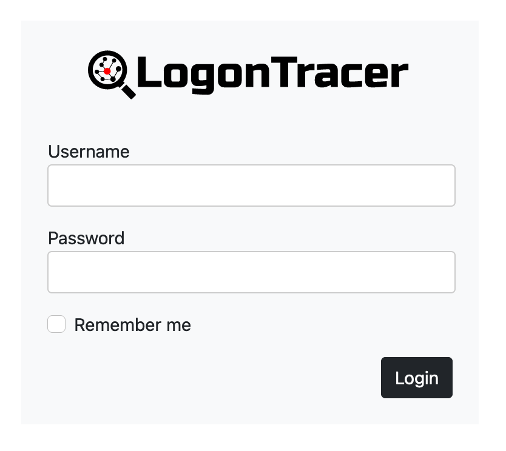

Upload evtx:


Sử dụng thanh điều hướng để tìm tên tài khoản, địa chỉ IP, event ID,...


Lọc thời gian:


</details>
</details>


<details close>
  <summary>Zircolite</summary>

Zircolite là công cụ viết bằng Python3, cho phép sử dụng SIGMA rules trên Windows Event Logs (định dạng EVTX và JSONL), Auditd và Sysmon với Linux.

Những chức năng chính của Zircolite:

  * Zircolite có thể được sử dụng trực tiếp trên endpoint được điều tra hoặc trong môi trường phân tích chuyên sâu / môi trường giả lập.
  * Nhanh và xử lý được lượng lớn dữ liệu cùng lúc
  * Sử dụng Sigma backend (SQLite)
  * Xuất kết quả sang nhiều định dạng khác nhau dựa trên các templates: JSON, CSV, JSONL, Splunk, Elastic, Zinc, Timesketch...

<details open>
  <summary>Hướng dẫn sử dụng Zircolite</summary>

Tải xuống công cụ tại [đây](https://github.com/wagga40/Zircolite), sau đó cài đặt các library với câu lệnh: `pip3 install -r requirements.txt`

Phân tích EVTX với bộ rule Windows Sysmon:

```powershell
# python3 zircolite.py --evtx <EVTX FOLDER or EVTX FILE> --ruleset <SIGMA RULESET> [--ruleset <OTHER RULESET>]
python3 zircolite.py --evtx sysmon.evtx --ruleset rules/rules_windows_sysmon.json
```

Phân tích Auditd / Sysmon cho Linux / JSONL hoặc NDJSON logs :

``` powershell
python3 zircolite.py --events auditd.log --ruleset rules/rules_linux.json --auditd
python3 zircolite.py --events sysmon.log --ruleset rules/rules_linux.json --sysmon4linux
python3 zircolite.py --events <JSON_FOLDER or JSON_FILE> --ruleset rules/rules_windows_sysmon.json --jsononly
```

Sử dụng miniGUI với option `--package`:


Timeline các sự kiện đã được phát hiện:


Ma trận MITRE ATT&CK:


</details>
</details>

<details close>
  <summary>AppCompatCacheParser</summary>
  
AppCompatCacheParser là công cụ phân tích AppCompatCache (ShimCache). Hỗ trợ xử lý các tập tin bị khóa.


<details open>
  <summary>Hướng dẫn sử dụng AppCompatCacheParser</summary>

Tải xuống công cụ tại [đây](https://ericzimmerman.github.io/#!index.md).

Mở cửa sổ CMD với quyền Administrator.

Chạy AppCompatCacheParser với cửa sổ dòng lệnh CMD vừa mở:

```powershell
AppCompatCache Parser version 1.4.4.0

Author: Eric Zimmerman (saericzimmerman@gmail.com)
https://github.com/EricZimmerman/AppCompatCacheParser

        c               The ControlSet to parse. Default is to extract all control sets.
        f               Full path to SYSTEM hive to process. If this option is not specified, the live Registry will be used
        t               Sorts last modified timestamps in descending order

        csv             Directory to save CSV formatted results to. Required
        csvf            File name to save CSV formatted results to. When present, overrides default name

        debug           Debug mode
        dt              The custom date/time format to use when displaying timestamps. See https://goo.gl/CNVq0k for options. Default is: yyyy-MM-dd HH:mm:ss
        nl              When true, ignore transaction log files for dirty hives. Default is FALSE

Examples: AppCompatCacheParser.exe --csv c:\temp -t -c 2
          AppCompatCacheParser.exe --csv c:\temp --csvf results.csv

          Short options (single letter) are prefixed with a single dash. Long commands are prefixed with two dashes
```

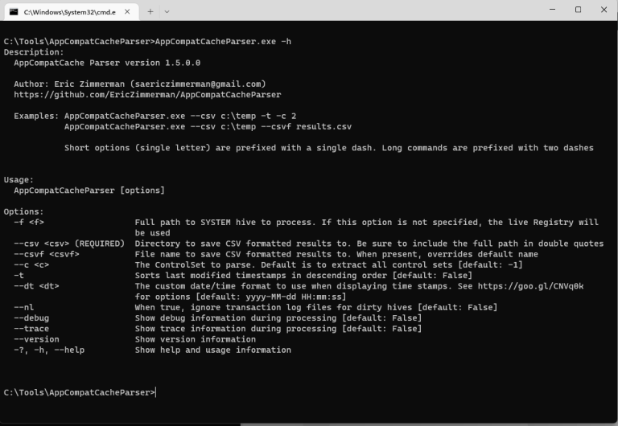

Để bắt đầu phân tích, ta sẽ chạy câu lệnh sau:

```powershell
AppCompatCacheParser.exe -f C:\temp\muldwych\Content\C\Windows\System32\config\SYSTEM –csv c:\temp –dt yyyy-MM-ddTHH:mm:ss
```

  * Chạy AppCompatCacheParser.exe
  * -f yêu cầu chương trình sử dụng tập tin tại đường dẫn sau nó, ở ví dụ là `C:\temp\muldwych\Content\C\Windows\System32\config\SYSTEM`
  * –csv yêu cầu công cụ xuất dưới đuôi csv và tại thư mục đã nêu, tức là `c:\temp`
  * –dt yêu cầu công cụ sử dụng định dạng ngày/giờ tùy chỉnh khi xử lý thời gian, trong ví dụ là `yyyy-MM-ddTHH:mm:ss`

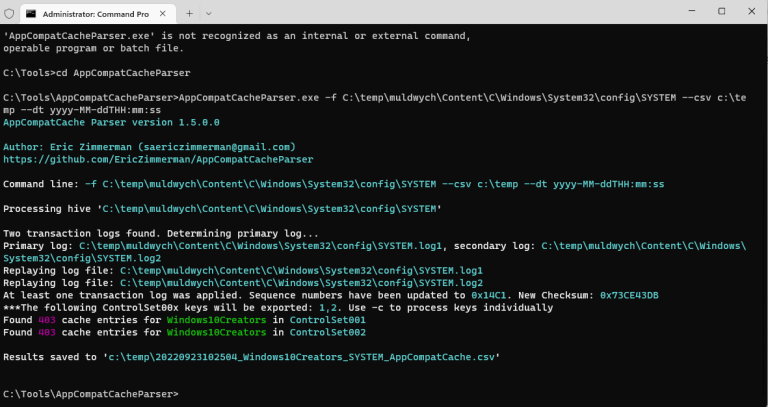

Sau đó chúng ta đã có tập tin csv để tiến hành điều tra chuyên sâu hơn:

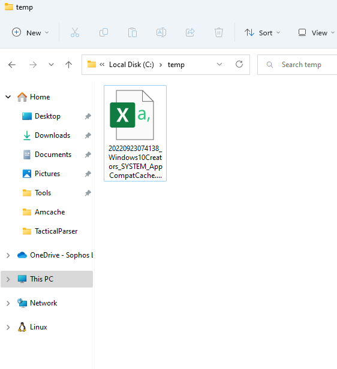

Chúng ta có thể sử dụng Timeline Explorer hoặc Excel để mở tập tin trên.

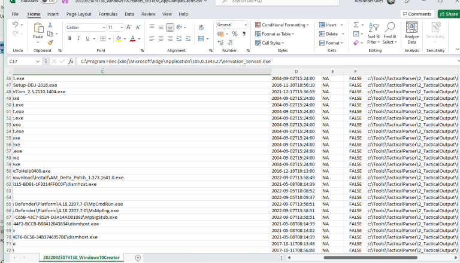


</details>
</details>

<details close>
  <summary>Chainsaw</summary>

Chainsaw là công cụ hỗ trợ phân tích và phát hiện dấu hiệu tấn công hệ thống thông qua các đặc trưng từ Windows, ví udj như Event Logs và MFT.  Chainsaw cung cấp một phương pháp tìm kiếm nhanh chóng thông qua từ khóa và xác định mối đe doạ dựa trên Sigma rules.


Những chức năng chính của Chainsaw:

  * Săn tìm mối đe doạ dựa trên Sigma rules và các rule tuỳ chỉnh từ Chaisaw
  * Tìm kiếm và trích xuất các dấu vết bằng khớp chuỗi và biểu thức chính quy (regex).
  * Được viết bằng Rust, dựa trên thư viện [EVTX parser](https://github.com/omerbenamram/evtx)
  * Xuất kết quả với nhiều định dạng khác nhau: ASCII table, định dạng CSV và định dạng JSON

<details open>
  <summary>Hướng dẫn sử dụng Chainsaw</summary>

Tải xuống Chainsaw từ mục [releases](https://github.com/countercept/chainsaw/releases)

```powershell
  USAGE:
      chainsaw search [FLAGS] [OPTIONS] <pattern> [--] [path]...

  FLAGS:
      -h, --help            Prints help information
      -i, --ignore-case     Ignore the case when searching patterns
          --json            Print the output in json format
          --load-unknown    Allow chainsaw to try and load files it cannot identify
          --local           Output the timestamp using the local machine's timestamp
      -q                    Supress informational output
          --skip-errors     Continue to search when an error is encountered
      -V, --version         Prints version information

  OPTIONS:
          --extension <extension>...    Only search through files with the provided extension
          --from <from>                 The timestamp to search from. Drops any documents older than the value provided
      -o, --output <output>             The path to output results to
      -e, --regex <pattern>...          A string or regular expression pattern to search for
      -t, --tau <tau>...                Tau expressions to search with. e.g. 'Event.System.EventID: =4104'
          --timestamp <timestamp>       The field that contains the timestamp
          --timezone <timezone>         Output the timestamp using the timezone provided
          --to <to>                     The timestamp to search up to. Drops any documents newer than the value provided

  ARGS:
      <pattern>    A string or regular expression pattern to search for. Not used when -e or -t is specified
      <path>...    The paths containing event logs to load and hunt through
```

Tìm kiếm tất cả chuỗi "mimikatz" không phân biệt hoa thường:

```bash
./chainsaw search mimikatz -i evtx_attack_samples/
```

Tìm kiếm tất cả sự kiện đăng nhập với regex, xuất dưới dạng JSON:

```bash
./chainsaw search -e "DC[0-9].insecurebank.local" evtx_attack_samples --json
```

Tìm kiếm tất cả các tập tin evtx bằng Sigma rules để phát hiện tấn công:

```powershell
  $ ./chainsaw hunt -r rules/ evtx_attack_samples -s sigma/rules --mapping mappings/sigma-event-logs-all.yml --level critical

   ██████╗██╗  ██╗ █████╗ ██╗███╗   ██╗███████╗ █████╗ ██╗    ██╗
  ██╔════╝██║  ██║██╔══██╗██║████╗  ██║██╔════╝██╔══██╗██║    ██║
  ██║     ███████║███████║██║██╔██╗ ██║███████╗███████║██║ █╗ ██║
  ██║     ██╔══██║██╔══██║██║██║╚██╗██║╚════██║██╔══██║██║███╗██║
  ╚██████╗██║  ██║██║  ██║██║██║ ╚████║███████║██║  ██║╚███╔███╔╝
   ╚═════╝╚═╝  ╚═╝╚═╝  ╚═╝╚═╝╚═╝  ╚═══╝╚══════╝╚═╝  ╚═╝ ╚══╝╚══╝
      By Countercept (@FranticTyping, @AlexKornitzer)

  [+] Loading detection rules from: ../../rules/, /tmp/sigma/rules
  [+] Loaded 129 detection rules (198 not loaded)
  [+] Loading event logs from: ../../evtx_attack_samples (extensions: .evtx)
  [+] Loaded 268 EVTX files (37.5 MB)
  [+] Hunting: [========================================] 268/268

  [+] Group: Antivirus
  ┌─────────────────────┬────────────────────┬──────────┬───────────┬─────────────┬────────────────────────────────┬──────────────────────────────────┬────────────────────┐
  │      timestamp      │     detections     │ Event ID │ Record ID │  Computer   │          Threat Name           │           Threat Path            │        User        │
  ├─────────────────────┼────────────────────┼──────────┼───────────┼─────────────┼────────────────────────────────┼──────────────────────────────────┼────────────────────┤
  │ 2019-07-18 20:40:00 │ ‣ Windows Defender │ 1116     │ 37        │ MSEDGEWIN10 │ Trojan:PowerShell/Powersploit. │ file:_C:\AtomicRedTeam\atomic-   │ MSEDGEWIN10\IEUser │
  │                     │                    │          │           │             │ M                              │ red-team-master\atomics\T1056\   │                    │
  │                     │                    │          │           │             │                                │ Get-Keystrokes.ps1               │                    │
  ├─────────────────────┼────────────────────┼──────────┼───────────┼─────────────┼────────────────────────────────┼──────────────────────────────────┼────────────────────┤
  │ 2019-07-18 20:53:31 │ ‣ Windows Defender │ 1117     │ 106       │ MSEDGEWIN10 │ Trojan:XML/Exeselrun.gen!A     │ file:_C:\AtomicRedTeam\atomic-   │ MSEDGEWIN10\IEUser │
  │                     │                    │          │           │             │                                │ red-team-master\atomics\T1086\   │                    │
  │                     │                    │          │           │             │                                │ payloads\test.xsl                │                    │
  └─────────────────────┴────────────────────┴──────────┴───────────┴─────────────┴────────────────────────────────┴──────────────────────────────────┴────────────────────┘

  [+] Group: Log Tampering
  ┌─────────────────────┬───────────────────────────────┬──────────┬───────────┬────────────────────────────────┬───────────────┐
  │      timestamp      │          detections           │ Event ID │ Record ID │            Computer            │     User      │
  ├─────────────────────┼───────────────────────────────┼──────────┼───────────┼────────────────────────────────┼───────────────┤
  │ 2019-01-20 07:00:50 │ ‣ Security Audit Logs Cleared │ 1102     │ 32853     │ WIN-77LTAPHIQ1R.example.corp   │ Administrator │
  └─────────────────────┴───────────────────────────────┴──────────┴───────────┴────────────────────────────────┴───────────────┘

  [+] Group: Sigma
  ┌─────────────────────┬────────────────────────────────┬───────┬────────────────────────────────┬──────────┬───────────┬──────────────────────────┬──────────────────────────────────┐
  │      timestamp      │           detections           │ count │     Event.System.Provider      │ Event ID │ Record ID │         Computer         │            Event Data            │
  ├─────────────────────┼────────────────────────────────┼───────┼────────────────────────────────┼──────────┼───────────┼──────────────────────────┼──────────────────────────────────┤
  │ 2019-04-29 20:59:14 │ ‣ Malicious Named Pipe         │ 1     │ Microsoft-Windows-Sysmon       │ 18       │ 8046      │ IEWIN7                   │ ---                              │
  │                     │                                │       │                                │          │           │                          │ Image: System                    │
  │                     │                                │       │                                │          │           │                          │ PipeName: "\\46a676ab7f179e511   │
  │                     │                                │       │                                │          │           │                          │ e30dd2dc41bd388"                 │
  │                     │                                │       │                                │          │           │                          │ ProcessGuid: 365ABB72-D9C4-5CC   │
  │                     │                                │       │                                │          │           │                          │ 7-0000-0010EA030000              │
  │                     │                                │       │                                │          │           │                          │ ProcessId: 4                     │
  │                     │                                │       │                                │          │           │                          │ RuleName: ""                     │
  │                     │                                │       │                                │          │           │                          │ UtcTime: "2019-04-29 20:59:14.   │
  │                     │                                │       │                                │          │           │                          │ 430"                             │
  ├─────────────────────┼────────────────────────────────┼───────┼────────────────────────────────┼──────────┼───────────┼──────────────────────────┼──────────────────────────────────┤
  │ 2019-04-30 20:26:51 │ ‣ CobaltStrike Service         │ 1     │ Microsoft-Windows-Sysmon       │ 13       │ 9806      │ IEWIN7                   │ ---                              │
  │                     │ Installations in Registry      │       │                                │          │           │                          │ Details: "%%COMSPEC%% /b /c st   │
  │                     │                                │       │                                │          │           │                          │ art /b /min powershell.exe -no   │
  │                     │                                │       │                                │          │           │                          │ p -w hidden -noni -c \"if([Int   │
  │                     │                                │       │                                │          │           │                          │ Ptr]::Size -eq 4){$b='powershe   │
  │                     │                                │       │                                │          │           │                          │ ll.exe'}else{$b=$env:windir+'\   │
  │                     │                                │       │                                │          │           │                          │ \syswow64\\WindowsPowerShell\\   │
  │                     │                                │       │                                │          │           │                          │ v1.0\\powershell.exe'};$s=New-   │
  │                     │                                │       │                                │          │           │                          │ Object System.Diagnostics.Proc   │
  │                     │                                │       │                                │          │           │                          │ essStartInfo;$s.FileName=$b;$s   │
  │                     │                                │       │                                │          │           │                          │ .Arguments='-noni -nop -w hidd   │
  │                     │                                │       │                                │          │           │                          │ en -c &([scriptblock]::create(   │
  │                     │                                │       │                                │          │           │                          │ (New-Object IO.StreamReader(Ne   │
  │                     │                                │       │                                │          │           │                          │ w-Object IO.Compression.GzipSt   │
  │                     │                                │       │                                │          │           │                          │ ream((New-Object IO.MemoryStre   │
  │                     │                                │       │                                │          │           │                          │ am(,[Convert]::FromBase64Strin   │
  │                     │                                │       │                                │          │           │                          │ g(''H4sIAIuvyFwCA7VW+2/aSBD+OZ   │
  │                     │                                │       │                                │          │           │                          │ H6P1...                          │
  │                     │                                │       │                                │          │           │                          │ (use --full to show all content) │
  │                     │                                │       │                                │          │           │                          │ EventType: SetValue              │
  │                     │                                │       │                                │          │           │                          │ Image: "C:\\Windows\\system32\   │
  │                     │                                │       │                                │          │           │                          │ \services.exe"                   │
  │                     │                                │       │                                │          │           │                          │ ProcessGuid: 365ABB72-2586-5CC   │
  │                     │                                │       │                                │          │           │                          │ 9-0000-0010DC530000              │
  │                     │                                │       │                                │          │           │                          │ ProcessId: 460                   │
  │                     │                                │       │                                │          │           │                          │ RuleName: ""                     │
  │                     │                                │       │                                │          │           │                          │ TargetObject: "HKLM\\System\\C   │
  │                     │                                │       │                                │          │           │                          │ urrentControlSet\\services\\he   │
  │                     │                                │       │                                │          │           │                          │ llo\\ImagePath"                  │
  │                     │                                │       │                                │          │           │                          │ UtcTime: "2019-04-30 20:26:51.   │
  │                     │                                │       │                                │          │           │                          │ 934"                             │
  ├─────────────────────┼────────────────────────────────┼───────┼────────────────────────────────┼──────────┼───────────┼──────────────────────────┼──────────────────────────────────┤
  │ 2019-05-12 12:52:43 │ ‣ Meterpreter or Cobalt        │ 1     │ Service Control Manager        │ 7045     │ 10446     │ IEWIN7                   │ ---                              │
  │                     │ Strike Getsystem Service       │       │                                │          │           │                          │ AccountName: LocalSystem         │
  │                     │ Installation                   │       │                                │          │           │                          │ ImagePath: "%COMSPEC% /c ping    │
  │                     │                                │       │                                │          │           │                          │ -n 1 127.0.0.1 >nul && echo 'W   │
  │                     │                                │       │                                │          │           │                          │ inPwnage' > \\\\.\\pipe\\WinPw   │
  │                     │                                │       │                                │          │           │                          │ nagePipe"                        │
  │                     │                                │       │                                │          │           │                          │ ServiceName: WinPwnage           │
  │                     │                                │       │                                │          │           │                          │ ServiceType: user mode service   │
  │                     │                                │       │                                │          │           │                          │ StartType: demand start          │
  ├─────────────────────┼────────────────────────────────┼───────┼────────────────────────────────┼──────────┼───────────┼──────────────────────────┼──────────────────────────────────┤
  │ 2019-06-21 07:35:37 │ ‣ Dumpert Process Dumper       │ 1     │ Microsoft-Windows-Sysmon       │ 11       │ 238375    │ alice.insecurebank.local │ ---                              │
  │                     │                                │       │                                │          │           │                          │ CreationUtcTime: "2019-06-21 0   │
  │                     │                                │       │                                │          │           │                          │ 6:53:03.227"                     │
  │                     │                                │       │                                │          │           │                          │ Image: "C:\\Users\\administrat   │
  │                     │                                │       │                                │          │           │                          │ or\\Desktop\\x64\\Outflank-Dum   │
  │                     │                                │       │                                │          │           │                          │ pert.exe"                        │
  │                     │                                │       │                                │          │           │                          │ ProcessGuid: ECAD0485-88C9-5D0   │
  │                     │                                │       │                                │          │           │                          │ C-0000-0010348C1D00              │
  │                     │                                │       │                                │          │           │                          │ ProcessId: 3572                  │
  │                     │                                │       │                                │          │           │                          │ RuleName: ""                     │
  │                     │                                │       │                                │          │           │                          │ TargetFilename: "C:\\Windows\\   │
  │                     │                                │       │                                │          │           │                          │ Temp\\dumpert.dmp"               │
  │                     │                                │       │                                │          │           │                          │ UtcTime: "2019-06-21 07:35:37.   │
  │                     │                                │       │                                │          │           │                          │ 324"                             │
  └─────────────────────┴────────────────────────────────┴───────┴────────────────────────────────┴──────────┴───────────┴──────────────────────────┴──────────────────────────────────┘
```

</details>
</details>

<details close>
  <summary>Event Log Observer</summary>

Event Log Observer là công cụ giúp nhanh chóng tìm và phân tích các cảnh báo bảo mật, sự cố và các sự kiện khác trong hệ điều hành Microsoft Windows. Với Event Log Observer, ta có thể trích xuất dữ liệu cần thiết bằng cú pháp truy vấn SQLite và nâng cao hiệu quả phân tích Event Logs.

Những chức năng chính của Event Log Observer:

  * Điều hướng dễ dàng và trực quan hóa dữ liệu
  * Sử dụng SQL để đọc event logs
  * Sử dụng cho nhiều loại log khác nhau
  * Hỗ trợ tìm kiếm thông tin nhanh chóng

<details open>
  <summary>Hướng dẫn sử dụng Event Log Observer</summary>

Tải xuóng công cụ: [Event Log Observer](https://lizard-labs.com/event_log_observer.aspx)

Giao diện Dashboard của Event Log Observer:

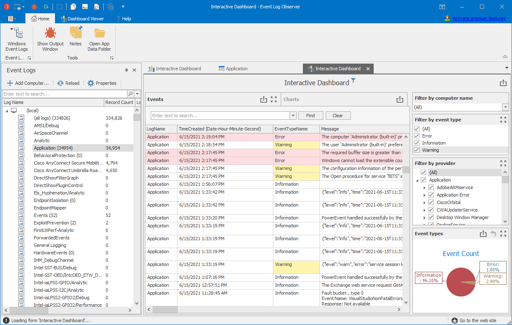

Tìm kiếm thông tin từ Event Log:


</details>
</details>

<details close>
  <summary> Log Parser Lizard</summary>

Công cụ truy vấn dữ liệu và phân tích Event log cho phép dễ dàng trích xuất thông tin có giá trị bằng sức mạnh của các lệnh truy vấn SQL. Với Log Parser Lizard, ta có thể dễ dàng phân tích các system hoặc application logs khác nhau, sau đó thực hiện các truy vấn SQL đối với chúng.

Những chức năng chính của  Log Parser Lizard:

  * Sử dụng truy vấn SQL để đọc log
  * Web API Server
  * Lọc dữ liệu và xử lý khối lượng log lớn
  * Xuất ra nhiều định dạng: XLS, XLSX, PDF, RTF, TXT, MHT, CSV, HTML,...

<details open>
  <summary>Hướng dẫn sử dụng  Log Parser Lizard</summary>

Sử dụng câu lệnh SQL để xử lý dữ liệu mà không cần lưu vào database:

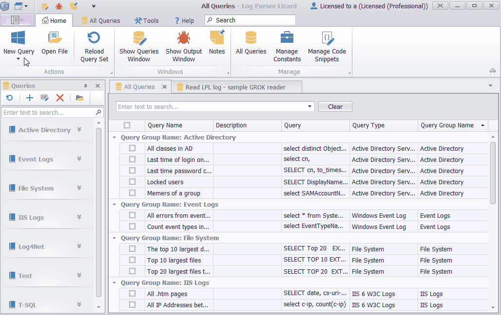

```SQL
SELECT DISTINCT src-ip FROM firewall.log WHERE action='DROP'

SELECT TOP 100 * FROM c:\webserver.log WHERE sc-status <> 200

SELECT cs-uri-stem FROM c:\InetPub\Logs\ex*.log
GROUP BY cs-uri-stem HAVING COUNT(*) > 50

SELECT to_lowercase(extract_extension(cs-uri-stem)) AS PageType, SUM(sc-bytes)
FROM ex131118.log, ex131119.log GROUP BY PageType 
```

</details>
</details>

</details>

<details close>
  <summary class="h6">Công cụ săn tìm mối đe doạ</summary>
  
  <details close>
    <summary>THOR Lite</summary>
  
  THOR Lite là một IOC và YARA scanner đa nền tảng, nhanh và linh hoạt. THOR Lite là phiên bản rút gọn và miễn phí của THOR.
  
  THOR Lite bao gồm module quét tập tin hệ thống cũng như các tiến trình và các chương trình "autorun" trên nhiều nền tảng.
  
  Những tính năng chính của THOR Lite:
  
    * Scanner miễn phí cho Windows, Linux and macOS
    * Bộ luật mã nguồn mở được biên dịch và mã hoá
    * Công cụ cập nhật để tải xuống phiên bản mới nhất
    * Quét với luật và IOC tự viết
    * Nhiều loại kết quả scan: tập tin text, SYSLOG (udp/tcp/tcp+tls), tập tin JSON, JSON thông qua Syslog
    * Hạn chế sử dụng CPU, không gây nghẽn hệ thống
  
  
  
  <details open>
    <summary>Hướng dẫn sử dụng THOR Lite</summary>
  
    * https://www.nextron-systems.com/thor-lite/
    * https://www.nextron-systems.com/download-thor-lite/
    * Đăng ký với email để tải xuống THOR Lite và license.
    * Giải nén thư mục, di chuyển nó tới vị trí cần thiết.
    * Di chuyển license vào thư mục thor10lite-win-pack.
    * Khởi động THOR bằng chương trình thor64-lite.exe và thor-lite.exe
  
  
  
  </details>
  </details>
  
  <details close>
    <summary>Fastfinder</summary>
  
  FastFinder là công cụ được tạo ra để tìm kiếm mối đe dọa (threat hunting), forensics trực tiếp trên nền tảng Windows và Linux. Nó tập trung vào liệt kê endpoint và tìm tập tin đáng ngờ dựa trên các tiêu chí khác nhau.
  
  
  
  Những chức năng chính của Fastfinder:
  
    * file path / name
    * md5 / sha1 / sha256 checksum
    * Chuỗi đơn giản
    * Điều kiện phức tạp dựa trên YARA
  
  <details open>
    <summary>Hướng dẫn sử dụng Fastfinder</summary>
  
  Tải file thực thi của công cụ tại [đây](https://github.com/codeyourweb/fastfinder/releases), sau đó chạy chương trình qua CLI bằng quyền user hoặc admin
  
  ```powershell
    ___       __  ___  ___         __   ___  __
   |__   /\  /__`  |  |__  | |\ | |  \ |__  |__)
   |    /~~\ .__/  |  |    | | \| |__/ |___ |  \
  
    2021-2022 | Jean-Pierre GARNIER | @codeyourweb
    https://github.com/codeyourweb/fastfinder  
  
  usage: fastfinder [-h|--help] [-c|--configuration "<value>"] [-b|--build
                    "<value>"] [-o|--output "<value>"] [-n|--no-window]
                    [-u|--no-userinterface] [-v|--verbosity <integer>]
                    [-t|--triage]
  
                    Incident Response - Fast suspicious file finder
  
  Arguments:
  
    -h  --help              Print help information
    -c  --configuration     Fastfind configuration file. Default:
    -b  --build             Output a standalone package with configuration and
                            rules in a single binary
    -o  --output            Save fastfinder logs in the specified file
    -n  --no-window         Hide fastfinder window
    -u  --no-userinterface  Hide advanced user interface
    -v  --verbosity         File log verbosity
                                   | 4: Only alert
                                   | 3: Alert and errors
                                   | 2: Alerts,errors and I/O operations
                                   | 1: Full verbosity)
                                  . Default: 3
    -t  --triage            Triage mode (infinite run - scan every new file in
                            the input path directories). Default: false
  ```
  
  </details>
  </details>
  
  <details close>
    <summary>Fenrir</summary>
  
  Fenrir là một bash script với vai trò là IOC Scanner đơn giản. Nó cho phép quét các hệ thống Linux/Unix/OSX để tìm các Indicators of Compromise (IOC).
  
  
  
  Những tính năng chính của Fenrir:
  
    * Bash Script
    * Không cần cài đặt agent hoặc phần mềm
    * Sử dụng công cụ phổ biến để trích xuất các nội dung thuộc tính (ví dụ md5sum, grep, stat ở nhiều chế độ khác nhau)
    * Có thể chạy trên mọi Linux / Unix / OS X với Bash
    * Sử dụng ít tài nguyên
    * Loại trừ thông minh (kích cỡ file, extension, các thư mục loại trừ) tăng tốc quá trình quét
  
  <details open>
    <summary>Hướng dẫn sử dụng Fenrir</summary>
  
  ```bash
  ./fenrir.sh "ĐỊA CHỈ THƯ MỤC"
  ```
  
  Tất cả các cài đặt có thể được định điều chỉnh trong header của script.
  
  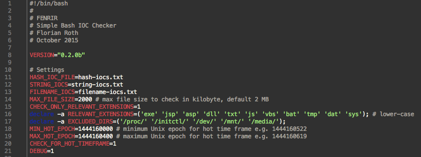
  
  </details>
  </details>
  
  <details close>
    <summary>Loki</summary>
    
  Fenrir là một IOC Scanner đơn giản dựa trên 4 nguyên tắc: tên tập tin, yara rule, kiểm tra hash, kiểm tra kết nối đến C2 Server.
  
  
  
  Những tính năng khác của Loki:
    * Kiểm tra tính nguyên vẹn của hệ thống (thông qua --reginfs)
    * Kiểm tra tiến trình bất thường (dựa trên [Sysforensics](http://goo.gl/P99QZQ))
    * Giải nén và quét SWF
    * Kiểm tra SAM dump
  
  <details open>
    <summary>Hướng dẫn sử dụng Loki</summary>
  
    * Tải xuống phiên bản mới nhất của LOKI tại [releases](https://github.com/Neo23x0/Loki/releases)
    * Giải nén bộ công cụ
    * Chạy loki-upgrader.exe trên hệ thống có kết nối internet để cập nhật các đặc trưng mới nhất 
    * Di chuyển bộ công cụ tới hệ thống mục tiêu cần quét: USB, ổ cứng di động, network share, copy thư mục tới máy mục tiêu,...
    * Mở cửa số "cmd.exe" với quyền Administrator và chạy LOKI từ đó (Ta có thể chạy LOKI mà không cần quyền Administrator nhưng một số kiểm tra sẽ bị tắt và một số mục tiêu quét sẽ không thể truy cập được)
  
  ```powershell
  usage: loki.py [-h] [-p path] [-s kilobyte] [-l log-file] [-r remote-loghost]
                 [-t remote-syslog-port] [-a alert-level] [-w warning-level]
                 [-n notice-level] [--allhds] [--alldrives] [--printall]
                 [--allreasons] [--noprocscan] [--nofilescan] [--vulnchecks]
                 [--nolevcheck] [--scriptanalysis] [--rootkit] [--noindicator]
                 [--dontwait] [--intense] [--csv] [--onlyrelevant] [--nolog]
                 [--update] [--debug] [--maxworkingset MAXWORKINGSET]
                 [--syslogtcp] [--logfolder log-folder] [--nopesieve]
                 [--pesieveshellc] [--nolisten]
                 [--excludeprocess EXCLUDEPROCESS] [--force]
  
  Loki - Simple IOC Scanner
  
  optional arguments:
    -h, --help            show this help message and exit
    -p path               Path to scan
    -s kilobyte           Maximum file size to check in KB (default 5000 KB)
    -l log-file           Log file
    -r remote-loghost     Remote syslog system
    -t remote-syslog-port
                          Remote syslog port
    -a alert-level        Alert score
    -w warning-level      Warning score
    -n notice-level       Notice score
    --allhds              Scan all local hard drives (Windows only)
    --alldrives           Scan all drives (including network drives and
                          removable media)
    --printall            Print all files that are scanned
    --allreasons          Print all reasons that caused the score
    --noprocscan          Skip the process scan
    --nofilescan          Skip the file scan
    --vulnchecks          Run the vulnerability checks
    --nolevcheck          Skip the Levenshtein distance check
    --scriptanalysis      Statistical analysis for scripts to detect obfuscated
                          code (beta)
    --rootkit             Skip the rootkit check
    --noindicator         Do not show a progress indicator
    --dontwait            Do not wait on exit
    --intense             Intense scan mode (also scan unknown file types and
                          all extensions)
    --csv                 Write CSV log format to STDOUT (machine processing)
    --onlyrelevant        Only print warnings or alerts
    --nolog               Don't write a local log file
    --update              Update the signatures from the "signature-base" sub
                          repository
    --debug               Debug output
    --maxworkingset MAXWORKINGSET
                          Maximum working set size of processes to scan (in MB,
                          default 100 MB)
    --syslogtcp           Use TCP instead of UDP for syslog logging
    --logfolder log-folder
                          Folder to use for logging when log file is not
                          specified
    --nopesieve           Do not perform pe-sieve scans
    --pesieveshellc       Perform pe-sieve shellcode scan
    --nolisten            Dot not show listening connections
    --excludeprocess EXCLUDEPROCESS
                          Specify an executable name to exclude from scans, can
                          be used multiple times
    --force               Force the scan on a certain folder (even if excluded
                          with hard exclude in LOKI's code
  ```
  
  </details>
  </details>
  
  <details close>
    <summary>recon</summary>
  
  recon là công cụ index metadata đa chức năng tập trung vào loại nội dung.
  
  Chúng ta có thể dùng recon như:
    * `find` với khả năng sử dụng các query phức tạp của SQL
    * Công cụ điều tra số: Tìm kiếm các tập tin khớp với điều kiện từ đơn giản đến phức tạp trên máy mục tiêu
    * Công cụ phát hiện và thu thập những phần mềm hoặc nội dung độc hại
  
  `$ DATABASE_URL=sqlite::memory: recon <..args..>`
  
  <details open>
    <summary>Hướng dẫn sử dụng recon</summary>
  
  Tạo một tập tin cấu hình chứa cá thông tin cần tìm kiếm:
  
  ```yaml
  # ...
    computed_fields:
      byte_type: true
      is_binary: true
      file_magic: true
      # crc32: true
      sha256: true
      sha512: true
      simhash: true
  ```
  
  Chỉ tìm tập tin binary:
  
  ```powershell
  recon -c config.yaml -q 'select path from files where is_binary = 1'
  ```
  
  Tạo danh sách chứa các thông tin của tập tin
  
  ```powershell
  recon -c config.yaml -q 'select path,sha256,sha512 from files'
  ```
  
  
  Xuất mọi thứ
  
  ```powershell
  recon -c config.yaml -q 'select * from files' --csv
  ```
  
  </details>
  </details>
  
  </details>  

<details close>
<summary class="h6">Công cụ điều tra thiết bị di động</summary>

<details close>
  <summary>MobSF</summary>

Mobile Security Framework (MobSF) là một công cụ phân tích phần mềm độc hại trên các hệ điều hành di động (IOS, Android, Windows) có khả năng thực hiện phân tích tĩnh và động.


Các tính năng chính của MobSF:
  * Phân tích tĩnh - Android
  * Phân tích tĩnh - Android dưới dạng Source Tree
  * Phân tích tĩnh - iOS
  * Phân tích động - Android APK
  * Kiểm tra Web API

<details open>
  <summary>Hướng dẫn sử dụng MobSF</summary>

Để cài đặt công cụ:
```powershell
git clone https://github.com/MobSF/Mobile-Security-Framework-MobSF.git
cd Mobile-Security-Framework-MobSF
setup.bat
```

Để chạy công cụ:
```powershell
run.bat 127.0.0.1:8000
```

Phân tích tĩnh - Android


Phân tích tĩnh - Android dưới dạng Source Tree


Phân tích tĩnh - iOS


Phân tích động - Android APK


Kiểm tra Web API

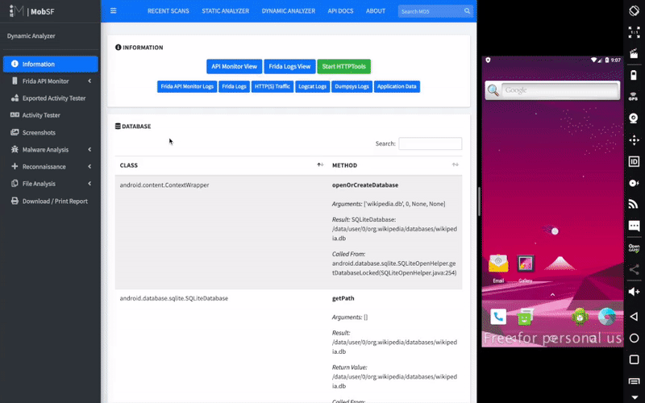

</details>
</details>

<details close>
  <summary>Andriller</summary>

Andriller là một bộ công cụ điều tra dành cho điện thoại. Công cụ này có thể thực hiện lấy dữ liệu trên hệ điều hành Android mà không ảnh hưởng đến thiết bị. Nó có thể xuất báo cáo dưới định dạng HTML và Excel.

Các tính năng chính của Andriller:
  * Khai thác và giải mã dữ liệu.
  * Trích xuất dữ liệu của thiết bị chưa root bằng Android Backup (Phiên bản Android 4.x).
  * Trích xuất dữ liệu với quyền root: root adb deamon, chế độ khôi phục CWM hoặc SU (Superuser/SuperSU).
  * Phân tích cú pháp và giải mã dữ liệu cho: Thư mục, tập tin Tarball (từ bản sao lưu nanddroid) và Sao lưu Android (tệp backup.ab).
  * Giải mã cơ sở dữ liệu của ứng dụng Android. 
  * Giải mã cơ sở dữ liệu WhatsApp được mã hóa (.crypt thành .crypt12, phải có *key* phù hợp).
  * Bẻ khóa màn hình cho Pattern, mã PIN, Mật khẩu.
  * Giải nén các tập tin sao lưu Android.
  * Chụp màn hình hiển thị của thiết bị.

<details open>
  <summary>Hướng dẫn sử dụng Andriller</summary>

Yêu cầu của công cụ:

```
Python 3.6-3.10 (64-bit)
adb
python3-tk
```

[Ubuntu/Debian] Cài đặt từ terminal: `sudo apt-get install android-tools-adb python3-tk`

[Mac] Cài đặt từ Homebrew: `brew install android-platform-tools`

[Windows]: Đã bao gồm trong bộ công cụ.

Cài đặt:

Tạo một môi trường ảo bằng python3:

```powershell
python3 -m venv env
```

Kích hoạt môi trường ảo:

Linux: `source env/bin/activate`
Windows: `.\env\Scripts\activate`

Cài đặt/Cập nhật Andriller với PIP:

```powershell
pip install andriller -U
```

Khởi động công cụ:

```powershell
python -m andriller
```

</details>
</details>

<details close>
  <summary>ALEAPP</summary>

ALEAPP là công cụ hỗ trợ phân tích Android Logs Events và Protobuf. Công cụ có thể phân tích ổ cứng logic, trích xuất tar và zip cũng như xuất báo cáo ở định dạng html và csv.

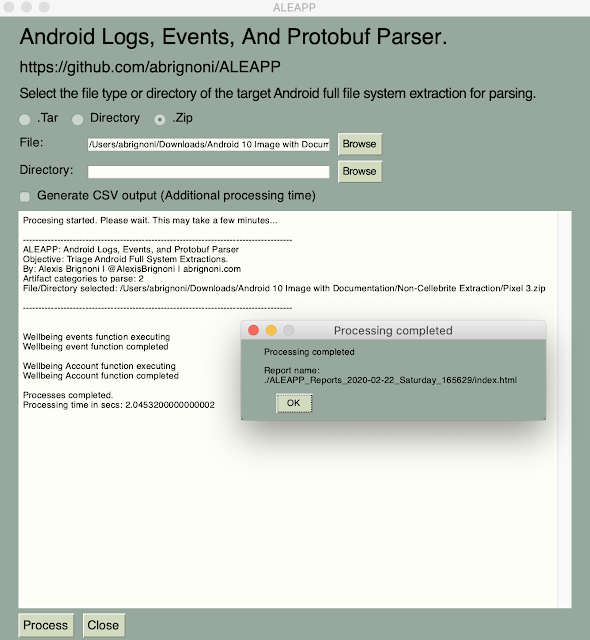

Các tính năng chính của ALEAPP:
  * Hỗ trợ phân tích các sự kiện và tài khoản trong Wellbeing Android database
  * Hỗ trợ phân tích sự kiện UsageStats dưới dạng XML và protobuf.

<details open>
  <summary>Hướng dẫn sử dụng ALEAPP</summary>

Yêu cầu hệ thống:

```
Python 3.7.4 hoặc cao hơn
pip install six
pip install PySimpleGUI
```

Thông tin tài khoản được trích xuất từ protobuf:

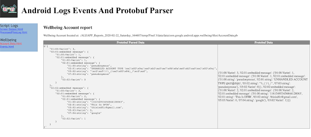

Báo cáo sự kiện Wellbeing Android:

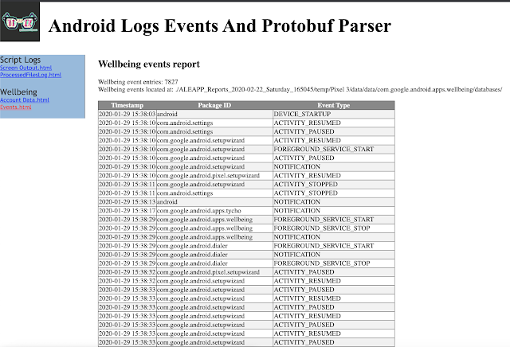

Báo cáo CSV:

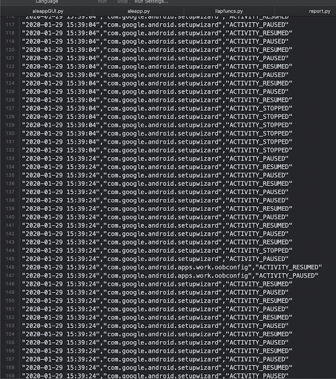

</details>
</details>

<details close>
  <summary>iLEAPP</summary>

iLEAPP là công cụ phân tích Logs, Events và Plists. Hỗ trợ iOS/iPadOS 11, 12, 13 và 14. công cụ có thể phân tích trực tiếp từ tệp .tar/.zip đã nén hoặc thư mục đã giải nén hoặc thư mục sao lưu iTunes/Finder.

Các tính năng chính của iLEAPP:
  * Logs cài đặt của thiết bị.
  * Thông báo của iOS 12 và 13.
  * Thông tin build (phiên bản iOS,...).
  * Thông tin dịch vụ di động (IMEI, số điện thoại,...).
  * Danh sách biểu tượng.
  * Tên người dùng và máy tính mà thiết bị iOS đã kết nối.

<details open>
  <summary>Hướng dẫn sử dụng iLEAPP</summary>

Cài đặt môi trường: `py -m pip install -r requirements.txt`

Với linux, ta cần cài đặt `tkinter`: `sudo apt-get install python3-tk`

Chạy công cụ với Command line interface (CLI):

```bash
$ python ileapp.py -t <zip | tar | fs | gz> -i <path_to_extraction> -o <path_for_report_output>
```

Chạy công cụ với Graphical User Interface (GUI):

```bash
$ python ileappGUI.py 
```

Mở hướng dẫn:

```bash
$ python ileapp.py --help
```

</details>
</details>

</details>

<details close>
<summary class="h6">Công cụ điều tra phương tiện lưu trữ</summary>

<details close>
  <summary>AccessData FTK Imager</summary>

FTK Imager là ứng dụng được phát triển bởi công ty AccessData. Đây là một trong những công ty cung cấp những công cụ phục vụ công tác Computer Forensics tốt nhất hiện này.

FTK Imager được gắn liền với sự phát triển của FTK (Forensic Toolkits) cũng được phát triển bởi AccessData. Hiểu đơn giản, FTK Imager có nhiệm vụ tạo tệp tin ảnh để phục vụ cho FTK phân tích được hiệu quả và nhanh chóng (Hiện nay FTK Imager đã bổ sung nhiều định dạng tệp tin phổ biến để tệp tin ảnh có thể được sử dụng trên nhiều ứng dụng Forensic khác).

FTK Imager có nhiệm vụ chính là tạo tệp tin ảnh, hay hiểu là tạo một tệp tin phản ánh chính xác từng bit (bit by bit) một phần hoặc toàn bộ bộ nhớ. Nguyên do phải tạo file ảnh là để đảm bảo tính nguyên vẹn của chứng cứ được thu thập theo thủ tục tố tụng hình sự. Không chỉ vậy, ứng dụng này còn có khả năng trích xuất dữ liệu trực tiếp từ RAM trên các hệ thống đang hoạt động (Live)

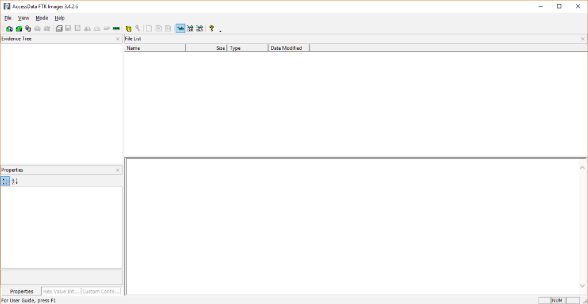

<details open>
  <summary>Hướng dẫn sử dụng AccessData FTK Imager</summary>

Chọn File – Add Evidence Item để lựa chọn nguồn tạo tệp tin ảnh:


Select Source


Tùy vào nguồn muốn tạo ảnh:

+ Physical Drive (ổ đĩa vật lý): Là các thiết bị lưu trữ dữ liệu điện tử như: Ổ cứng máy tính, ổ cứng thể răn, thẻ nhớ v.v…).

+ Logical Drive (ổ đĩa logic):Là các phân vùng dữ liệu được tạo ra từ các ổ đĩa vật lý

+ Image File (File ảnh): Là file ảnh đã được tạo sẵn thường được định dạng dưới dạng “.dd”, “.SMART”, “.E01”…

+ Contents of a Folder (nội dung trong Folder): Đây là trường hợp ta lựa chọn khi ta biết chính xác địa điểm ta cần phân tích, khi sử dụng lựa chọn này, FTK Imager yêu cầu ta điều hướng chọn vùng cần phân tích sau đó nó sẽ tự khoanh vùng để tiến hành tạo tệp tin ảnh vùng đó.

Trong phần này, ta chọn Physical Drive để tiến hành tạo tệp tin ảnh thiết bị lưu trữ:


Chọn Finish, FTK Imager sẽ đọc và hiển thị nội dung của thiết bị lưu trữ:


Chọn Export Logical image (AD1) như hình:

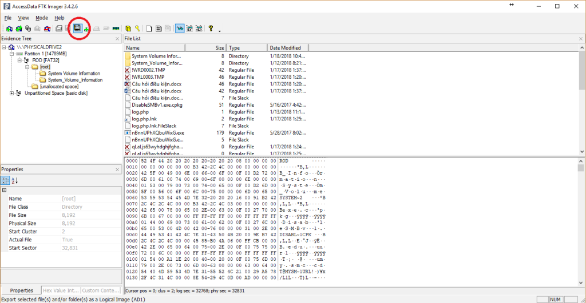

Chọn Add và điền các thông tin cần thiết.

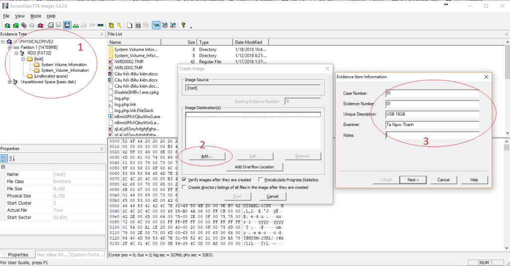

Chọn Next và thiết lập tên cũng như nơi lữu trữ tệp tin ảnh.


Có thể sử dụng chức năng nén hoặc mã hóa dữ liệu nếu cần. Chọn Finish và Start để bắt đầu tiến hành tạo tệp tin ảnh.

Sau khi tệp tin ảnh được tạo xong, cần kiểm tra lại các thông tin trong hộp thoại Drive/Image Verify Results. Nếu mã **MD5** và **SHA1** cho kết quả *Match*. Tệp tin ảnh đã được tạo thành công.

</details>
</details>

<details close>
<summary>Bitscout</summary>

Bitscout là một công cụ xây dựng Live OS có thể tùy chỉnh được viết bằng Bash. Mục đích chính của công cụ là giúp các chuyên gia bảo mật nhanh chóng tạo tập tin ảnh hỗ trợ điều tra từ xa của riêng mình.  Bitscout là công cụ mã nguồn mở và miễn phí.


Trong hầu hết các cuộc tấn công mạng, chủ sở hữu hợp pháp của các hệ thống bị xâm nhập là nạn nhân của những thủ phạm không xác định. Nạn nhân thường đồng ý hợp tác và giúp các nhà nghiên cứu bảo mật tìm ra cách thức lây nhiễm hoặc các chi tiết khác về kẻ tấn công. Tuy nhiên, các nhà nghiên cứu cho rằng việc di chuyển khoảng cách xa để thu thập các bằng chứng quan trọng như các mẫu phần mềm độc hại từ các máy tính bị nhiễm có thể dẫn đến các cuộc điều tra tốn kém và trì trệ. Càng mất nhiều thời gian để tìm hiểu về một cuộc tấn công thì càng mất nhiều thời gian hơn trước khi người dùng được bảo vệ và xác định được thủ phạm. Tuy nhiên, các phương án thay thế đều cần đến các công cụ đắt tiền và kiến thức về cách vận hành chúng hoặc nguy cơ lây nhiễm hay làm mất bằng chứng bằng việc di chuyển nó giữa các máy tính.

Để giải quyết vấn đề này, ông Vitaly Kamluk, Giám đốc Nhóm Nghiên cứu và Phân tích Toàn cầu của Kaspersky Lab ở Châu Á Thái Bình Dương (APAC) đã tạo ra một công cụ kĩ thuật số nguồn mở có thể thu thập từ xa các tài liệu pháp y quan trọng, thu được hình ảnh đĩa toàn bộ thông qua mạng hoặc lưu trữ đính kèm cục bộ, hoặc đơn giản là hỗ trợ từ xa trong việc xử lí sự cố phần mềm độc hại. Dữ liệu bằng chứng có thể được xem xét và phân tích từ xa hoặc cục bộ trong khi lưu trữ dữ liệu nguồn vẫn còn nguyên vẹn.

<details open>
  <summary>Hướng dẫn sử dụng Bitscout</summary>

1. Xây dựng tập tin ISO:

```bash
$ ./automake.sh
```
Sau khi chạy lệnh này, ta cần trả lời một số câu hỏi như vị trí của máy chủ VPN, loại tập tin, v.v.
Ngoài ra, ta có thể tải một trong những tập tin ISO dựng sẵn (chỉ dành cho việc thử nghiệm, không sử dụng trong môi trường thực tế ): https://bitscout-forensics.info/quick-try/prebuilt-images
2. Kiểm tra tập tin ISO vừa tạo:

```bash
$ ./autotest.sh
```
Lệnh này sẽ chạy thử nghiệm đối với tập tin ISO mới được tạo.  Nó kiểm tra của các thành phần trên tập tin ISO và chạy nó bằng cách sử dụng qemu để chắc chắn rằng tất cả các dịch vụ thiết yếu đang chạy.
</details>
</details>

<details close>
  <summary>FEX Imager</summary>

FEX Imager là công cụ thu thập hoặc băm tập tin ảnh của ổ đĩa cấp độ bit với xác thực hàm băm MD5, SHA1, SHA256. FEX Imager làm việc với ổ đĩa vật lý, ổ đĩa logic, thư mục và tệp, thiết bị từ xa (sử dụng servlet) hoặc lấy lại tập tin ảnh. Công cụ hỗ trợ các phương pháp không nén, nén nhanh, tốt hoặc tốt nhất với các tập tin ảnh:
  * DD/RAW
  * E01
  * L01

Những tính năng chính của FEX Imager:

  * Tạo ảnh từ ổ đĩa vật lý, logic, thư mục và tập tin.
  * Lấy lại các tập tin ảnh hiện có.
  * Hỗ trợ thu thập từ các thiết bị từ xa bằng servlet GetData Forensics.
  * Chuyển sang định dạng .E01 hoặc DD với hàm băm MD5, SHA1 hoặc SHA256.
  * Chuyển các thư mục và tệp sang định dạng L01 với hàm băm tệp MD5, SHA1 hoặc SHA256.
  * Tự động xác minh hàm băm sau khi tạo.
  * Thu thập toàn bộ thiết bị hoặc đặt vị trí sector bắt đầu và kết thúc.
  * Chia tập tin ảnh thành các đoạn tùy chỉnh không giới hạn kích thước.
  * Có thể điều chỉnh sector size để thu thập với 512, 2048 hoặc 4096 sector size.

<details open>
  <summary>Hướng dẫn sử dụng FEX Imager</summary>

Chọn thiết bị nguồn:

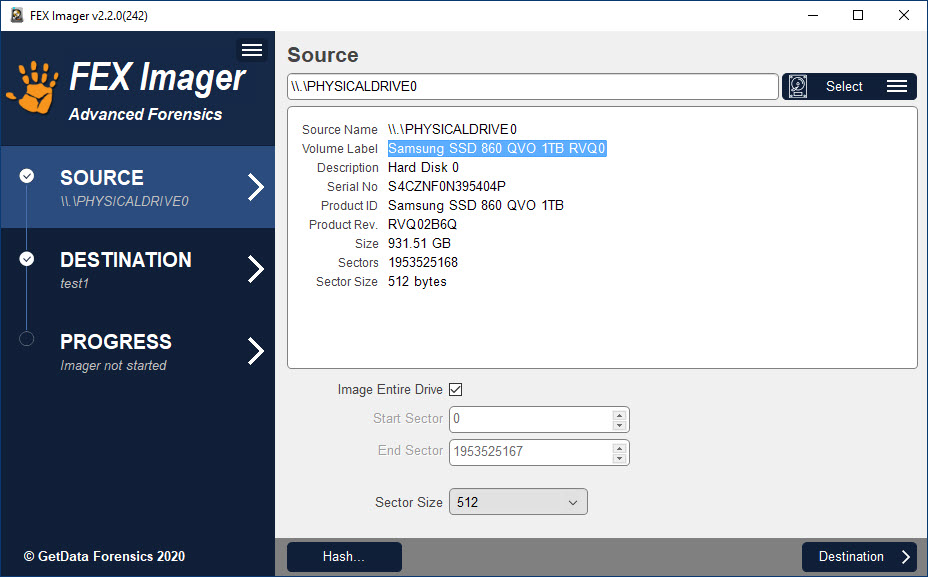

Chọn địa chỉ lưu tập tin ảnh và nhập thông tin:

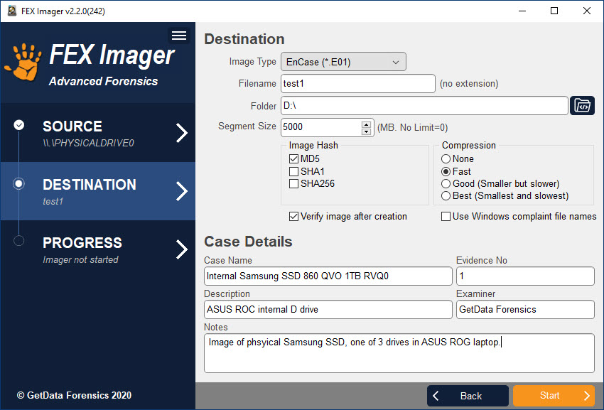

Thu thập và xác minh:


</details>
</details>

<details close>
  <summary>Guymager</summary>

Guymager là một công cụ tạo tập tin ảnh miễn phí để thu thập chứng cứ.

Những tính năng chính của Guymager:

  * Giao diện người dùng dễ sử dụng bằng nhiều ngôn ngữ khác nhau
  * Chạy trên Linux
  * Thực hiện nhanh và nén dữ liệu đa luồng
  * Sử dụng tất cả tài nguyên của máy tính.
  * Tạo tập tin dd, EWF (E01) và AFF, hỗ trợ sao chép đĩa
  * Miễn phí, mã nguồn mở hoàn toàn

<details open>
  <summary>Hướng dẫn sử dụng Guymager</summary>

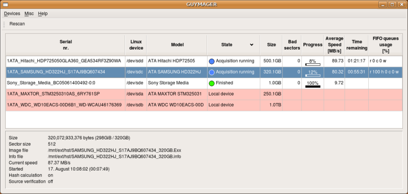 


  * Các thiết bị lưu trữ đã kết nối được liệt kê ở phần trên. Các thiết bị mới có thể được kết nối bất cứ lúc nào - nhấn nút Rescan để hiển thị.
  * Các thiết bị được đánh dấu bằng màu đỏ nhạt là các đĩa cứng cục bộ. Không thể tạo ảnh từ các ổ đĩa này để ngăn chặn việc chọn nhầm ổ đĩa. Đĩa cứng cục bộ được nhận dạng bằng số sê-ri có thể được cấu hình.
  * Phần bên dưới hiển thị thông tin chi tiết hơn về việc thu thập hiện được chọn.


</details>
</details>
</details>

<details close>
<summary class="h6">Công cụ điều tra dữ liệu bộ nhớ</summary>

<details close>
  <summary>Volatility</summary>

Volatility là một framework với rất nhiều plugins được dùng để phân tích và tìm kiếm thông tin từ chứng cứ thu được. Các plugins được viết để phân tích điều tra bộ nhớ theo kiến trúc của hệ điều hành windows.


Một số câu lệnh đáng chú ý của Volatility :

  * malfind: câu lệnh này tìm code được tiêm vào trong 1 process (nếu được cung cấp processID cụ thể) hoặc cả hệ thống (nếu không có processID)
  * vaddump : câu lệnh này sẽ đổ tất cả vùng nhớ vào 1 file riêng biệt
  * dlldump: để đổ 1 file dll từ vùng nhớ của process lên ổ đĩa.
  * dlllist: liệt kê tất cả mô-đun từ PEB(Process enviroment block)
  * ldrmodules: liệt kê những mô-đun trong EPROCESS.
  * HollowFind: là 1 plugin của Volatility framework dùng để phát hiện các vùng nhớ đáng ngờ

<details open>
  <summary>Hướng dẫn sử dụng Volatility</summary>

Để xử lý một tập tin RAM dump, ta phải phân tích xem nó là của OS nào bằng câu lệnh:
`volatility -f <tập_tin_ram_dump.raw> imageinfo`

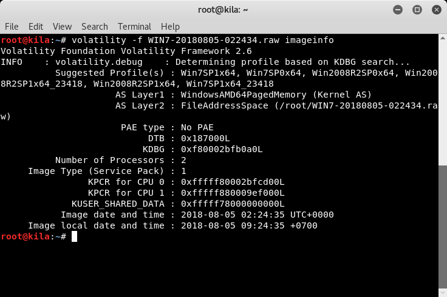

Sau khi đã biết được profile của tập tin dump RAM này, ta sẽ liệt kê chi tiết về một tiến trình – mà cụ thể ở đây là notepad – kèm với kết hợp câu lệnh grep để lọc ra process muốn tìm.


Sau khi tìm được kết quả như ý muốn, ta ghi nhớ lại số PID của tiến trình notepad trong tập tin dump RAM này. Sau đó, ta sẽ dump riêng process này ra để xem nội dung.

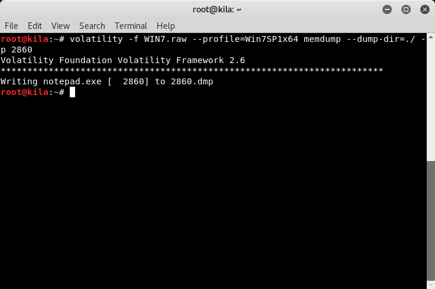

</details>
</details>

<details close>
  <summary>VolUtility</summary>

VolUtility là Web interface của Volatility Memory Forensics Framework


Những tính năng chính của VolUtility:
  * Chạy các plugin và lưu trữ kết quả trong cơ sở dữ liệu mongo. 
  * Trích xuất các tệp từ plugin (hỗ trợ dump-dir) và lưu trữ trong cơ sở dữ liệu.
  * Tìm kiếm trên tất cả các plugin và nội dung tệp bằng tìm kiếm strings và yara rules. 
  * Cho phép làm việc trên nhiều memory dump trong một cơ sở dữ liệu.

<details open>
  <summary>Hướng dẫn sử dụng VolUtility</summary>

cd tới VolUtility folder, sau đó chạy câu lệnh sau:

```powershell
./manage.py runserver 0.0.0.0:8000
```
Theo mặc định, 0.0.0.0 cho phép website có thể được truy cập từ bất kỳ thiết bị/giao diện mạng nào. Ta có thể thay đổi điều này bằng cách đặt 0.0.0.0 thành một địa chỉ cụ thể hoặc thành 127.0.0.1 chỉ để truy cập local. Cổng 8000 cũng có thể được thay đổi để phù hợp với nhu cầu của người dùng. 
Sau khi bắt đầu, hãy truy cập trình duyệt tới địa chỉ `IP:Port`.


</details>
</details>

<details close>
  <summary>Invtero.net</summary>

Tìm/Trích xuất tiến trình, hypervisors (bao gồm cả nested hypervisors) trong memory dumps sử dụng kỹ thuật vi kiến trúc Virtual Machine Introspection (WMI) độc lập. Công cụ hỗ trợ đa nền tảng, đa kiến trúc với khả năng xử lý bộ nhớ tốc độ cao.


Những tính năng chính của Invtero.net:

  * VMWARE
  * XEN
  * Crash dump (PAGEDUMP64 / Blue Screen dump)
  * Symbolic type extraction / binding
  * DLR Scripting (Python)
  * Linux cơ bản (Chủ yếu trên: BSD), HyperV, Windows,...

<details open>
  <summary>Hướng dẫn sử dụng Invtero.net</summary>

[Tải xuống công cụ tại đây](https://github.com/ShaneK2/inVtero.net/blob/master/quickdumps/publish.zip)

Đăng ký msdia140.dll bằng câu lệnh 
```batch
cmd /c regsvr32 msdia140.dll
```
Sau đó chạy trực tiếp chương trình từ CLI, không cần cài đặt / cấu hình.

</details>
</details>

<details close>
  <summary>KeeFarce</summary>

KeeFarce cho phép trích xuất thông tin cơ sở dữ liệu mật khẩu KeePass 2.x từ bộ nhớ. KeeFarce sử dụng kỹ thuật DLL injection để thực thi mã độc trong khi tiến trình KeePass đang chạy.


KeeFarce có thể thu thập thông tin dạng rõ(cleartext) và lưu dưới dạng CSV ở %AppData%: 
  * Usernames
  * Passwords
  * Notes 
  * Url


<details open>
  <summary>Hướng dẫn sử dụng KeeFarce</summary>

Cần lựa chọn bản build KeeFarce thích hợp tùy thuộc vào kiến ​​trúc của mục tiêu (32 bit hoặc 64 bit). Để chạy công cụ, các tệp sau cần nằm trong cùng một thư mục:

  * BootstrapDLL.dll
  * KeeFarce.exe
  * KeeFarceDLL.dll
  * Microsoft.Diagnostic.Runtime.dll

Sao chép các tệp này vào máy mục tiêu và thực thi KeeFarce.exe
</details>
</details>

<details close>
  <summary>MemProcFS</summary>

MemProcFS là công cụ hỗ trợ phân tích bộ nhớ vật lý dưới dạng tập tin hoặc ổ đĩa ảo.


Những tính năng chính của MemProcFS:

  * Giám sát mọi gói tin trao đổi ra/vào máy chủ, trong đó cho phép phát hiện ảnh, các file dữ liệu và tài khoản đăng nhập.

<details open>
  <summary>Hướng dẫn sử dụng MemProcFS</summary>

  * Mount memory dump dưới dạng ổ đĩa ảo M:
`memprocfs.exe -device c:\temp\win10x64-dump.raw`
  * Mount memory dump dưới dạng ổ đĩa ảo M: ở chế độ verbose :
`memprocfs.exe -device c:\temp\win10x64-dump.raw -v`
  * Mount memory dump dưới dạng ổ đĩa ảo M: và bắt đầu forensics mode:
`memprocfs.exe -device c:\temp\win10x64-dump.raw -forensic 1`
  * Mount the memory dump file vào /home/pi/mnt/ trên Linux:
`./memprocfs -mount /home/pi/linux -device /dumps/win10x64-dump.raw`
  * Mount memory dump dưới dạng ổ đĩa ảo S:
`memprocfs.exe -mount s -device c:\temp\win10x64-dump.raw`
  * Mount bộ nhớ trực tiếp ở chế độ chỉ đọc - verbose, với DumpIt ở chế độ /LIVEKD:
`DumpIt.exe /LIVEKD /A memprocfs.exe /C "-v"`
  * Mount bộ nhớ trực tiếp ở chế độ chỉ đọc, với WinPMEM driver:
`memprocfs.exe -device pmem`
  * Mount bộ nhớ trực tiếp ở chế độ đọc/ghi, với thiết bị thu thập bộ nhớ PCILeech FPGA:
`memprocfs.exe -device fpga -memmap auto`
  * Mount memory dump với tập tin page files tương ứng:
`memprocfs.exe -device unknown-x64-dump.raw -pagefile0 pagefile.sys -pagefile1 swapfile.sys`

</details>
</details>

<details close>
  <summary>Rekall</summary>

Rekall là một framework mã nguồn mở và miễn phí giúp triển khai các kỹ thuật phân tích tiên tiến với memory forensics và ứng cứu sự cố.
Rekall là một branch trong Volatility project được tạo ra module hoá code base, cải thiện hiệu suất và tăng khả năng sử dụng. 
Tính mô đun cho phép chức năng phân tích bộ nhớ vật lý được sử dụng trong [GRR](https://github.com/google/grr) để phân tích trực tiếp trong bộ nhớ từ xa.


Rekall hỗ trợ điều tra các bộ nhớ 32 bit và 64 bit sau:

  * Microsoft Windows XP Service Pack 2 và 3
  * Microsoft Windows 7 Service Pack 0 và 1
  * Microsoft Windows 8 và 8.1
  * Microsoft Windows 10
  * Linux Kernels 2.6.24 tới hiện tại.
  * OSX 10.7-10.12.x.

<details open>
  <summary>Hướng dẫn sử dụng Rekall</summary>

Rekall có sẵn dưới dạng python package có thể cài đặt thông qua pip package manager. Để cài đặt công cụ, trước tiên hãy tạo một virtal env, chuyển sang nó và sau đó cài đặt rekall:
```bash
$ virtualenv  /tmp/MyEnv
New python executable in /tmp/MyEnv/bin/python
Installing setuptools, pip...done.
$ source /tmp/MyEnv/bin/activate
$ pip install --upgrade setuptools pip wheel
$ pip install rekall-agent rekall
```
</details>
</details>

</details>

<details close>
<summary class="h6">Công cụ điều tra mạng</summary>

<details close>
  <summary>Wireshark</summary>
Wireshark là một ứng dụng dùng để bắt (capture), phân tích và xác định các vấn đề liên quan đến network như: rớt gói tin, kết nối chậm, hoặc các truy cập bất thường. Phần mềm này cho phép quản trị viên hiểu sâu hơn các Network Packets đang chạy trên hệ thống, qua đó dễ dàng xác định các nguyên nhân chính xác gây ra lỗi.

Sử dụng WireShark có thể capture các packet trong thời gian thực (realtime), lưu trữ chúng lại và phân tích chúng offline. Ngoài ra, nó cũng bao gồm các filter, color coding và nhiều tính năng khác, cho phép người dùng tìm hiểu sâu hơn về lưu lượng mạng cũng như inspect (kiểm tra) các packets.

Ứng dụng được viết bằng ngôn ngữ C và hệ điều hành Cross-platform, ngoài ra hiện này gồm có các bản phân phối Linux, Windows, OS X, FreeBSD, NetBSD và OpenBSD. Đây là một phần mềm mã nguồn mở, được cấp phép GPL, và do đó miễn phí sử dụng, tự do chia sẻ và sửa đổi.


Các tính năng nổi bật của phần mềm bắt gói tin Wireshark:

  * Hỗ trợ phân tích sâu hàng trăm giao thức và liên tục được cập nhật.
  * Live capture và phân tích offline.
  * Hoạt động đa nền tảng: Windows, Linux, MacOS, Solaris, FreeBSD, OpenBSD…
  * Các gói tin đã capture có thể xem bằng giao diện hoặc sử dụng command line (tshark).
  * Display filter mạnh mẽ.
  * Hỗ trợ phân tích VoIP chuyên sâu.
  * Hỗ trợ read/write nhiều định dạng: tcpdump (libpcap), Pcap NG, Catapult DCT2000, Cisco Secure IDS iplog, Microsoft Network Monitor, Network General Sniffer® (compressed and uncompressed), Sniffer® Pro, and NetXray®, Network Instruments Observer, NetScreen snoop, Novell LANalyzer, RADCOM WAN/LAN Analyzer, Shomiti/Finisar Surveyor, Tektronix K12xx, Visual Networks Visual UpTime, WildPackets EtherPeek/TokenPeek/AiroPeek …
  * File capture được nén bằng gzip có thể được giải nén “on the fly”.
  * Capture dữ liệu từ Ethernet, IEEE 802.11, PPP/HDLC, ATM, Bluetooth, USB, Token Ring, Frame Relay, FDDI …
  * Hỗ trợ decryption của nhiều giao thức như: IPsec, ISAKMP, Kerberos, SNMPv3, SSL/TLS, WEP, and WPA/WPA2.
  * Coloring rules cho phép thiết lập màu sắc cho các packet giúp phân tích nhanh và hiệu quả hơn.
  * Output có thể export sang XML, PostScript®, CSV, hoặc plain text.

<details open>
  <summary>Hướng dẫn sử dụng Wireshark</summary>

Sau khi download và cài đặt, ta có thể khởi động nó bằng cách double-click vào tên của Network interface trong danh sách phía dưới “Capture” để bắt đầu bắt gói tin trên card mạng đó. Đường biểu diễn phía sau tên Interface thể hiện lưu lượng mạng đang sử dụng.

> Ví dụ: Nếu muốn bắt gói tin trong mạng wifi, hãy double click vào “Wi-Fi” (hoặc “Wireless Interface”). Ngoài ra, chúng ta cũng có thể thiết lập các biểu thứ ở phần “…using this filter” để lọc và capture những packet chỉ định khi thỏa mãn yêu cầu.

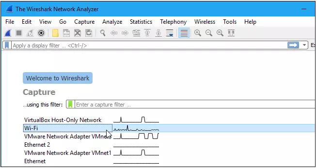

Sau đó, các packet sẽ bắt đầu hiển thị theo thời gian thực. Wireshark sẽ capture từng packet được gửi đến hoặc đi từ hệ thống của ta.

Click vào nút “Stop” màu đỏ (ở góc trên bên trái của cửa sổ – hoặc chọn “Capture > Stop”) nếu muốn dừng việc capture lại.

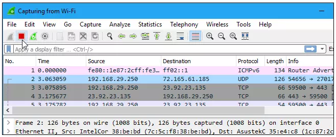

Ngoài cách bắt gói tin và sử dụng giao diện như trên, bạn cũng có thể dùng cách bắt gói tin bằng cách sử dụng command line được đề cập ở phần nâng cao phía dưới bài viết.

Để mở gói tin bằng Wireshark, chọn “File > Open” và tìm đến đường dẫn của file cần mở.


Để lưu gói tin đã capture, click vào “File > Save”, sau đó chọn dường dẫn để lưu trữ, đặt tên cho file capture và định dạng sẽ lưu.

</details>
</details>

<details close>
  <summary>Brim</summary>

Brim hay còn được biết đến với tên ZUI là ứng dụng mã nguồn mở có thể được sủ dụng để phân tích lưu lượng mạng có cấu trúc.


<details open>
  <summary>Hướng dẫn sử dụng Brim</summary>

Hướng dẫn sử dụng

- Cài đặt Brim Security trên Ubuntu/Debian Desktop

```bash
wget https://github.com/brimdata/zui/releases/download/v1.0.1/zui_1.0.1_amd64.deb
apt install ./zui_1.0.1_amd64.deb -y
```

- Cài đặt Brim trên trên CentOS/Rocky Linux/RHEL: Tương tự, tải xuống các tệp nhị phân RPM từ trang tải xuống;

```bash
yum local install https://github.com/brimdata/zui/releases/download/v1.0.1/zui-1.0.1.x86_64.rpm
```

Cài đặt Brim trên  Windows: Tải file cài đặt từ link và thực hiện cài đặt:

```
https://github.com/brimdata/zui/releases/download/v1.0.1/Zui-Setup-1.0.1.exe
```

Giao diện khởi chạy của Brim:


Phân tích lưu lượng mạng với BRIM/ZUI

Nhập tệp PCAP vào Brim để phân tích bằng cách kéo tệp vào Brim hoặc chỉ cần nhập bằng cách tải tệp lên trong khung “IMPORT FILES”


Sau khi tải lên, Brim ngay lập tức bắt đầu xử lý tệp lưu lượng truy cập mạng bằng các công cụ ZEEK inbuild;


Kết quả sau xử lí 
 


Sau xử lí Brim đưa ra các trường thông tin như dns , stats , conn , freak , capture_loss v.v. Và alert là những nhật ký được tạo bằng quy tắc công cụ Suricata của Brim.
Brim cũng cho phép hỗ trợ truy vấn log dựa trên các query:
 


</details>
</details>
  
<details close>
  <summary>Kismet</summary>

Kismet là công cụ dò tìm, nghe lén và phát hiện người dùng bất hợp pháp xâm nhập vào hệ thống mạng không dây. 

Kismet chủ yếu tập trung vào việc thu thập, đối chiếu và phân loại dữ liệu không dây. Logs do Kismet tạo có thể được đưa vào các công cụ khác (pcap, handshakes và các dữ liệu khác) như hashcat, aircrack, v.v.

Kismet có thể hoạt động cả headless như một hệ thống giám sát và Wireless IDS (WIDS) độc lập hoặc với giao diện trên web UI.

Kismet có thể chạy trên nhiều loại phần cứng, từ thiết bị rất nhỏ đến máy chủ lớn, tùy thuộc vào lượng lưu lượng truy cập dự định giám sát.


Những tính năng chính của Kismet:

  * Nghe lén gói tin, WIDS, wardriver và giám sát gói tin cho mạng Wi-Fi
  * Giám sát Bluetooth, BTLE
  * Nhiệt kế không dây, đồng hồ đo điện, Zigbee, v.v.

<details open>
  <summary>Hướng dẫn sử dụng Kismet</summary>


Cách đơn giản nhất để khởi động Kismet là mở terminal và chỉ cần chạy câu lệnh:

    kismet

Câu lệnh này sẽ chạy Kismet với cấu hình mặc định. Kismet sẽ hiển thị thông tin về quá trình khởi động và các lỗi nếu có.

```bash
dragorn@boron ~ % kismet -n --no-ncurses
INFO: Including sub-config file: /usr/local/etc/kismet_httpd.conf
INFO: Including sub-config file: /usr/local/etc/kismet_memory.conf
INFO: Including sub-config file: /usr/local/etc/kismet_alerts.conf
INFO: Including sub-config file: /usr/local/etc/kismet_80211.conf
INFO: Including sub-config file: /usr/local/etc/kismet_logging.conf
INFO: Including sub-config file: /usr/local/etc/kismet_filter.conf
INFO: Including sub-config file: /usr/local/etc/kismet_uav.conf
INFO: Loading config override file '/usr/local/etc/kismet_package.conf'
INFO: Optional sub-config file not present: /usr/local/etc/kismet_package.conf
INFO: Loading config override file '/usr/local/etc/kismet_site.conf'
INFO: Optional sub-config file not present: /usr/local/etc/kismet_site.conf
INFO: Setting server UUID DBC402AE-9B3E-11EC-88C2-4B49534D4554
INFO: Starting Beast webserver on 0.0.0.0:2501
INFO: Opened OUI file '/usr/local/share/kismet/kismet_manuf.txt.gz
INFO: Indexing manufacturer db
INFO: Completed indexing manufacturer db, 31466 lines 630 indexes
INFO: Saving devices to the Kismet database log every 30 seconds.
INFO: Using default rates of 10/min, 1/sec for alert 'DEVICEFOUND'
INFO: Using default rates of 10/min, 1/sec for alert 'DEVICELOST'
INFO: Registering support for DLT_PPI packet header decoding
INFO: Registering support for DLT_RADIOTAP packet header decoding
INFO: Registering support for DLT_BTLE_RADIO packet header decoding
INFO: Using default rates of 10/min, 1/sec for alert 'BADFIXLENIE'
INFO: PHY80211 will only process AP signal levels from beacons
INFO: Allowing Kismet clients to view WEP keys
INFO: Keeping EAPOL packets in memory for easy download and WIDS functionality; this can use more RAM.
INFO: Registered PHY handler 'IEEE802.11' as ID 0
INFO: Registered PHY handler 'RTL433' as ID 1
INFO: Registered PHY handler 'Z-Wave' as ID 2
INFO: Registered PHY handler 'Bluetooth' as ID 3
INFO: Registered PHY handler 'UAV' as ID 4
INFO: Registered PHY handler 'NrfMousejack' as ID 5
INFO: Using default rates of 10/min, 1/sec for alert 'BLEEDINGTOOTH'
INFO: Registered PHY handler 'BTLE' as ID 6
INFO: Registered PHY handler 'METER' as ID 7
INFO: Indexing ADSB ICAO db
INFO: Completed indexing ADSB ICAO db, 322278 lines 6446 indexes
INFO: Registered PHY handler 'ADSB' as ID 8
INFO: Registered PHY handler '802.15.4' as ID 9
INFO: Registered PHY handler 'RADIATION' as ID 10
INFO: Serving static file content from /usr/local/share/kismet/httpd/
INFO: Enabling channel hopping by default on sources which support channel control.
INFO: Setting default channel hop rate to 5/sec
INFO: Enabling channel list splitting on sources which share the same list of channels
INFO: Enabling channel list shuffling to optimize overlaps
INFO: Sources will be re-opened if they encounter an error
INFO: Saving datasources to the Kismet database log every 30 seconds.
INFO: Launching remote capture server on 127.0.0.1 3501
INFO: No data sources defined; Kismet will not capture anything until a source is added.
ALERT: LOGDISABLED Logging has been disabled via the Kismet config files or the command line.  Pcap, database, and related logs will not be saved.
INFO: Logging disabled, not enabling any log drivers.
INFO: GPS track will be logged to the Kismet logfile
INFO: Starting Kismet web server...
INFO: HTTP server listening on 0.0.0.0:2501
INFO: Could not open system plugin directory (/usr/local/lib/kismet/), skipping: No such file or directory
INFO: Did not find a user plugin directory (/home/user/plugins/), skipping: No such file or directory
```
</details>
</details>

<details close>
  <summary>NetworkMiner</summary>

NetworkMiner là công cụ giám sát mạng, mã nguồn mở dành cho hệ điều hành Window. Công cụ này cũng được hỗ trợ để cài đặt trên Linux, Mac OS X và FreeBSD. 

Có hai phiên bản miễn phí và trả phí, trong đó, phiên bản trả phí có tính năng cho phép tìm kiếm trực tuyến thông tin về địa chỉ IP mà máy chủ (cài networkminer) đang có kết nối tới.

Đối với hệ thống ICS/SCADA, nếu sử dụng các công cụ dò quét mạng để discover các thông tin về thì rất dễ tạo ra một cuộc tấn công DoS, làm ngưng trệ hoạt động của hệ thống đó. 

NetworkMiner thu thập thông tin mà không cần tạo ra lưu lượng dò quét mà thực hiện kỹ thuật “passive network sniffing” và “packet capturing”. Sau đó dựa trên các thông tin thu thập được, NetworkMiner sẽ phân tích để có được các thông tin về hệ thống ICS/SCADA.


Những tính năng chính của NetworkMiner:

  * Giám sát mọi gói tin trao đổi ra/vào máy chủ, trong đó cho phép phát hiện ảnh, các file dữ liệu và tài khoản đăng nhập.
  * Dữ liệu hiển thị trực quan
  * Dung lượng nhẹ

<details open>
  <summary>Hướng dẫn sử dụng NetworkMiner</summary>

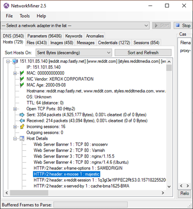

Tại tab Credentials của NetworkMiner có thể thu thập thông tin người dùng gồm tài khoản đăng nhập và mật khẩu, kể cả thông tin người dùng sử dụng cho các dịch vụ trực tuyến phổ biến như Gmail hay Facebook. 

Tab Keyword cho phép tìm kiếm bằng các từ khóa. Các báo cáo cũng có thể được chuyển sang các tập tin HTML, TXT, Javascript,...

Tab Anomalies giúp phát hiện các hiện tượng khả nghi và các sự cố có thể xảy ra đối với hệ thống mạng, giúp admin phòng tránh và xử lý kịp thời.

</details>
</details>

</details>
